Pages
=====

.. _header-desc:

Header
------

There is main navigation and base action buttons in the page header.

Main tabs

	:ref:`overview-desc` - common information about game and statistics.

	:ref:`characters-desc` - character management and profiles. 

	:ref:`story-desc` - filling stories: event creation, character lists with inventory and activities, adding characters to events. 

	:ref:`events-desc` - event adaptations editing for each character. 
	
	:ref:`breifings-desc` - preview, proofreading and handout export. 
	
View tabs

	:ref:`timeline-desc` - events timeline. 

	:ref:`social-network-desc` - social network view. 
	
	:ref:`characters-filter` - character search by profile and saving character filter to group. 
	
	:ref:`groups-desc` - group management, groups hierarchy and story map. 
	
Base management

	**Load database from file** - load database from file.

	**Save database to file** - save database to file.
	
	**Create new database** - create new database.
	
	**Documentation** - open documentation in new browser tab.
	
	:ref:`administrative-tools` (multi user version only) - entity and adaptation rights management, editor mode. 
	
	:ref:`logs` - about NIMS authors and users action log: create/rename/remove character/story/group, etc. 
	
.. figure:: images/0_header.jpg

	Header

.. _overview-desc:
	
Overview
--------

This is the first page which is open on NIMS start.

Page content

	``Name`` - name of the game.
	
	``Pre game events start date`` - pre game events start date in game universe. 
	
	``Pre game events end date`` - pre game events end date in game universe (time of game start usually). In this time interval happens most of pregame *events*. These dates are necessary for timeline boundaries. You can make dates outside of this time interval. If event time is not specified then it is equal to pre game events end date.
	
	``Last save time`` - time of last base saving.
		
	``Description`` - text with game description. It is not used anywhere but we decided to add it. Master can do some notes here.
	
	``Statistics`` - common information about current base: 
  
		``Count of stories/characters/events`` 
    
		``Count of users`` - used in multi user mode
    
		``first and last event in time`` by timeline
    
		``Symbol count in texts`` - it includes master stories, group texts, events and adaptations texts
    
		``Story completeness`` - number of stories which have all adaptations marked as completed
		
		``General completeness`` - number of adaptations marked as completed

.. figure:: images/1_1_overview.jpg
	
	Tab Overview. Description
	
Subtab **Diagrams** shows standard histograms and donut charts. Number on histogram column is a column height. On mouse cursor hover you will see tooltip with details. For example, on screenshot tooltip "2600-2699: Merry (2636), Pippin (2635)" means that Merry has 2636 symbols in handout and Pippin has 2635 symbols in handout. On donut charts hover you will see slice name and its size.

Standard diagrams

	``Event count in stories`` - histogram, shows summary event count in stories.
	
	``Character count in stories`` - histogram, shows character count in stories.
	
	``Story count per character`` - histogram, shows story count per character.
	
	``Detailed story completeness`` - histogram, shows detailed story completeness. Most left value - no complete adaptations at all. Most right value - all adaptations in story completed.
	
	``Symbol count per character`` - histogram, shows symbol count per character. Counted only events/adaptations texts and group texts. Profile texts are not considered.
	
	``Object belonging`` - parts of entities which belongs to different owners in multi user mode.

Profile diagrams are build automatically for numbers (histogram), single choices and checkboxes (donut chart). Histogram column width is calculated by input data (it is not necessary to have smallest number zero).
  
.. figure:: images/1_2_diagrams.jpg
	
	Tab Overview. Diagrams
	
.. _characters-desc:

Characters
----------

**Characters** page has common part and two subtabs: **Profile** and **Profile constructor**.

Common part includes character management elements: create/rename/remove character.

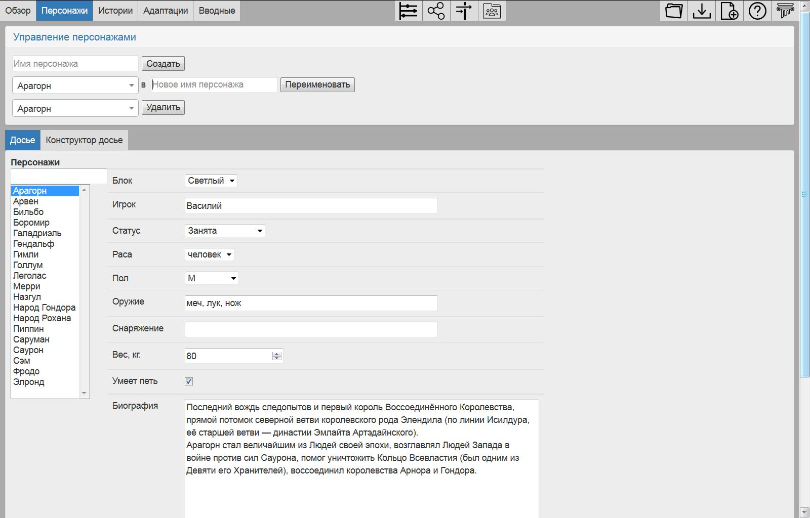

	Tab Characters

.. _characters-profile:
	
Characters. Profile
-------------------

**Profile** subtab is used to fill character profile. You select character in the left list. You see profile on the center. Changes are saved automatically. More details about data types see in concepts section.

	Tab Characters. Profile

.. _characters-profile-editor:
	
Characters. Profile constructor
-------------------------------

**Profile constructor** is used to change structure of character profile: create/rename/change/remove profile items. In the top there are controls to create, move and remove profile items. Profile item names must be unique. All current profile items are shown in table: ``Profile item name``, ``Type``, ``Value(s)`` and ``Do export``. Value in ``Value(s)`` is a default value for item except single choice. In single choice the first value in list is a default value. Profile items with checked ``Do export`` value will be printed in handout.

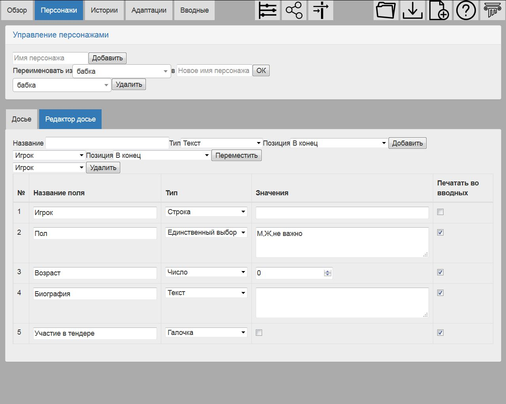

	Tab Characters. Profile constructor
	
.. _story-desc:

Stories
-------

On **Stories** tab you fill information about stories. Upper right panel - stories management: create/rename/remove actions. Upper left panel - story view selector. Center - subtabs for story editing.

	**Master story** - common story text. It is not necessary to fill it but in our experience it may be useful.
	
	:ref:`story-events` - story events information. Event is described by name, description and time. Event description is the **original** text and it is opposite to **adaptation** text.
	
	:ref:`story-characters` - story character list, inventories and activity marks (see. :ref:`concepts-character-activity`).
	
	:ref:`story-presence` - presence table of characters in event.

You can enable any pair or single subtab on **Stories**. Click active subtab header to collapse it. On this picture you see two active tabs. Later there will be single subtab screenshots.

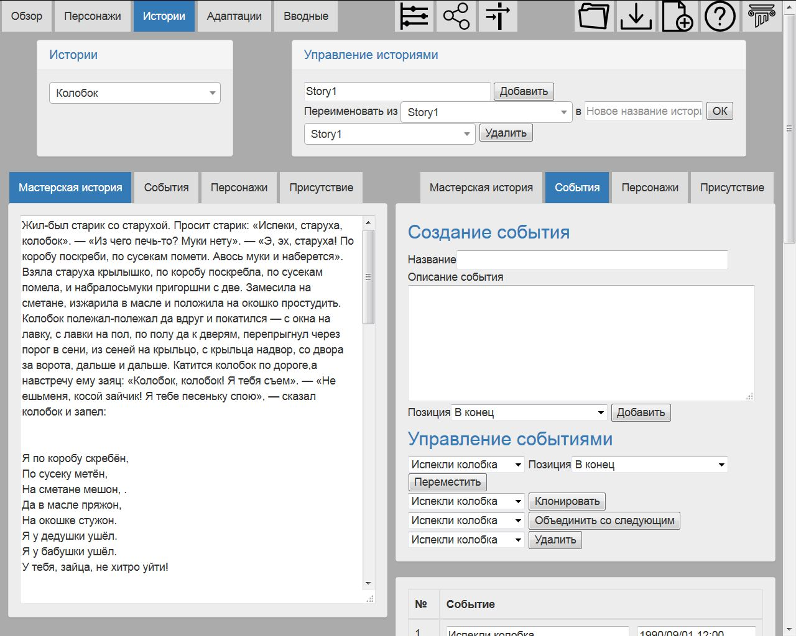

	Tab Stories
	
.. _story-events:

Stories. Events
---------------

You make splitting stories to events on **Events** subtab. Each event has next attributes: name (it is not unique), text, position and time. Standard actions available: create, move, remove. Special actions: clone and merge. Clone action makes copy of event including adaptations (see :ref:`events-desc`). Merge action concatenates two sequential events in one. This action concatenates everything: names, descriptions, adaptations.

Event list sequence is fixed by master. It is not sorted automatically by time. Event rename and text corrections are saved immediately. There is time field in upper right corner of event. If it is highlighted with red then this event has default time (pre game events end time).

.. figure:: images/3_2_storyEvents.jpg

	Tab Events
	
.. _story-characters:

Stories. Characters
-------------------

On **Characters** tab you add/replace/remove characters in story. On replace action all information from old character will be transfered to new one.

There are two tables on this page. First is an inventory table where you can fill story related inventory. For example, Frodo gets the One Ring in the beginning of Starting journey story. So we add it to inventory to be sure that Frodo have the One Ring on game start. Second table is an activity table. See see activity descriptions in :ref:`concepts-character-activity`.

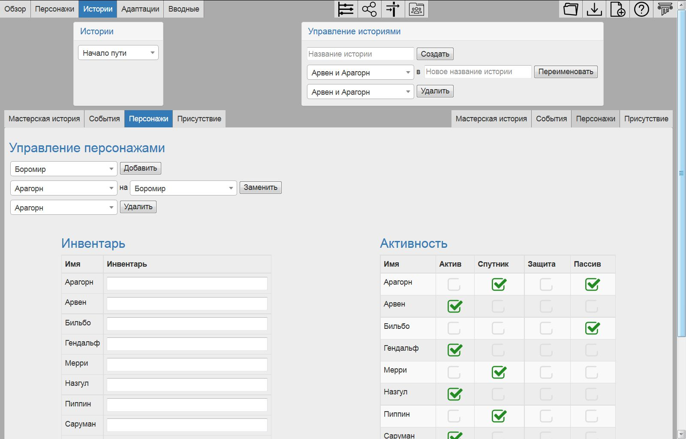

	Tab Stories. Characters

.. _story-presence:
	
Stories. Presence
-----------------

One this subtab you can set presence fact of characters in events. There are story events names in the first column. There are story character names in the first row. Check crossing of event row and character column if this character took part in this event. Unchecking this crossing will remove all character specific information from event. It will remove all written adaptations (see :ref:`events-desc`). If character have some adaptations system will ask permission to remove them.

There is character filter list on the left side. You can select only necessary characters for the table in center (multiselect with ctrl/shift). It was implemented for stories with big character lists.

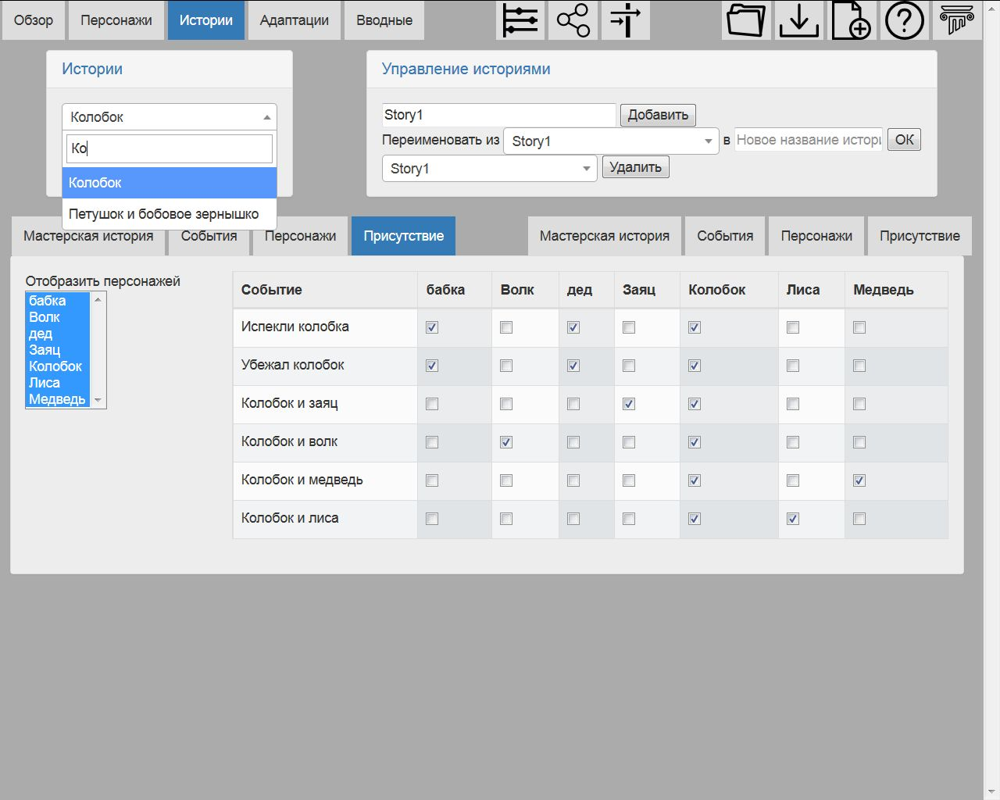

	Tab Stories. Presence
	
.. _events-desc:

Adaptations
-----------

Each character may have own vision of his events. You need to describe event from character point of view for each character (if it is necessary).

Upper left corner - story selector (single select). Lower left corner - adaptations filter. You can see adaptations by characters or by events (multiselect with ctrl/shift). Page center - two columns table. Left column - original event description. Right column - adaptation texts. You can select several characters or several events and work with several adaptations simultaneously. There is a checkbox under adaptation text with label ``Text finished``. Check it when adaptation will be finished. Completness statistic is based on these checkboxes. Story is finished if all adaptations are finished.

Original event consists of event name, event text and event time. Adaptation consists of character name, subjective time and subjective text. For example, subjective time is "20 years ago", "three days ago", "last summer". Character can't remember exact time but he can remember it rudely. If subjective text is empty then character will get original event text in handout. If subjective time is empty then character will get original event time in handout.

Left panel size may be changed with panel resize corner (in bottom right corner). Any element with such corner can be resized.

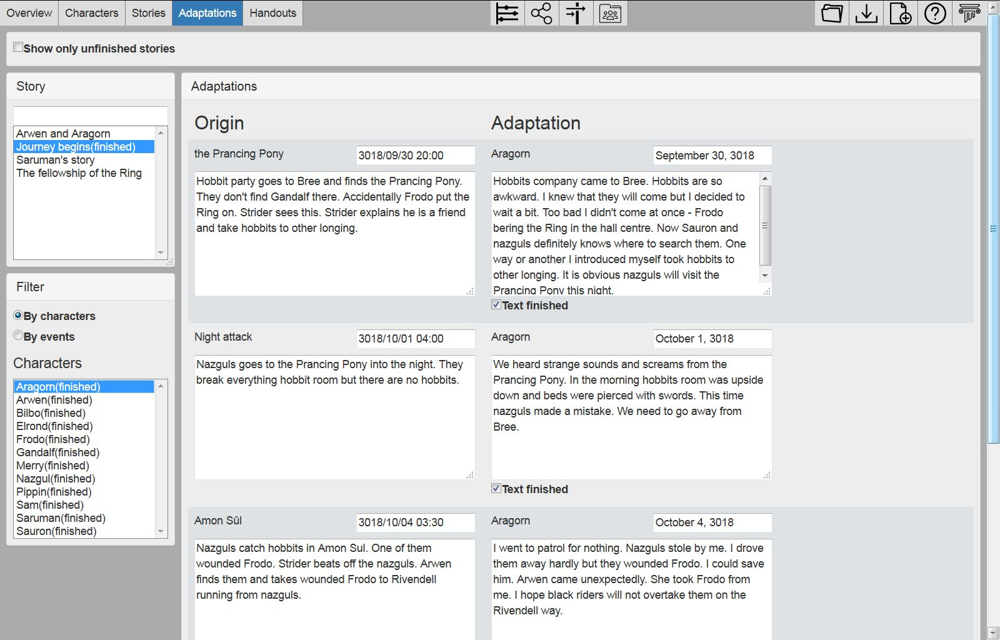

	Tab Adaptations
	
.. _breifings-desc:

Handouts
--------

**Handouts** tab is used for proofreading and handout export. **Preview** subtab is used for proofreading. **Export** subtab is used for export.
	
.. _breifings-preview:

Handouts. Preview
-----------------

You can use **Preview** subtab to look at handouts before export. Subtab header contains character selector for preview. There are some available options:

	``Adaptation mode`` and ``Proofreading mode`` - earlier ther was only proofreading mode in NIMS. In this mode we see only player visible text. In practice it may be useful to see both event adaptations and event originals simultaneously and edit them together. Difference of these modes described below.
	
	``Group events by story`` and ``Sort events by timeline`` - two possible ways of events export.
	
	``Hide all panels`` - there are five kinds of panels in handout preview: profile, inventory, groups, relations and events. It may be very annoying to scroll through them. Using this checkbox you can collapse or expand them all.
	
	``Disable headers`` - story names and event names may contain spoilers for players. By this reason there are no story and event headers in default templates. Using this checkbox you will see how handout looks without meaningful names. It may be useful in proofreading process.
	
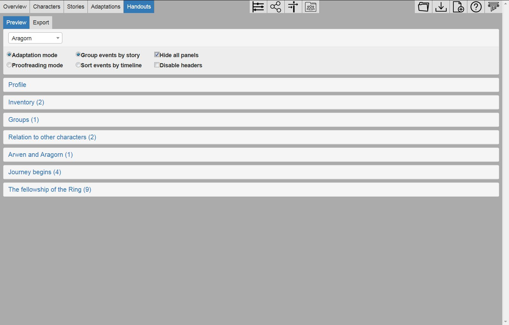

	Subtab Preview, all panels collapsed
	
Profile Panel
^^^^^^^^^^^^^

You can see character's profile on this panel. All printed profile items are marked as ``Do export`` items in **Profile constructor**. Profile is read only. There are no difference for this panel in adaptation and proofreading mode.

.. figure:: images/5_1_2_profile.jpg

	Subtab Preview, Profile Panel

Inventory Panel
^^^^^^^^^^^^^^^

You can see character's inventories on this panel. Number in panel header is a number of non empty inventories of this character. Inventories are editable. There are no difference for this panel in adaptation and proofreading mode.

.. figure:: images/5_1_3_inventory.jpg

	Subtab Preview, Inventory Panel

Groups Panel
^^^^^^^^^^^^

You can see character's group texts in this panel. Number in panel header is a number of character groups. Group texts are read only. There are no difference for this panel in adaptation and proofreading mode.

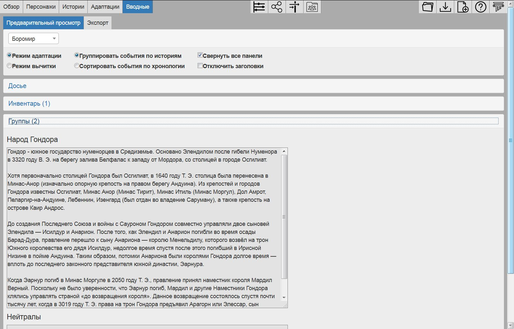

	Subtab Preview, Groups

Relations Panel
^^^^^^^^^^^^^^^

You can fill character's relation to other characters on this panel. Number in panel header is a number of non empty relations of this character. All game characters are splitted into two groups: characters which meet selected character in events and other characters. In other words characters from the first group may have face-to-face meetings. Characters from second group may never meet selected character. Any character may have relation to any other. Also relations may be asymmetric. For example, everyone knows mafia's boss but mafia's boss knows only his mobsters and nobody else.

During relation writing it may be important to see some counter character profile info. You can select which profile item you want to see in table. This value will be shown in ``Extra information`` column.

Relations panel depends on preview page mode and have different columns in relations table:

	``Character name`` - counter character name.
	
	``Relation`` - relation text.
	
	``Reverse relation`` - counter character relation text. This column exists in adaptation mode and hidden in proofreading mode.
	
	``Extra information`` - counter character extra information. There are list of stories where characters and counter character meet in events and selected counter character profile item.

If relation text is empty it means that there are no relation.

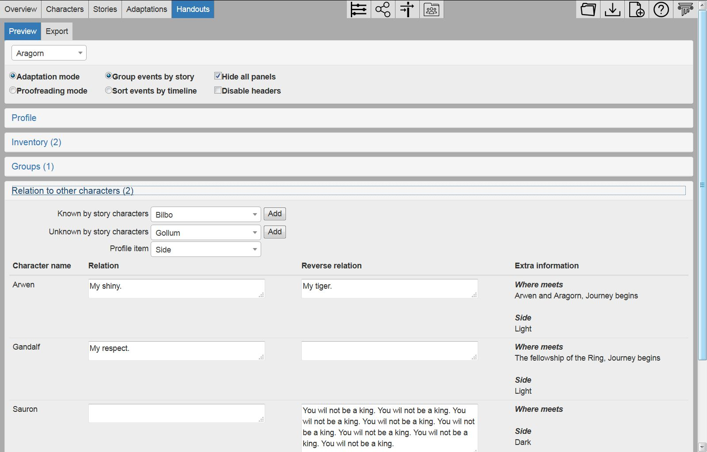

	Subtab Preview, Relations in adaptation mode
	
.. figure:: images/5_1_6_relations_pmode.jpg

	Subtab Preview, Relations in proofreading mode
	
Events Panels
^^^^^^^^^^^^^

You can modify event texts, adaptation texts and subjective time on this panel. Read only fields: event name, event time. Editable fields: event origin text (need unlock to edit), adaptation text and subjective time. Press button ``Unlock origin editing`` to edit origin text. In adaptation mode this panels show both origin and adaptation texts even if adaptation texts are empty. In proofreading mode this panel shows only significant text - adaptation text if it is not empty or origin text otherwise.

``Subjective time`` field shows event time which character can remember. If field is empty character will see time as is.

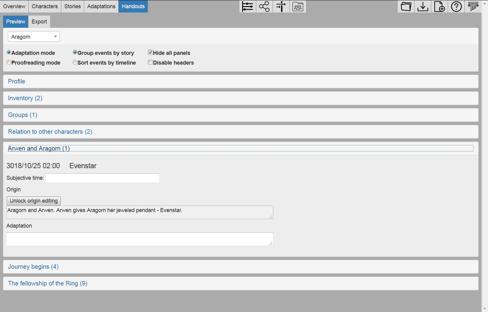

	Subtab Preview, Events in adaptation mode
	
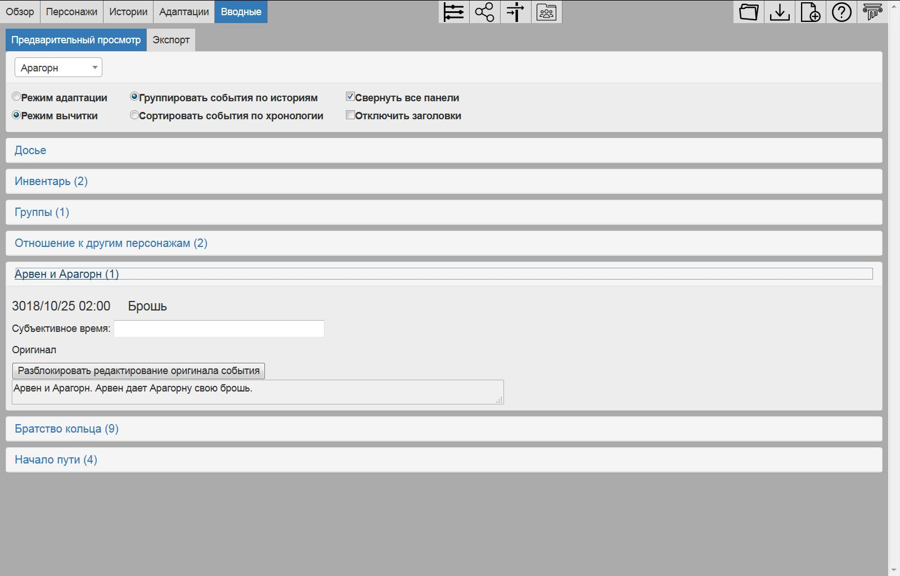

	Subtab Preview, Events in proofreading mode

.. _breifings-export:
	
Handouts. Export
----------------

There are next generic options on **Export** tab. You can print handouts to one file or to separate files. In second case you will receive zip archive with generated handouts. You can export all handouts, range handouts or selected handouts (most flexible but most time-consuming option).

On ``Simple export`` subtab you can see buttons with embedded templates: ``Make handouts, sort events by timeline (docx)``, ``Make handouts, group events by story (docx)``, ``Make text handouts``, ``Make inventory list (docx)``.

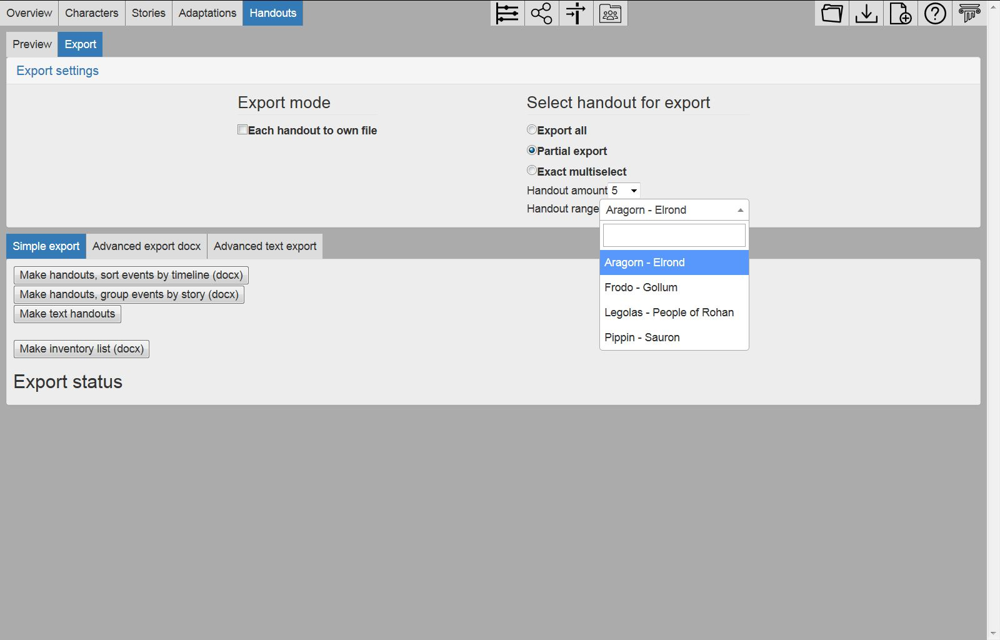

	Handouts tab. Export-Simple export

When export will be ended you will see a save request (see. pic.). There were bug here. Adding this dialog partially solves of not saving handout problem.

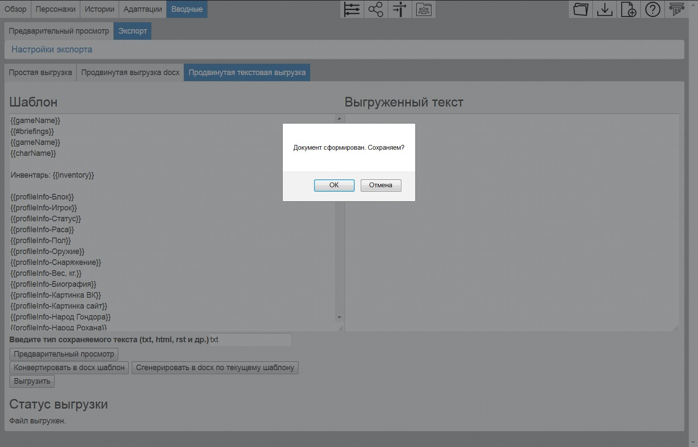

	Handouts tab. Export-extra dialog question

On ``Advanced export docx`` subtab you need to upload your own docx template to generate handouts. Template may use all export data or only part. You can find template examples in NIMS archive. Template language is very close to Mustache language which is used in text export. See details in :ref:`breifings-templates`.
  
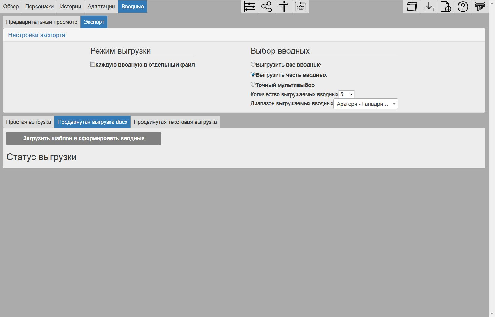

	Handouts tab. Export-Advanced export docx
	
On ``Advanced text export`` subtab you can work with template in interactive mode. On the left side you need to type template. On the right side you will see generated handout. Embedded text template includes almost all possible data for export. It is used Mustache template engine in text generation. Button ``Preview`` generates handout in right panel. Button ``Export`` generates text files by template.

Also you can make some experiments with text templates and then transform it to docx templates. Button ``Convert to docx template`` transforms text template to docx template. Button ``Generate to docx by current template`` transforms text template to docx template and applies it to real data. Resulted docx has poor formatting but it is useful for template checking.

Also you can specify any necessary text file extension (txt, tex, html, etc.).

.. warning:: Template text is not saved in NIMS. If switch to other tab and came back your template will be replaced by embedded one.
  
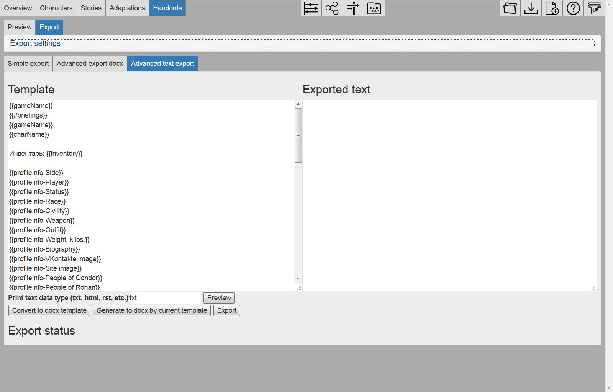

	Handouts tab. Export-Advanced text export
	
.. _timeline-desc:

Timeline
--------

You can see events timeline on this tab. On the left side - story multi selector. There is a timeline in the center. Timeline scale is changes by mouse wheel. Red events are pregame start and end dates.

Story selector width can be changed with right bottom corner.

.. note:: Earlier it was possible to move events on timeline. This function was disabled by users request to avoid accidentally events moving.

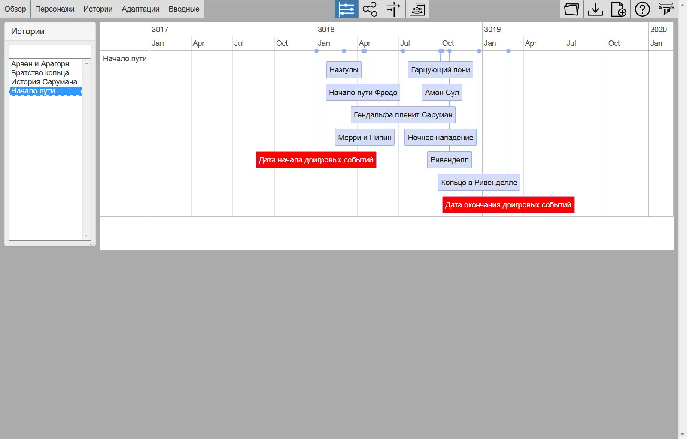

	Timeline tab
	
.. _social-network-desc:

Social Network
--------------

На этой вкладке отрисовываются социальные сети на основе имеющихся данных. Поддерживаются несколько типов отрисовываемых сетей с разными видами узлов и связей между ними (см. далее типы графов). Для отрисовки необходимо указать общие и частные параметры социальной сети и нажать кнопку ``Нарисовать``.

.. warning::  Отрисовка социальной сети требует большого количества ресурсов, поэтому перед ее использованием рекомендуется сохранить текущее состояние базы. 

После того как социальная сеть будет нарисована, список ``Показать узел``, расположенный над общими параметрами будет заполнен. В этом списке находятся все узлы текущей социальной сети. Выберите узел из списка, чтобы сеть на нём отцентрировалась.

Общие параметры
^^^^^^^^^^^^^^^

Раскраска узлов выполняется на основе полей досье с типом **единственный выбор** и **галочка**. Вы можете выбрать любое из этих полей, а ниже будет приведена цветовая расшифровка.
Так же возможно три вида выборки.

1. Все данные. Будут отрисованы все данные.

2. Избранные персонажи. В этом случае появится список персонажей. Можно выбрать нескольких персонажей с помощью ctrl/shift. В этом случае будут отрисованы выбранные персонажи, все истории, в которых задействованы эти персонажи и все остальные персонажи, пересекающиеся в событиях с избранными. Примечание: при отрисовке графа человек-история не все связи отображают реальные связи персонажей по событиям.

3. Избранные истории. В этом случае появится список историй. Можно выбрать несколько историй с помощью ctrl/shift. В этом случае будут отрисованы все истории и все персонажи, входящие в истории.

Частные параметры
^^^^^^^^^^^^^^^^^

Частной настройкой является тип отрисовываемого графа. Поддерживаются следующие типы.

1. Социальные связи - сеть связей между персонажами. Узлы: персонажи. Связь между узлами: совместное участие персонажей в некотором событии. Чем толще связь, тем в больших историях эти персонажи пересекаются. При наведении на связь выводится список историй, в которых пересекаются эти персонажи.

2. Персонаж-участие-история - сеть связей персонажей и историй. Узлы: персонажи и истории. Связь между узлами: участие персонажа в истории. Размер истории пропорционален числу участников истории.

3. Персонаж-активность-история - сеть связей персонажей и историй на основе данных об активности. Узлы: персонажи и истории. Связь между узлами: активность персонажа в истории (см. :ref:`concepts-character-activity`). Можно выбирать несколько требуемых активностей через ctrl.

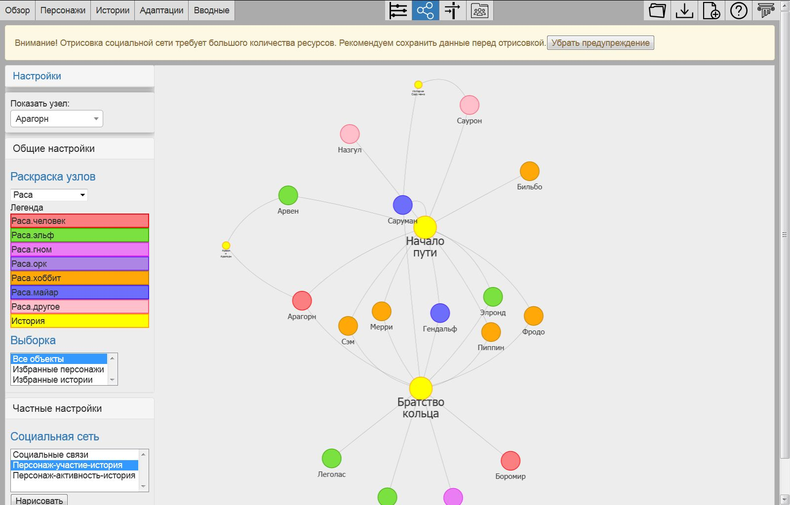

	Вкладка Социальная сеть
	
.. _characters-filter:
	
Фильтр
------

В новой версии НИМС страница вкладка была существенно доработана. На вкладке находятся 4 панели:

	#. ``Группы`` - управление группами и сохранение фильтра в группу.
	
	#. ``Отобразить поле`` - список столбцов для отображения.
	
	#. ``Фильтр`` - настройки фильтрации.
	
	#. ``Таблица данных`` (центральная часть экрана) - результаты фильтрации.
	
.. figure:: images/2_2_1_characterFilter.jpg

	Вкладка Фильтр

Панель ``Группы`` описана в разделе :ref:`groups-desc`, так как она относится в первую очередь к работе с группами.

На панели ``Отобразить поле`` перечислены все столбцы данных, выводящихся в результате фильтрации, кроме имени персонажа (множественный выбор через ctrl/shift). Имя персонажа всегда выводится в результате фильтрации. Данные о персонажах бывают двух типов: данные из досье и статистические данные.  

В версии НИМС 0.4.4u3 были добавлены статистические данные в фильтр:

	``Актив``, ``Спутник``, ``Защита``, ``Пассив`` - количество историй, в которых персонаж имеет указанный тип активности.
	
	``Завершённость адаптаций, %`` - процент завершённых адаптаций для данного персонажа.
	
	``Количество историй`` - количество историй, в которых принимает участие данный персонаж.

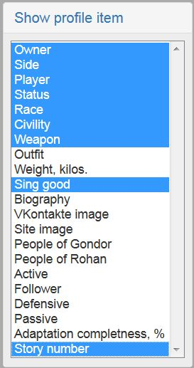

	Панель ``Отобразить поле``
	
Панель ``Фильтр`` используется для построения фильтра данных. В первой строке выводится количество персонажей, удовлетворяющих построенному фильтру. С помощью кнопки ``Скачать таблицу`` вы можете скачать текущий результат фильтрации в формате CSV. Этот формат поддерживается и Excel и LibreOffice. 
	
Далее находится инструмент построения фильтра. Последовательность действий для фильтрации:

	Шаг 1. Отметьте галочкой те столбцы данных, по которым вы хотите фильтровать персонажей. Эти столбцы автоматически переместятся на вершину списка столбцов и у них появятся поля для ввода ограничений.
	
	Шаг 2. Задайте необходимые ограничения для выбранных столбцов. Подробнее про типы данных столбцов можно прочитать в разделе :ref:`characters-profile-editor`. Фильтрация строк и текстов происходит по наличию искомой строки в строке или тексте. Фильтрация по полям с единственным выбором происходит по выбору из предложенного списка значений. Чтобы сделать множественный выбор зажмите ctrl и выбирайте элементы в списке. Фильтрация для значений вида ``да/нет`` аналогична фильтрации по полям с единственным выбором. Фильтрация по числовым значениям требует указания числа и вида проверки: не важно, больше, равно, меньше. 
	
	Шаг 3. Если вы хотите отключить фильтр для некоторых столбцов - выключите галочку рядом с названием столбца. Этот столбце вернётся в список не фильтруемых столбцов. 
	
	Шаг 4. Повторная активация галочки для столбца вернёт столбец в фильтр с ранее выставленным условием.
	
Все шаги проиллюстрированы на рисунке.

.. figure:: images/2_2_3_filterExample.jpg

	Панель ``Фильтр``

Обновление результата фильтрации происходит сразу после изменения параметров фильтра. Размер левого столбца с настройками фильтра персонажей можно регулировать с помощью таскаемого уголка внизу панели ``Фильтр``.

Панель ``Таблица данных`` выводит результаты фильтрации. Клик по заголовку таблицы выполняет сортировку по соответствующему полю + иконка. 

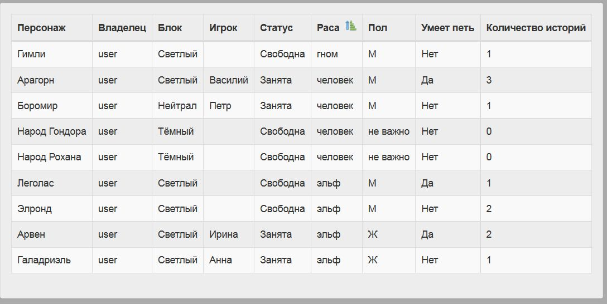

	Панель ``Таблица данных``
	
.. _groups-desc:
  
Группы
------

Во многих ролевых сервисах есть поддержка групп персонажей. Обычно они реализованы следующим образом: создаётся группа и каждый персонаж по очереди вносится в группу. Мы пошли другим путем – зачем что-то вносить вручную, если у нас есть досье персонажа? Мы формируем фильтр по досье, который определяет состав группы. Так что теперь, если у персонажа в досье проставлена галочка «тамплиер», то он автоматически попадет в группу «тамплиеры».

Теперь в деталях. Информация о группе состоит из двух частей: фильтр группы и досье группы. 

Фильтр группы
^^^^^^^^^^^^^

Фильтр группы определяет какие персонажи попадут в группу. Фильтр группы это сохранённый фильтр персонажей.

На картинке представлена панель ``Группы`` с вкладки ``Фильтр``. В правой части стандартный набор действий создание/переименование/удаление группы. При создании фильтр группы пуст, что значит, что ничего не фильтруется и все персонажи попадают в новосозданную группу. В левой части действия для фильтра группы. Выберите группу из выпадающего списка. При нажатии на кнопку ``Показать фильтр группы`` текущие настройки фильтрации будут заменены настройками из выбранной группы. При нажатии на кнопку ``Сохранить фильтр в группу`` текущие настройки фильтрации будут сохранены в фильтр выбранной группы.

Если вы создаете нового персонажа и проставляете ему параметры досье, подходящие под этот фильтр, он автоматически войдет в группу. Если вы измените параметры досье уже имеющегося персонажа, так что они станут/перестанут соответствовать фильтру, то он так же автоматически войдет в/выйдет из группы.

.. figure:: images/2_2_1_characterFilter.jpg

	Вкладка Фильтра с панелью Группы

Досье группы
^^^^^^^^^^^^

На подвкладке **Досье группы** представлена информация о досье групп. Принцип работы с досье групп такой же как и с досье персонажей: слева выбираем группу для редактирования, по центру заполняем данные. В отличие от персонажей досье групп фиксировано и состоит из следующих частей: 

	``Фильтр`` - отображает структуру текущего фильтра группы.
	
	``Состав группы`` - список персонажей, участвующих в группе.
	
	``Мастерское описание`` - заметки о группе, доступные только мастерам.
	
	``Печатать во вводных`` - переключатель, нужно ли выводить текст группы во вводные персонажам.
	
	``Текст для персонажа`` - информация о группе, которая попадёт персонажу во вводную.

.. figure:: images/10_1_groupProfile.jpg

	Подвкладка Досье группы
	
Иерархия
^^^^^^^^

Группы могут соотноситься между собой. В группах могут быть подгруппы. Этот факт можно проиллюстрировать схемой, представленной на данной вкладке. Иерархия групп строится автоматически на основе анализа фильтров групп. Например, группа "3ий курс Гриффиндора" это подгруппа "Гриффиндора" и подгруппа "3го курса", которые в свою очередь являются подгруппами "Хогвартса". В иерархии групп они бы сформировали ромб.

.. figure:: images/10_2_groupHeirarchy.jpg

	Подвкладка Иерархия
	
.. _investigation-board:
	
Карта сюжета
^^^^^^^^^^^^

Карта сюжета это инструмент для отображения конфликтов и интересов групп в виде схемы. **Карту сюжета вы формируете в ручную. Этот процесс не автоматизируем.** Концепция карты сюжета изложена в разделе :ref:`concepts-investigation-board`. Процесс работы с картой сюжета:

	1. Создаёте группы. Можно пустые.
	
	2. Добавляете группы на карту сюжета.
	
	3. Добавляете ресурсы на карту сюжета.
	
	4. Прописываете отношения между группами и позиции групп по отношению к ресурсам.
	
К группе можно записать заметки, с перечислением сильных/слабых сторон или что ещё вам покажется важным.

.. figure:: images/10_3_storyMap.jpg

	Подвкладка Карта сюжета
  
.. _administrative-tools:
  
Администрирование
-----------------

На этой вкладке выполняются действия по управлению работой нескольких мастеров. Описание теории процесса смотрите в разделе :ref:`concepts-server-mode`. На панели ``Управление пользователями`` вы можете создавать/удалять пользователей и менять им пароли. На панели ``Специальные действия`` вы можете передать права администратора, назначить/удалить редактора и переключим режим прав на адаптации. На панели ``Права на редактирование`` слева вы видите полный список что кому принадлежит. По центру показываются ваши объекты и список пользователей. Чтобы передать свои объекты, выберите нужные, выберите пользователя и нажмите кнопку ``Назначить права``. Ваши объекты перейдут другому пользователю. Администратор может передавать любые объекты и в том числе не свои личные.

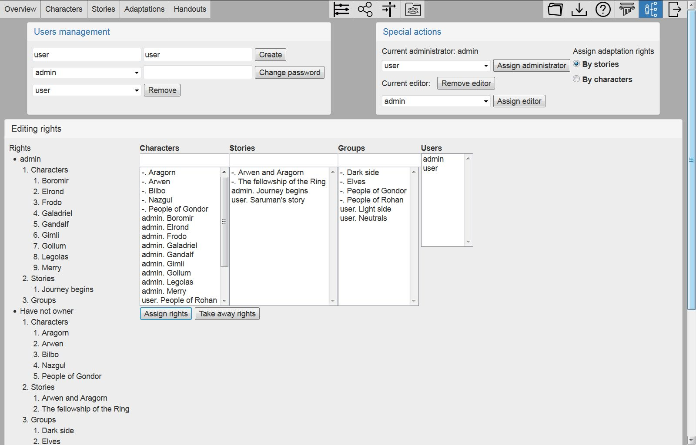

	Вкладка Администрирование
	
.. _logs:
  
Логи
----
  
НИМС включает в себя несколько защитных механизмов и один из них это логи. В логах мы можем посмотреть историю последних действий пользователей. Текущее ограничение - последняя 1000 операций. Возможно, мы изменим эту цифру в будущем. Логируются следующие виды деятельности: сохранение/загрузка базы, обновление метаинформации кроме описания игры, управление персонажами/досье/историями, изменения в историях - управление событиями, изменение вида активности и инвентаря, отметки о готовности адаптаций и выгрузка вводных. В серверном режиме к этому списку добавляется всё, что касается администрирования: управление пользователями, передача/назначение прав, изменение настроек. Основной принцип - мы не отслеживаем изменения текстов, но отслеживаем изменения в структуре базы.

Запись о событии содержит следующие поля:

	1. ``№`` - номер события в списке событий.
	2. ``Дата`` - время совершения события. На сервере будет использовано время сервера.
	3. ``Пользователь`` - пользователь от имени которого совершено событие. Может отсутствовать. Например, при автоматическом сохранении базы на сервере в логе указывается факт сохранения без пользователя.
	4. ``Действия`` - тип действия.
	5. ``Параметры`` - переданные параметры. С их помощью можно воспроизвести последовательность действий пользователя.
	
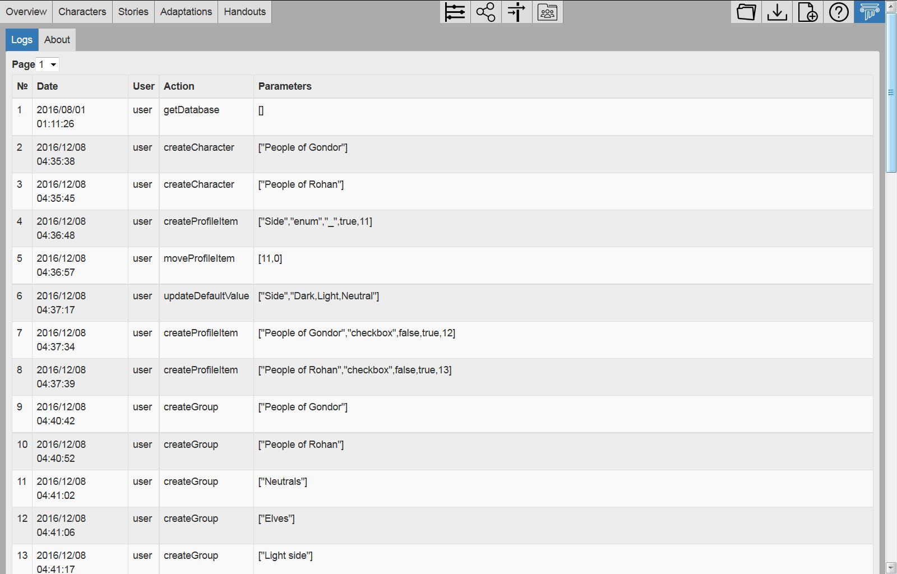

	Вкладка Логи
  