Pages
=====

.. _header-desc:

Header
------

There is main navigation and base action buttons in the page header.

Main tabs

	:ref:`overview-desc` - common information about game and statistics.

	:ref:`characters-desc` - character management and profiles. 

	:ref:`story-desc` - filling stories: event creation, character lists with inventory and activities, adding characters to events. 

	:ref:`events-desc` - event adaptations editing for each character. 
	
	:ref:`breifings-desc` - preview, proofreading and handout export. 
	
View tabs

	:ref:`timeline-desc` - events timeline. 

	:ref:`social-network-desc` - social network view. 
	
	:ref:`characters-filter` - character search by profile and saving character filter to group. 
	
	:ref:`groups-desc` - group management, groups hierarchy and story map. 
	
Base management

	**Load database from file** - load database from file.

	**Save database to file** - save database to file.
	
	**Create new database** - create new database.
	
	**Documentation** - open documentation in new browser tab.
	
	:ref:`administrative-tools` (multi user version only) - entity and adaptation rights management, editor mode. 
	
	:ref:`logs` - about NIMS authors and users action log: create/rename/remove character/story/group, etc. 
	
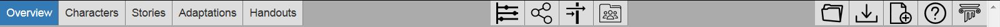

	Header

.. _overview-desc:
	
Overview
--------

This is the first page which is open on NIMS start.

Page content

	``Name`` - name of the game.
	
	``Pre game events start date`` - pre game events start date in game universe. 
	
	``Pre game events end date`` - pre game events end date in game universe (time of game start usually). In this time interval happens most of pregame *events*. These dates are necessary for timeline boundaries. You can make dates outside of this time interval. If event time is not specified then it is equal to pre game events end date.
	
	``Last save time`` - time of last base saving.
		
	``Description`` - text with game description. It is not used anywhere but we decided to add it. Master can do some notes here.
	
	``Statistics`` - common information about current base: 
  
		``Count of stories/characters/events`` 
    
		``Count of users`` - used in multi user mode
    
		``first and last event in time`` by timeline
    
		``Symbol count in texts`` - it includes master stories, group texts, events and adaptations texts
    
		``Story completeness`` - number of stories which have all adaptations marked as completed
		
		``General completeness`` - number of adaptations marked as completed

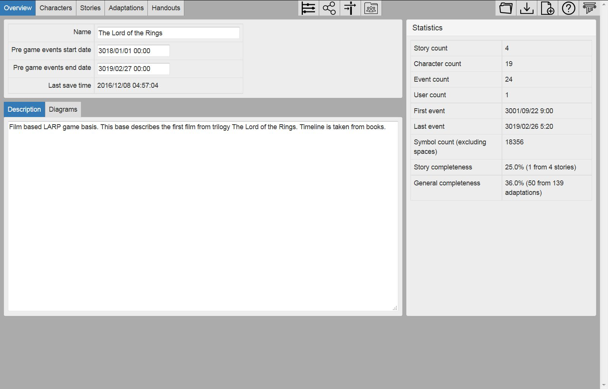
	
	Tab Overview. Description
	
Subtab **Diagrams** shows standard histograms and donut charts. Number on histogram column is a column height. On mouse cursor hover you will see tooltip with details. For example, on screenshot tooltip "2600-2699: Merry (2636), Pippin (2635)" means that Merry has 2636 symbols in handout and Pippin has 2635 symbols in handout. On donut charts hover you will see slice name and its size.

Standard diagrams

	``Event count in stories`` - histogram, shows summary event count in stories.
	
	``Character count in stories`` - histogram, shows character count in stories.
	
	``Story count per character`` - histogram, shows story count per character.
	
	``Detailed story completeness`` - histogram, shows detailed story completeness. Most left value - no complete adaptations at all. Most right value - all adaptations in story completed.
	
	``Symbol count per character`` - histogram, shows symbol count per character. Counted only events/adaptations texts and group texts. Profile texts are not considered.
	
	``Object belonging`` - parts of entities which belongs to different owners in multi user mode.

Profile diagrams are build automatically for numbers (histogram), single choices and checkboxes (donut chart). Histogram column width is calculated by input data (it is not necessary to have smallest number zero).
  
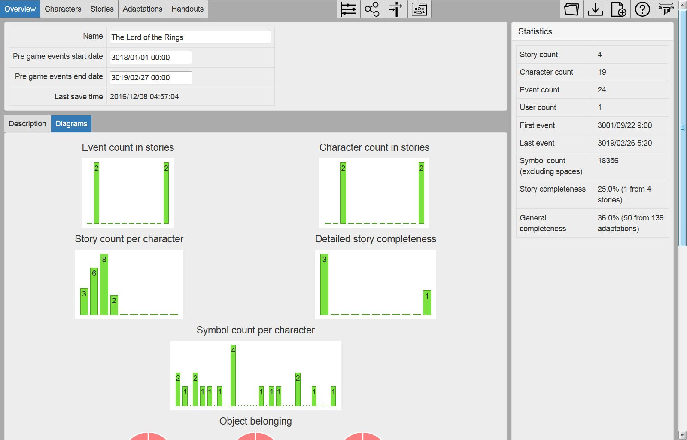
	
	Tab Overview. Diagrams
	
.. _characters-desc:

Characters
----------

**Characters** page has common part and two subtabs: **Profile** and **Profile constructor**.

Common part includes character management elements: create/rename/remove character.

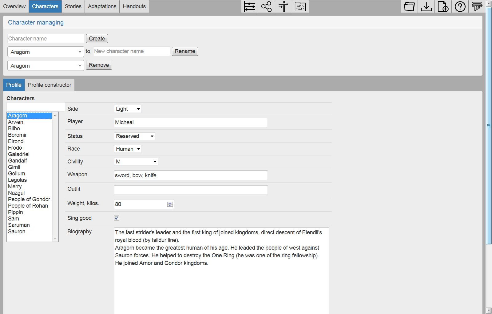

	Tab Characters

.. _characters-profile:
	
Characters. Profile
-------------------

**Profile** subtab is used to fill character profile. You select character in the left list. You see profile on the center. Changes are saved automatically. More details about data types see in concepts section.

	Tab Characters. Profile

.. _characters-profile-editor:
	
Characters. Profile constructor
-------------------------------

**Profile constructor** is used to change structure of character profile: create/rename/change/remove profile items. In the top there are controls to create, move and remove profile items. Profile item names must be unique. All current profile items are shown in table: ``Profile item name``, ``Type``, ``Value(s)`` and ``Do export``. Value in ``Value(s)`` is a default value for item except single choice. In single choice the first value in list is a default value. Profile items with checked ``Do export`` value will be printed in handout.

.. figure:: images/2_3_characterProfileConfigurer.jpg

	Tab Characters. Profile constructor
	
.. _story-desc:

Stories
-------

On **Stories** tab you fill information about stories. Upper right panel - stories management: create/rename/remove actions. Upper left panel - story view selector. Center - subtabs for story editing.

	**Master story** - common story text. It is not necessary to fill it but in our experience it may be useful.
	
	:ref:`story-events` - story events information. Event is described by name, description and time. Event description is the **original** text and it is opposite to **adaptation** text.
	
	:ref:`story-characters` - story character list, inventories and activity marks (see. :ref:`concepts-character-activity`).
	
	:ref:`story-presence` - presence table of characters in event.

You can enable any pair or single subtab on **Stories**. Click active subtab header to collapse it. On this picture you see two active tabs. Later there will be single subtab screenshots.

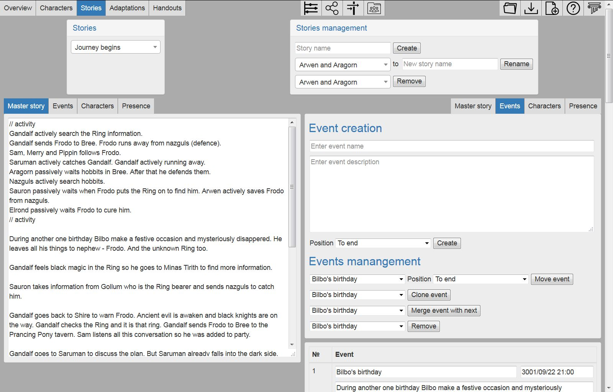

	Tab Stories
	
.. _story-events:

Stories. Events
---------------

You make splitting stories to events on **Events** subtab. Each event has next attributes: name (it is not unique), text, position and time. Standard actions available: create, move, remove. Special actions: clone and merge. Clone action makes copy of event including adaptations (see :ref:`events-desc`). Merge action concatenates two sequential events in one. This action concatenates everything: names, descriptions, adaptations.

Event list sequence is fixed by master. It is not sorted automatically by time. Event rename and text corrections are saved immediately. There is time field in upper right corner of event. If it is highlighted with red then this event has default time (pre game events end time).

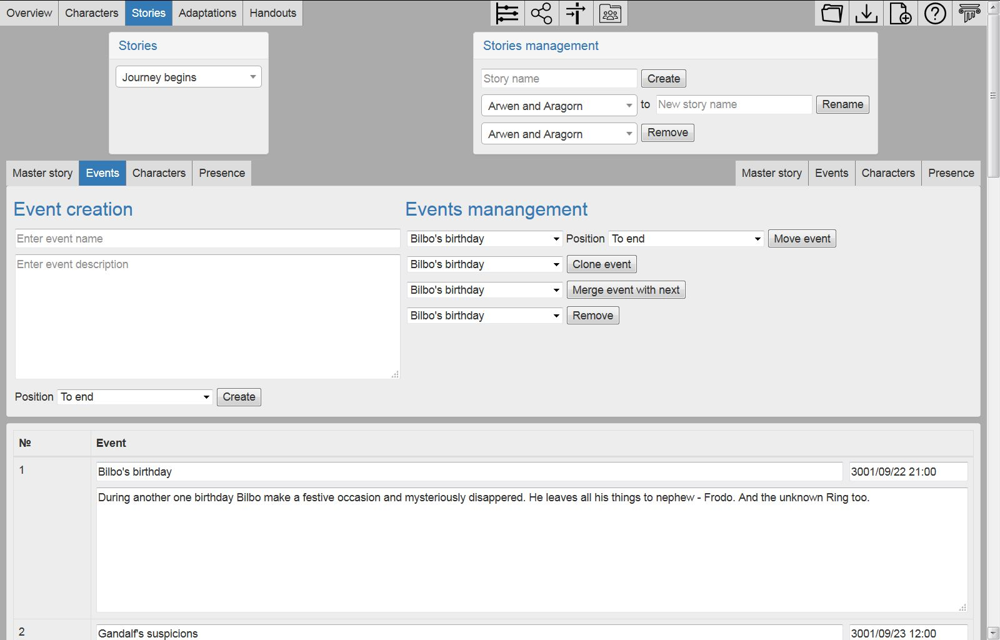

	Tab Events
	
.. _story-characters:

Stories. Characters
-------------------

On **Characters** tab you add/replace/remove characters in story. On replace action all information from old character will be transfered to new one.

There are two tables on this page. First is an inventory table where you can fill story related inventory. For example, Frodo gets the One Ring in the beginning of Starting journey story. So we add it to inventory to be sure that Frodo have the One Ring on game start. Second table is an activity table. See see activity descriptions in :ref:`concepts-character-activity`.

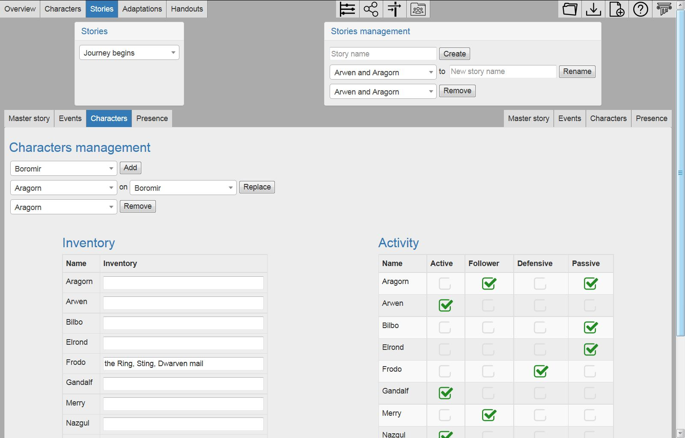

	Tab Stories. Characters

.. _story-presence:
	
Stories. Presence
-----------------

One this subtab you can set presence fact of characters in events. There are story events names in the first column. There are story character names in the first row. Check crossing of event row and character column if this character took part in this event. Unchecking this crossing will remove all character specific information from event. It will remove all written adaptations (see :ref:`events-desc`). If character have some adaptations system will ask permission to remove them.

There is character filter list on the left side. You can select only necessary characters for the table in center (multiselect with ctrl/shift). It was implemented for stories with big character lists.

.. figure:: images/3_4_eventPresence.jpg

	Tab Stories. Presence
	
.. _events-desc:

Adaptations
-----------

Each character may have own vision of his events. You need to describe event from character point of view for each character (if it is necessary).

Upper left corner - story selector (single select). Lower left corner - adaptations filter. You can see adaptations by characters or by events (multiselect with ctrl/shift). Page center - two columns table. Left column - original event description. Right column - adaptation texts. You can select several characters or several events and work with several adaptations simultaneously. There is a checkbox under adaptation text with label ``Text finished``. Check it when adaptation will be finished. Completness statistic is based on these checkboxes. Story is finished if all adaptations are finished.

Original event consists of event name, event text and event time. Adaptation consists of character name, subjective time and subjective text. For example, subjective time is "20 years ago", "three days ago", "last summer". Character can't remember exact time but he can remember it rudely. If subjective text is empty then character will get original event text in handout. If subjective time is empty then character will get original event time in handout.

Left panel size may be changed with panel resize corner (in bottom right corner). Any element with such corner can be resized.

.. figure:: images/4_events.jpg

	Tab Adaptations
	
.. _breifings-desc:

Handouts
--------

**Handouts** tab is used for proofreading and handout export. **Preview** subtab is used for proofreading. **Export** subtab is used for export.
	
.. _breifings-preview:

Handouts. Preview
-----------------

You can use **Preview** subtab to look at handouts before export. Subtab header contains character selector for preview. There are some available options:

	``Adaptation mode`` and ``Proofreading mode`` - earlier ther was only proofreading mode in NIMS. In this mode we see only player visible text. In practice it may be useful to see both event adaptations and event originals simultaneously and edit them together. Difference of these modes described below.
	
	``Group events by story`` and ``Sort events by timeline`` - two possible ways of events export.
	
	``Hide all panels`` - there are five kinds of panels in handout preview: profile, inventory, groups, relations and events. It may be very annoying to scroll through them. Using this checkbox you can collapse or expand them all.
	
	``Disable headers`` - story names and event names may contain spoilers for players. By this reason there are no story and event headers in default templates. Using this checkbox you will see how handout looks without meaningful names. It may be useful in proofreading process.
	
.. figure:: images/5_1_1_briefingPreview.jpg

	Subtab Preview, all panels collapsed
	
Profile Panel
^^^^^^^^^^^^^

You can see character's profile on this panel. All printed profile items are marked as ``Do export`` items in **Profile constructor**. Profile is read only. There are no difference for this panel in adaptation and proofreading mode.

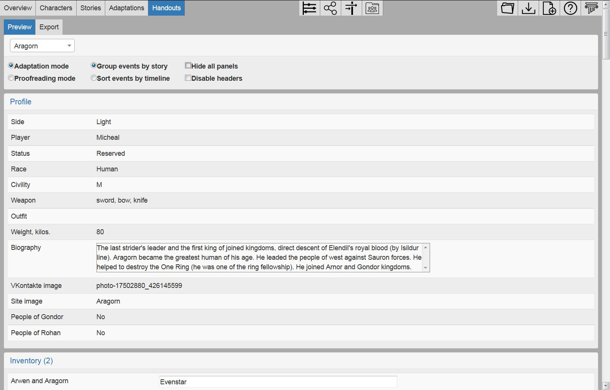

	Subtab Preview, Profile Panel

Inventory Panel
^^^^^^^^^^^^^^^

You can see character's inventories on this panel. Number in panel header is a number of non empty inventories of this character. Inventories are editable. There are no difference for this panel in adaptation and proofreading mode.

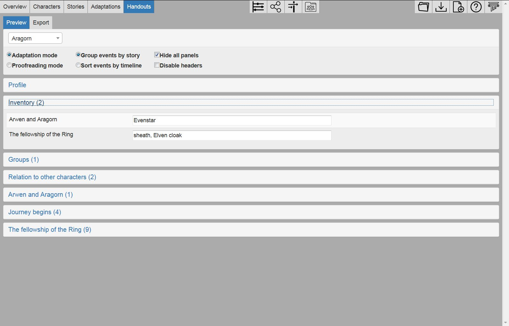

	Subtab Preview, Inventory Panel

Groups Panel
^^^^^^^^^^^^

You can see character's group texts in this panel. Number in panel header is a number of character groups. Group texts are read only. There are no difference for this panel in adaptation and proofreading mode.

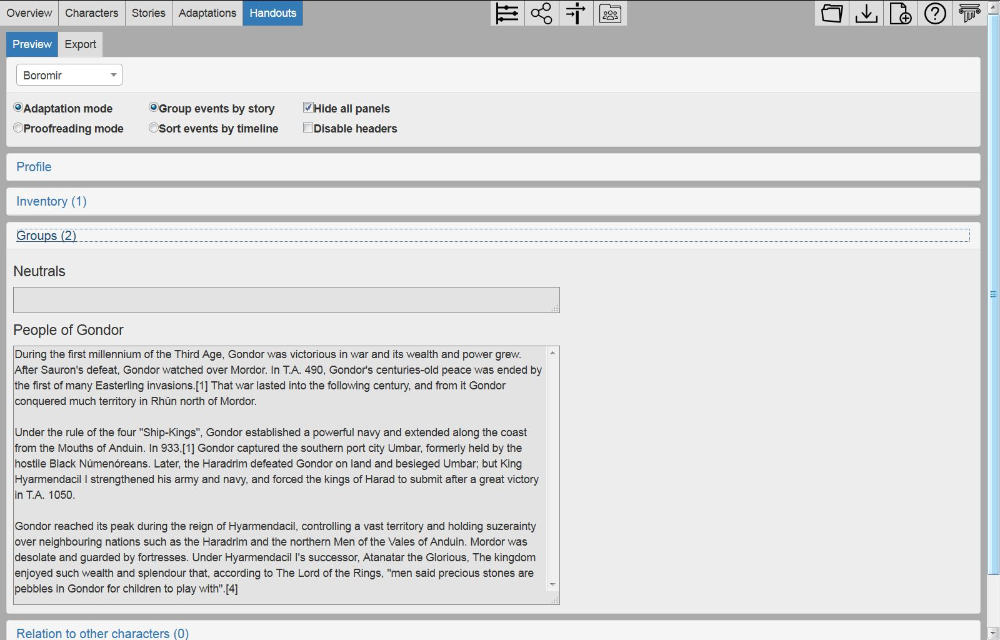

	Subtab Preview, Groups

Relations Panel
^^^^^^^^^^^^^^^

You can fill character's relation to other characters on this panel. Number in panel header is a number of non empty relations of this character. All game characters are splitted into two groups: characters which meet selected character in events and other characters. In other words characters from the first group may have face-to-face meetings. Characters from second group may never meet selected character. Any character may have relation to any other. Also relations may be asymmetric. For example, everyone knows mafia's boss but mafia's boss knows only his mobsters and nobody else.

During relation writing it may be important to see some counter character profile info. You can select which profile item you want to see in table. This value will be shown in ``Extra information`` column.

Relations panel depends on preview page mode and have different columns in relations table:

	``Character name`` - counter character name.
	
	``Relation`` - relation text.
	
	``Reverse relation`` - counter character relation text. This column exists in adaptation mode and hidden in proofreading mode.
	
	``Extra information`` - counter character extra information. There are list of stories where characters and counter character meet in events and selected counter character profile item.

If relation text is empty it means that there are no relation.

.. figure:: images/5_1_5_relations_amode.jpg

	Subtab Preview, Relations in adaptation mode
	
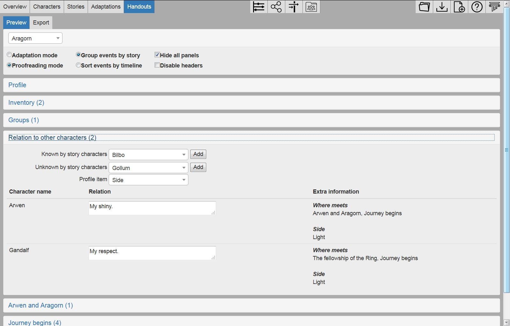

	Subtab Preview, Relations in proofreading mode
	
Events Panels
^^^^^^^^^^^^^

You can modify event texts, adaptation texts and subjective time on this panel. Read only fields: event name, event time. Editable fields: event origin text (need unlock to edit), adaptation text and subjective time. Press button ``Unlock origin editing`` to edit origin text. In adaptation mode this panels show both origin and adaptation texts even if adaptation texts are empty. In proofreading mode this panel shows only significant text - adaptation text if it is not empty or origin text otherwise.

``Subjective time`` field shows event time which character can remember. If field is empty character will see time as is.

.. figure:: images/5_1_7_events_amode.jpg

	Subtab Preview, Events in adaptation mode
	
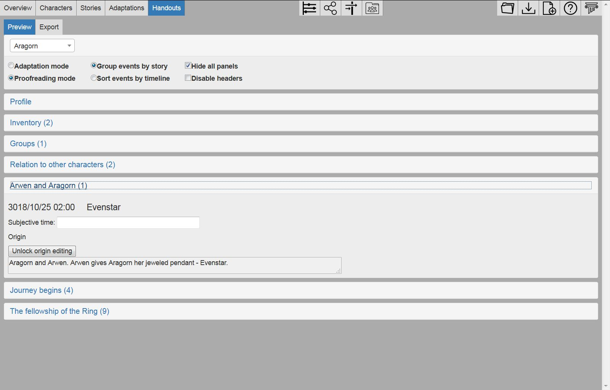

	Subtab Preview, Events in proofreading mode

.. _breifings-export:
	
Handouts. Export
----------------

There are next generic options on **Export** tab. You can print handouts to one file or to separate files. In second case you will receive zip archive with generated handouts. You can export all handouts, range handouts or selected handouts (most flexible but most time-consuming option).

On ``Simple export`` subtab you can see buttons with embedded templates: ``Make handouts, sort events by timeline (docx)``, ``Make handouts, group events by story (docx)``, ``Make text handouts``, ``Make inventory list (docx)``.

.. figure:: images/5_2_1_standardExport.jpg

	Handouts tab. Export-Simple export

When export will be ended you will see a save request (see. pic.). There were bug here. Adding this dialog partially solves of not saving handout problem.

.. figure:: images/5_2_4_extraConfirm.jpg

	Handouts tab. Export-extra dialog question

On ``Advanced export docx`` subtab you need to upload your own docx template to generate handouts. Template may use all export data or only part. You can find template examples in NIMS archive. Template language is very close to Mustache language which is used in text export. See details in :ref:`breifings-templates`.
  
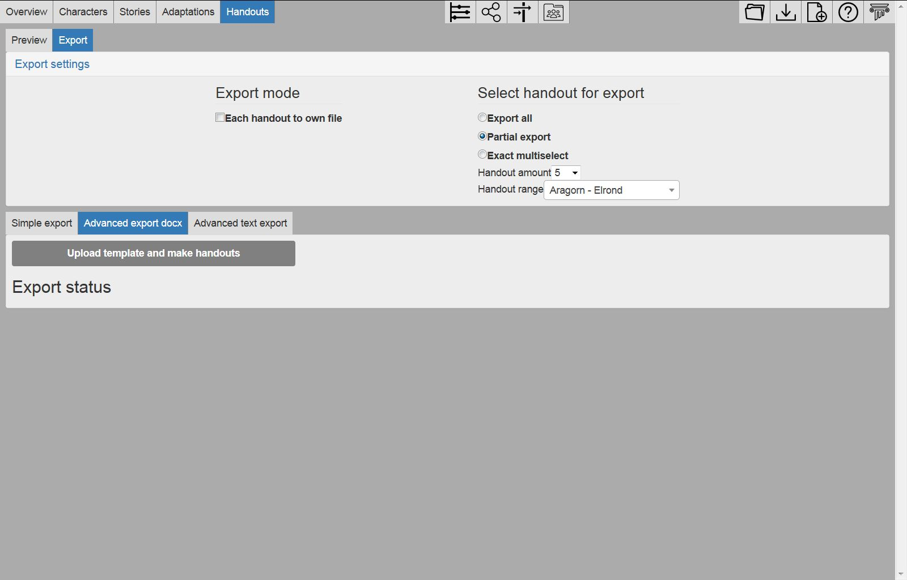

	Handouts tab. Export-Advanced export docx
	
On ``Advanced text export`` subtab you can work with template in interactive mode. On the left side you need to type template. On the right side you will see generated handout. Embedded text template includes almost all possible data for export. It is used Mustache template engine in text generation. Button ``Preview`` generates handout in right panel. Button ``Export`` generates text files by template.

Also you can make some experiments with text templates and then transform it to docx templates. Button ``Convert to docx template`` transforms text template to docx template. Button ``Generate to docx by current template`` transforms text template to docx template and applies it to real data. Resulted docx has poor formatting but it is useful for template checking.

Also you can specify any necessary text file extension (txt, tex, html, etc.).

.. warning:: Template text is not saved in NIMS. If switch to other tab and came back your template will be replaced by embedded one.
  
.. figure:: images/5_2_3_customTxt.jpg

	Handouts tab. Export-Advanced text export
	
.. _timeline-desc:

Timeline
--------

You can see events timeline on this tab. On the left side - story multi selector. There is a timeline in the center. Timeline scale is changes by mouse wheel. Red events are pregame start and end dates.

Story selector width can be changed with right bottom corner.

.. note:: Earlier it was possible to move events on timeline. This function was disabled by users request to avoid accidentally events moving.

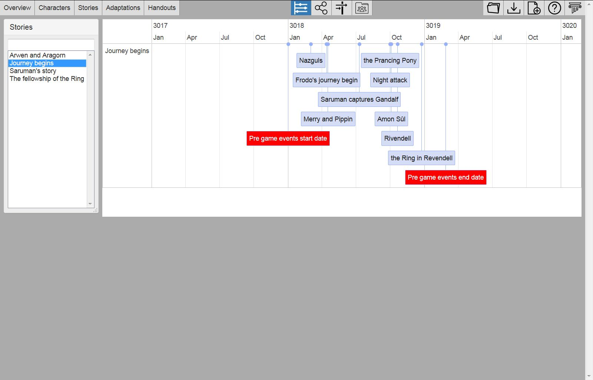

	Timeline tab
	
.. _social-network-desc:

Social Network
--------------

On this tab you can draw several types of social networks based on game data (see :ref:`concepts-social-network`). You need to specify common and private settings of social network and press button ``Draw``.

.. warning::  Social network rendering requires many computer resources. It is recommended to save database before rendering. 

``Focus node`` selector will be filled when social network will be drawn. You need to select any node from selector to center social network on this node.

Common settings
^^^^^^^^^^^^^^^

You can color character network nodes by profile items of **single choice** and **checkbox** types. You can select any profile item of these types. There will be color legend under profile item selector.

Social networks has three types of selection:

1. Everything.

2. Selected characters. In this mode you will see characters multi selector. Only selected characters will be drawn on network, stories of these characters and event counter characters. Note: for character-participation-story network not all edges show real meetings with other characters.

3. Selected stories. In this mode you will see stories multi selector. In this case you will see all selected stories and all characters from these stories.

Private settings
^^^^^^^^^^^^^^^^

You can select necessary social network type. See :ref:`concepts-social-network` for details.

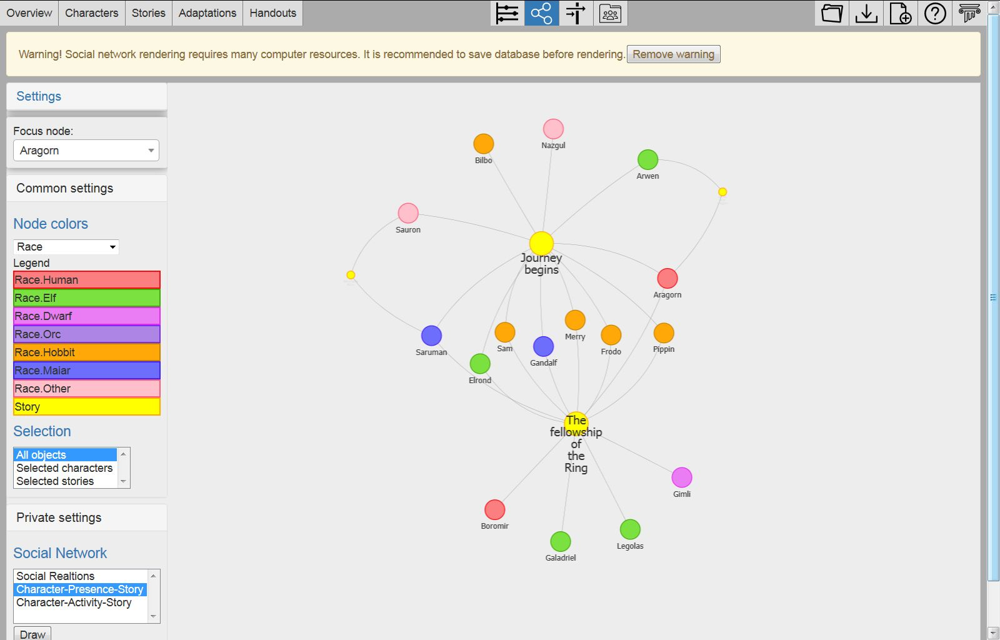

	Tab Social Network
	
.. _characters-filter:
	
Character filter
----------------

There are 4 panels on this tab:

	#. ``Groups`` - group management and saving filter to group.
	
	#. ``Show profile item`` - profile item list to show.
	
	#. ``Filter`` - filter settings.
	
	#. ``Data table`` (center of screen) - filtering result.
	
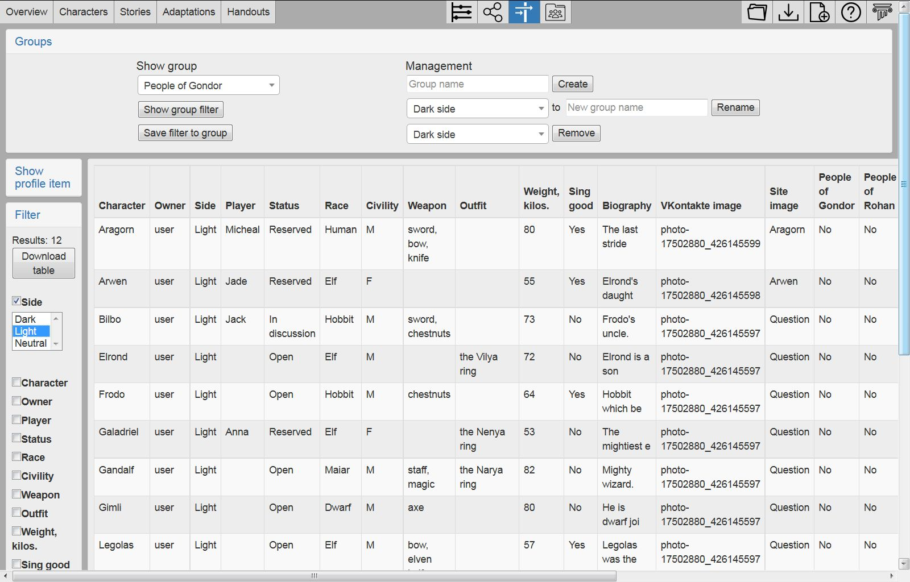

	Tab Character filter

``Groups`` panel described in :ref:`groups-desc` because this is a group specific panel.

``Show profile item`` panel enumerates all data columns in filter results. You can exclude any column from filter results except character name. There are two types of columns: profile data and statistic data. Profile data is taken from character profiles.

There are next statistics data supported:

	``Active``, ``Follower``, ``Defensive``, ``Passive`` - number of stories in which character has specific type of activity.
	
	``Adaptation completeness, %`` - percent of completed adaptations for this character.
	
	``Story number`` - number of character stories.

.. figure:: images/2_2_2_selectedColumns.jpg

	Panel ``Show profile item``
	
``Filter`` panel is used to make filter condition. In the first string you will number of characters which passes filter condition. You can download filter result in CSV by pressing button ``Download table``. CSV is supported by Excel and LibreOffice.

Next is a condition builder. Condition is builded with next steps:

	Step 1. Check all filter items which you want to filter. All these items will be moved up and you will see restriction controls.
	
	Step 2. Make restrictions for filter items. See details about data types in :ref:`characters-profile-editor`. Strings and texts are filtered by substring. Single choices are filtered by selected values. Checkboxes are filtered like single choices with yes/no values. Number filter requires number and condition: ignore, greater, equal, lesser.
	
	Step 3. If you want to disable some filter items just uncheck these filter items. Such filter items will go back to ignored items list. 
	
	Step 4. If check filter item again it will be back in filtered items list with old condition.
	
All steps are drawn in picture.

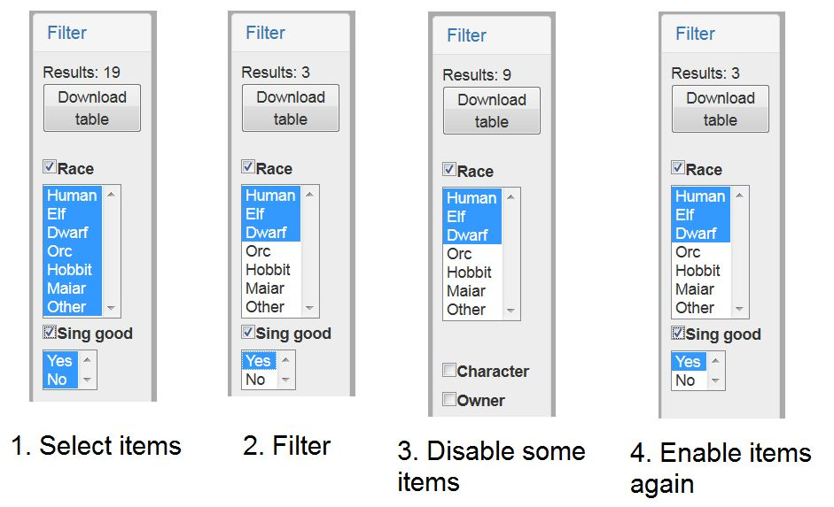

	Panel ``Filter``

Filtering result update happens immediately after filter change. You can resize filter panel with right bottom corner triangle.

``Data table`` panel shows filtering result. You can sort result by any column with clicking on column header.

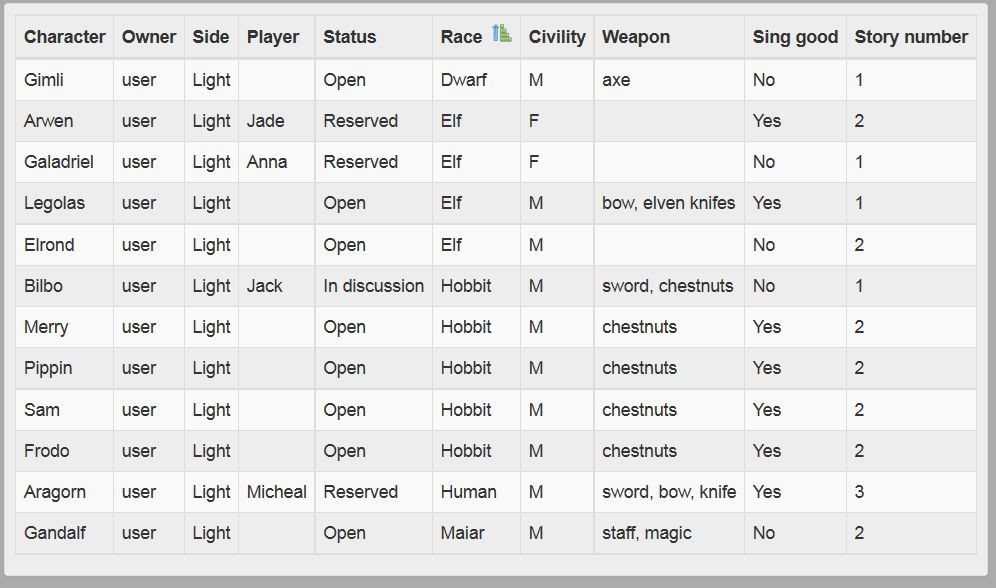

	Panel ``Data table``
	
.. _groups-desc:
  
Groups
------

Many LARP games services have support of character groups. In most cases you need to create group and then manually add all necessary characters to this group. We choose other way. Why we need to do anything manually if we have character profile? We make filter by profile and save this filter as group condition. So now if you set checkbox Templar in character profile this character will be in Templar's group automatically.

More group details. Group consists of two part: group filter and group profile.

Group filter
^^^^^^^^^^^^

Group filter is a condition for characters. Only those characters will be in group which satisfy condition. Group filter is a saved character filter.

You can see ``Group`` panel from ``Character filter`` tab. On the right side there are standard group management actions: create/rename/remove. Group filter is empty on group creation. This means that there are no filter at all and all characters satisfy filter condition. On the left side you can select one of existing group and make two actions. By pressing ``Show group filter`` you will get group filter and show it as character filter. By pressing ``Save filter to group`` you will save current character filter as group member condition.

If you create new character and his profile satisfies some group he will be included in this group automatically. If you change his profile so he doesn't satisfy group condition he will be automatically excluded from group.

	Tab Character Filter with group panel

Group profile
^^^^^^^^^^^^^

This subtab contains information about group profile. Group profile works the same way character profile. You select group in the left list and group profile in the screen center. Group profile data is fixed and consist of:

	``Filter`` - shows filter condition of this group.
	
	``Character list`` - shows group members list.
	
	``Master description`` - master notes about group.
	
	``Print in handouts`` - switch if it is necessary to print this group in handout. You may have inner non printable groups of characters.
	
	``Text for character`` - group text for handout.

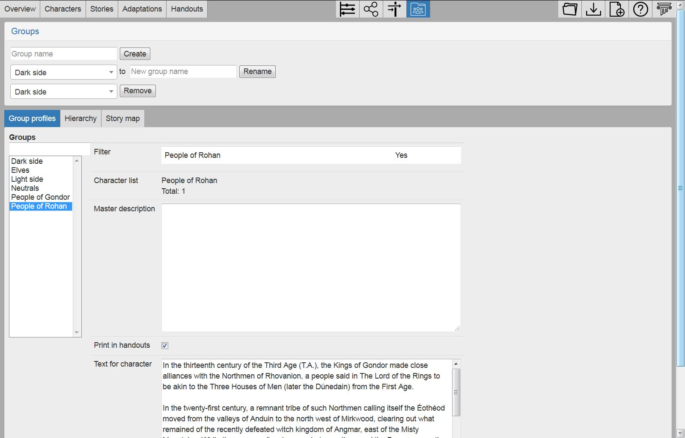

	Subtab Group profile
	
Hierarchy
^^^^^^^^^

Groups may be subgroups and supergroups to each other. These relation are shown on this schema. Group hierarchy is built automatically. For example: "Griffindor 3rd year course" is a subgroup of "Griffindor" and a subgroup of "3rd year course". And "Hogwarts" group is a super group for "Griffindor" and "3rd year course". 

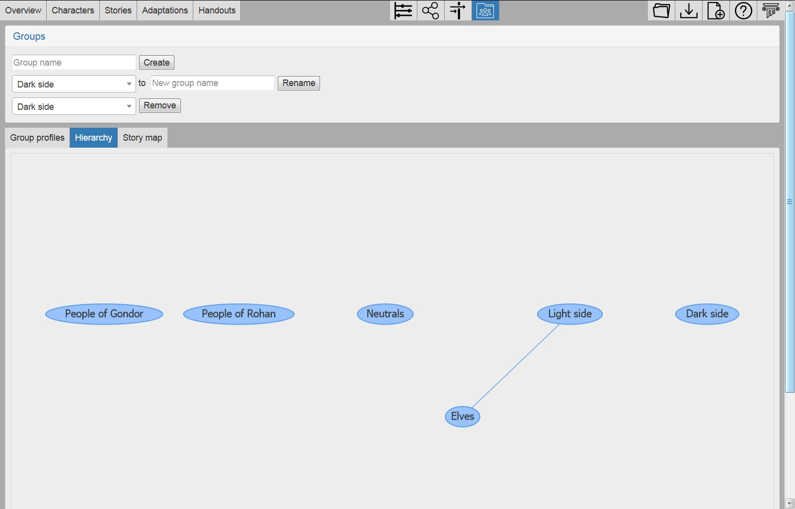

	Subtab Hierarchy
	
.. _investigation-board:
	
Story map
^^^^^^^^^

Story map is a tool for drawing conflicts and interests of active game groups. **You build story map manually. This process can't be automated.** See story map concept in :ref:`concepts-investigation-board`. Story map workflow:

	1. Create group. Groups may be empty.
	
	2. Add groups to story map.
	
	3. Add resource to story map.
	
	4. Add relations between groups and resources.
	
You can add notes to group with strengths/weaknesses or anything significant.

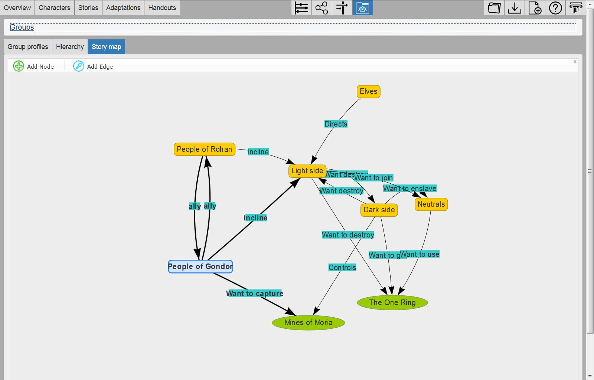

	Subtab Story map
  
.. _administrative-tools:
  
Administrative tools
--------------------

You make multi user management on this tab. See details in :ref:`concepts-server-mode`. ``Users management`` is used for create/change password/remove user actions. On ``Special actions`` panel you can pass administrator role to other user, assign/retire editor and switch adaptation right inheritance mode. On ``Editing rights`` panel you can see all entities and their owners. There is full entities list on the left side. In center there are available entities list and user list. If you select some entities and user and press button ``Assign rights`` you will assign right for these entities to user. Administrator can assign any entities to any user.

.. figure:: images/8_adminTools.jpg

	Tab Administrative tools
	
.. _logs:
  
Logs
----

There are several defensive tools in NIMS and one of them is Logs. In logs you can story of the last user actions. Currently it is the last thousand of operations. This number may changes in future. Logged actions list: save/load base, game meta info updates (excluding description), entities management, profile management, events management, inventory and activity changes, completness marks and export. In multi user mode there are added actions for user management, assigning/take away entity rights, settings change. The basic principle - we don't log text changes but we log base structure changes.

Log entry consist of next fields:

	1. ``№`` - entry number in log list.
	2. ``Date`` - action time. In server there will be server time.
	3. ``User`` - user which make action. User can be absent. For example base autosave action has no user.
	4. ``Action`` - action type.
	5. ``Parameters`` - action arguments. Action can be reproduced with arguments so it is possible to see user actions sequence.
	
.. figure:: images/9_1_log.jpg

	Tab Logs
  