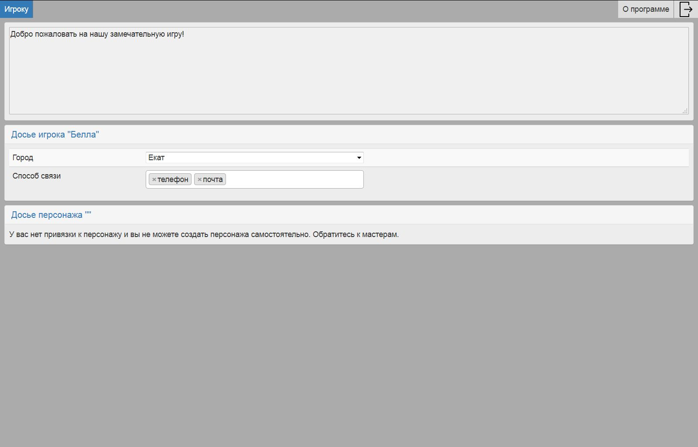
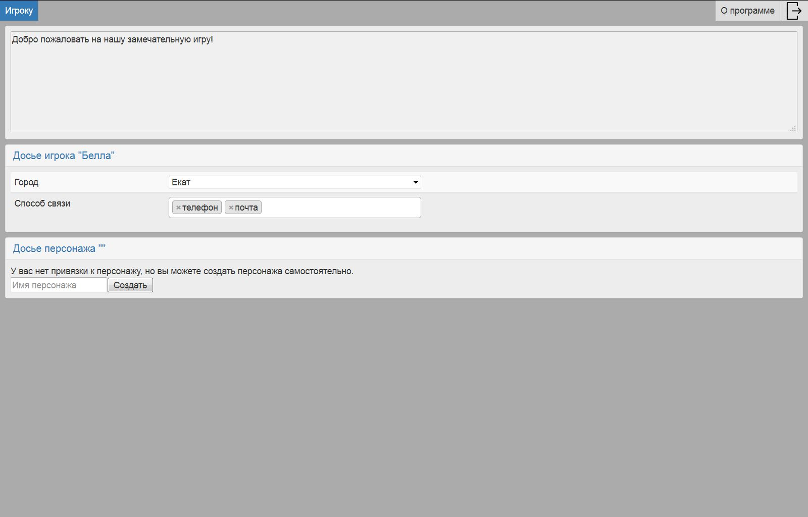

Страница игрока
===============

Это единственная страница, доступная игроку. Вверху страницы находится приветственный текст от мастеров. Далее находится досье игрока и досье персонажа (которое может отсутствовать). Досье персонажа показывается только если персонаж ассоциирован с игроком. У каждого поля в досье есть свой тип доступа игрока: изменение, только чтение, скрыт. Соответственно игрок может менять те части досье, которые открыты для изменения, читать то, что только на чтение. Скрытую часть досье игрок не видит.

Если мастера запретили создавать персонажей игрокам, то игрок без персонажа увидит следующий скрин:

	Игрок залогинился, у него нет персонажа и он не может его создать
	
Если мастера разрешили создавать персонажей игрокам, то игрок увидит поле ввода имени персонажа:
	

	Игрок залогинился, у него нет персонажа и он может его создать
	
Вот что увидит игрок, если персонаж ассоциирован с игроком:
	
.. figure:: images/13_3_player-with-char.jpg

	Игрок залогинился, у него есть персонаж
	
	
	
