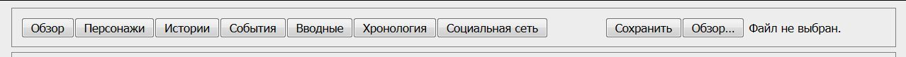
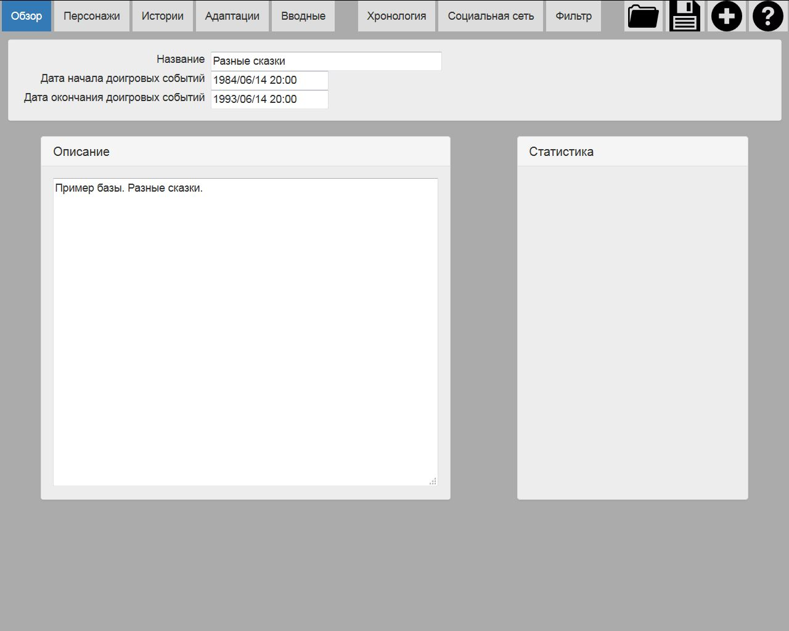
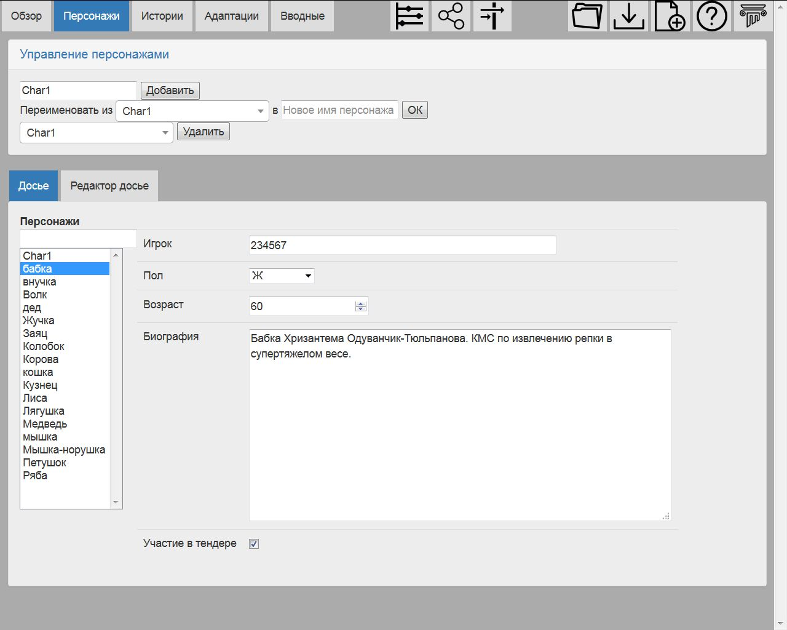
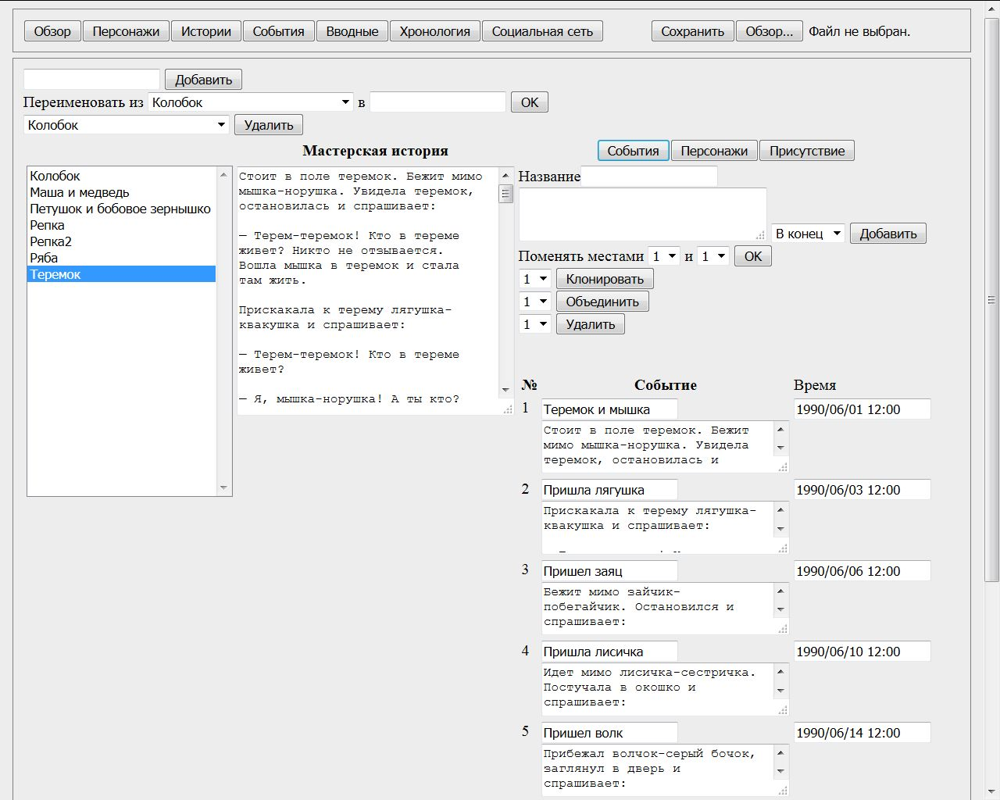
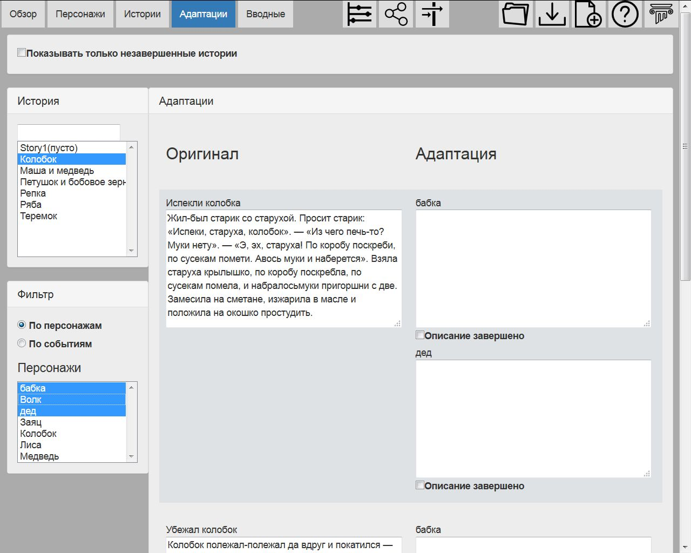
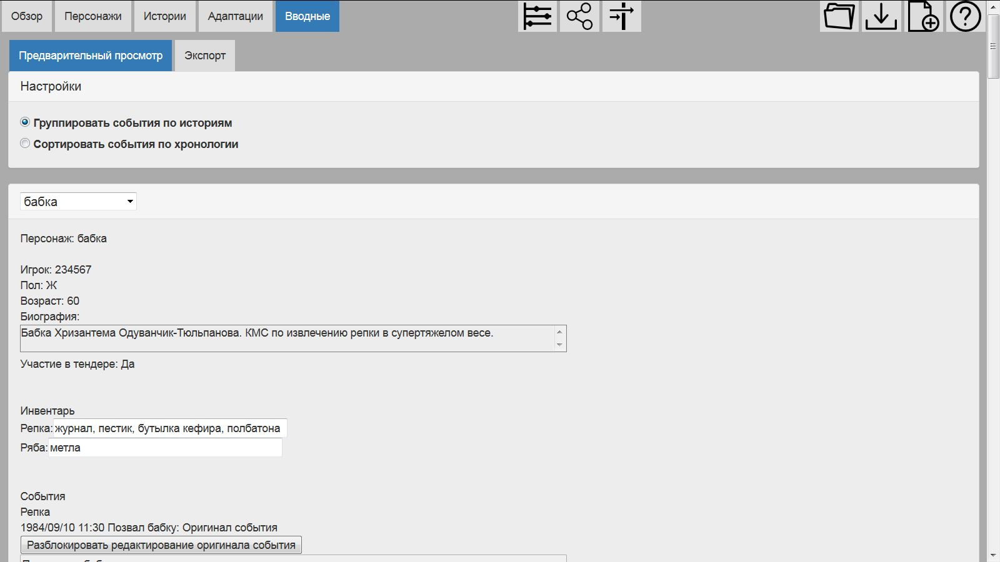
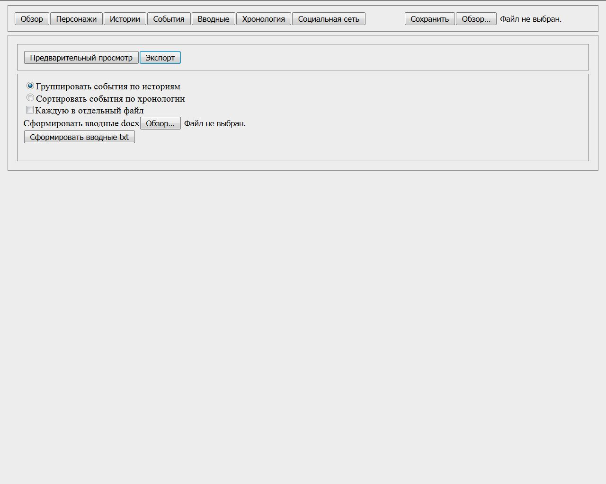
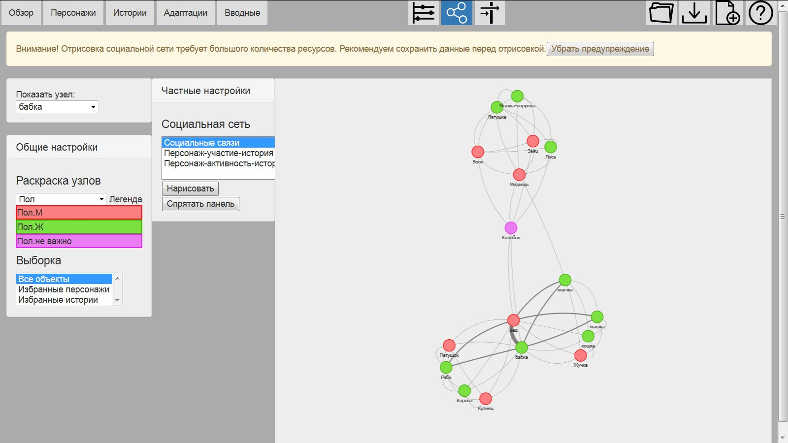
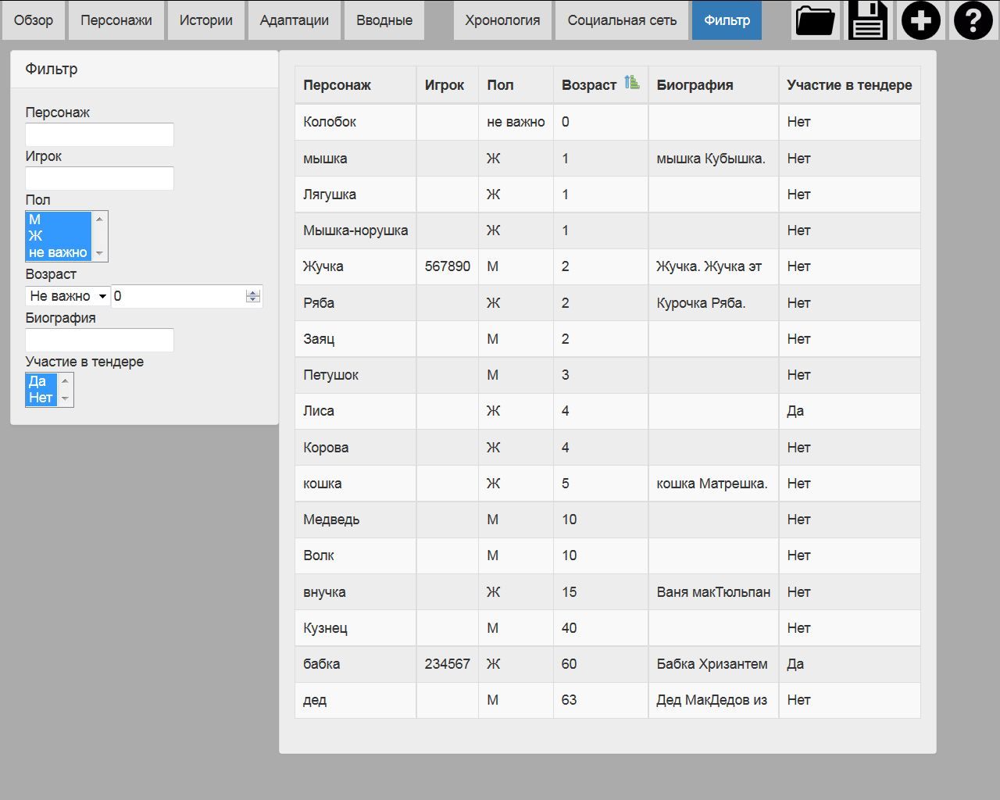

Страницы
========

.. _header-desc:

Заголовок
---------

Вверху страницы находятся основная навигация и кнопки для работы с базой. 

Основные вкладки 

	**Обзор** - общая информация об игре и немного статистики.

	**Персонажи** - управление персонажами и досье.

	**Истории** - заполнение историй: создание событий, перечень персонажей с указанием инвентаря и активности, ассоциация персонажей и событий

	**Адаптации** - детализация видения событий для каждого персонажа.
	
	**Вводные** - предварительный просмотр и экспорт вводных.
	
Вкладки просмотра данных

	**Хронология** - просмотр хронологии событий, уточнение времени событий.

	**Социальная сеть** - просмотр графа социальных взаимодействий.
	
	**Фильтр** - поиск персонажей по досье.
	
Управление базой

	**Загрузить** - загрузка базы из файла.

	**Сохранить** - сохранение базы в файл.
	
	**Новая база** - создание новой базы.
	
	**Помощь** - открывает справку в новой вкладке.
	

	Заголовок

.. _overview-desc:
	
Обзор
-----

Это первая страница, открывающаяся при старте НИМС. 

Содержание страницы

	``Название`` - здесь указывается название игры.
	
	``Дата начала доигровых событий`` - дата начала доигровых событий. 
	
	``Дата окончания доигровых событий`` - дата начала игры в мире игры. Между этими двумя датами будут происходить доигровые *события*. Эти даты необходимы для выставления границ хронологии. Можно выставлять даты событий и вне указанного временного промежутка. Введенные значения играют вспомогательную роль. Если у события не указано время, то оно по умолчанию заменяется игровой датой.
		
	``Описание`` - текст с описанием игры. Ни на что не влияет, но мы решили, что он тут должен быть) При желании мастера могут вести тут какие-то общие заметки для себя.
	
	``Статистика`` - здесь будут выводится общие данные об открытой базе: количество историй, количество персонажей и т.д.

	
	Вкладка Обзор
	
.. _characters-desc:

Персонажи
---------

На странице Персонажи есть общая часть и две дополнительных вкладки: досье и редактор досье.

Общая часть включает в себя элементы для создания/переименование/удаления персонажей в верхней части вкладки.

	Вкладка Персонажи

.. _characters-profile:
	
Персонажи. Досье
----------------

На вкладке Досье происходит заполнение досье персонажа. В левой части экрана выбирается персонаж. По центру показано досье. Внесенные в досье изменения сохраняются автоматически. Подробнее про типы данных в досье можно прочитать в описании Редактора досье.

	Вкладка Персонажи. Досье

.. _characters-profile-editor:
	
Персонажи. Редактор досье
-------------------------

На вкладке Редактор досье выполняется редактирование досье персонажей: добавление/изменение/удаление полей в досье. В верхней части вкладки находятся элементы управления для создания полей, перестановки полей и удаления полей. Имена полей должны быть уникальны. Все текущие поля показаны в таблице: название, тип и значения. То, что указано в поле ``Значения`` является значением по умолчанию для всех полей, кроме единственного выбора. В единственном выборе значением по умолчанию является первый элемент.

Типы полей:

	``Текст`` - поле для хранения текстовых данных. Пример: биография персонажа.

	``Строка`` - поле хранит одну строку. Пример: вероисповедание

	``Единственный выбор`` - поле содержащее перечисление значений из которых может быть выбрано только одно. Значения единственного выбора указываются через запятую. Первое значение является значением по умолчанию. Пример: пол ж, м, не важно

	``Число`` - числовое значение. Пример: возраст персонажа

	``Галочка`` - поле хранит значение да/нет.

.. figure:: images/2_3_characterPrfileConfigurer.jpg

	Вкладка Персонажи. Редактор досье
	
.. _story-desc:

Истории
-------

На странице Истории осуществляется заполнение мастерских версий историй. В общую часть входят следующие элементы: создание/переименование/удаление историй, заполнение мастерской версии истории. Заполнять мастерскую версию не обязательно, но по нашему опыту бывает полезно иметь всю историю перед глазами. Поле для мастерской истории прячется/показывается при нажатии на кнопку ``Мастерская история`` для экономии места для других вкладок. Во всех последующих рисунках мастерская история спрятана.

В левой части экрана расположен элемент для выбора текущей истории.

.. figure:: images/3_0_masterStory.jpg

	Вкладка Истории
	
.. _story-events:

Истории. События
----------------

На вкладке события выполняется разбиение истории на события. У каждого события есть следующие атрибуты: название (не уникально), текст, позиция и время. Кроме обычных операций создания/удаления/перестановки событий добавлены операции клонирования и объединения событий. Клонирование создает полную копию события с созданием копии текстов адаптаций (см. раздел :ref:`events-desc`). Объединение событий соединяет два подряд идущих события в одно. Объединяется все: название, описание и адаптации.

В таблице события приведены в том порядке, в котором их укажет мастер, а не в хронологическом порядке. Переименование и обновление текста событий сохраняется при завершении редактирования, то есть немедленно. Справа указано точное время наступления события. Если поле подсвечено красным, значит используется значение по умолчанию - время окончания доигровых событий.

	Вкладка События
	
.. _story-characters:

Истории. Персонажи
------------------

На вкладке Персонажи выполняется добавление/удаление/замещение персонажей в истории. При замещении все данные от старого персонажа переходят к новому. Так что да, Ромео не приехал, его место займет Меркуцио)

Здесь же приведено две таблицы. Первая таблица указывает вид активности персонажа в истории. Описание видов активности приведено в разделе :ref:`secondary-entities-desc`.

.. figure:: images/3_2_storyCharacters.jpg

	Вкладка Истории. Персонажи

.. _story-presence:
	
Истории. Присутствие
--------------------

На этой вкладке определяется участие персонажей в тех или иных событиях. В таблице в первом столбце перечислены названия событий. В заголовке имена персонажей истории. Отметьте галочками пересечение персонажа и события, если персонаж принял в них участие. Снятие галочки приводит к удалению уже существующих адаптаций событий (см. раздел :ref:`events-desc`). На всякий случай в этом месте всегда выскакивает напоминалка.

.. figure:: images/3_3_eventPresence.jpg

	Вкладка Истории. Присутствие
	
.. _events-desc:

Адаптации
-------

У каждого персонажа может быть свое видение происходящих событий, поэтому для событий необходимо сделать адаптацию как это событие выглядело с точки зрения того или иного персонажа.

Слева сверху расположен селектор истории (единственный выбор). Слева снизу расположен селектор персонажей (множественный выбор через ctrl). По центру отображаются таблица из двух столбцов. В левом столбце выводится оригинальное описание события, которое можно редактировать. В правом столбце выводятся текстовые поля с описанием события для каждого выбранного персонажа - текст адаптации. Таким образом в один момент времени можно работать, как с адаптацией одного персонажа, так и с несколькими персонажами одновременно. Под текстом адаптации выводится галочка - отметка о завершении работы над адаптацией. Сверху расположена галочка-фильтр завершенных историй. История считается завершенной, если проставлены галочки о завершении всех адаптаций. 

	Вкладка События
	
.. _breifings-preview:

Вводные. Предварительный просмотр
---------------------------------

Прежде чем экспортировать вводные, можно посмотреть какая информация будет выведена, используя вкладку предварительного просмотра. При предварительном просмотре необходимо указать тип отображения событий: в хронологическом порядке или сгруппированными по историям. Под этим выбором находится селектор персонажа. Инвентарь и адаптации событий можно редактировать из режима предварительного просмотра. Обращаю ваше внимание - в заголовке события указывается ключевое поле ``История`` или ``Персонаж``. Если это ``История``, значит для персонажа не была написана адаптация текста события и он увидит его как есть. Редактирование такого поля является редактированием текста события. Если в заголовке указано ``Персонаж``, значит вы редактируете адаптацию события.

	Вкладка Вводные. Предварительный просмотр

.. _breifings-export:
	
Вводные. Экспорт
----------------

На вкладке экспорта доступны следующие опции. Вводные можно выводить одним файлом, либо каждую в отдельный файл. Во втором случае вводные будут выгружены в zip архиве. В разделе Простая выгрузка перечислены несколько встроенных шаблонов: ``выгрузка в docx c событиями по хронологии``, ``выгрузка в docx c событиями по историям``, ``выгрузка таблицы с инвентарем`` и ``выгрузка в текстовый файл``.

В разделе продвинутой выгрузки необходимо указать тип используемого шаблона и загрузить свой собственный шаблон. Шаблон может включать в себя как все данные, так и только часть из них. Примеры шаблонов распространяются вместе с НИМС.

	Вкладка Вводные. Экспорт
	
.. _timeline-desc:

Хронология
----------

На этой вкладке отображается хронология событий. Слева находится селектор событий. Чтобы сделать множественный выбор зажмите ctrl и выбирайте элементы в списке. Масштаб хронологии изменяется с помощью колесика мыши. Красным отмечено время начала и завершения доигровых событий. События можно перетаскивать по хронологии. Для этого нажмите ЛКМ на событии и тащите его в нужную сторону. При этом следует учитывать, что от этих перемещений время событий в историях меняется автоматически.

.. figure:: images/6_timeline.jpg

	Вкладка Хронология
	
.. _social-network-desc:

Социальная сеть
---------------

На этой вкладке отрисовываются социальные сети на основе имеющихся данных. Поддерживаются несколько типов отрисовываемых сетей с разными видами узлов и связей между ними (см. далее типы графов). Отрисовка социальной сети требует большого количества ресурсов, поэтому перед ее использованием рекомендуется сохранить текущее состояние базы. Для отрисовки необходимо указать общие и частные параметры социальной сети и нажать кнопку ``Нарисовать``.

Общие параметры

Раскраска узлов выполняется на основе полей досье c типом **единственный выбор** и **галочка**. Вы можете выбрать любое из этих полей, а ниже будет приведена цветовая расшифровка.
Так же возможно три вида выборки.

1. Все данные. Будут отрисованы все данные.

2. Избранные персонажи. В этом случае появится список персонажей. Можно выбрать нескольких персонажей с помощью ctrl. В этом случае будут отрисованы выбранные персонажи, все истории, в которых задействованы эти персонажи и все остальные персонажи, пересекающиеся в событиях с избранными. Примечание: при отрисовке графа человек-история не все связи отображают реальные связи персонажей по событиям.

3. Избранные истории. В этом случае появится список историй. Можно выбрать несколько историй с помощью ctrl. В этом случае будут отрисованы все истории и все персонажи, входящие в истории.

Частной настройкой является тип отрисовываемого графа. Поддерживаются следующие типы.

1. Детальная сеть - сеть связей между персонажами. Узлы: персонажи. Связь между узлами: совместное участие персонажей в некотором событии. Чем толще связь, тем в больших историях эти персонажи пересекаются. При наведении на связь выводится список историй, в которых пересекаются эти персонажи.

2. Человек-история - сеть связей персонажей и историй. Узлы: персонажи и истории. Связь между узлами: участие персонажа в истории. Размер истории пропорционален числу участников истории.

3. Человек-история 2 - сеть связей персонажей и историй на основе данных об активности. Узлы: персонажи и истории. Связь между узлами: активность персонажа в истории. См. раздел с описанием активностей. Можно выбирать несколько требуемых активностей через ctrl.

	Вкладка Социальная сеть
	
.. _characters-filter:
	
Фильтр
------

На вкладке Фильтр выполняется выборка из персонажей по досье. Подробнее про типы данных в досье можно прочитать в разделе :ref:`characters-profile-editor`. Фильтрация строк и текстов происходит по наличию искомой строки в строке или тексте. Фильтрация по полям с единственным выбором происходит по выбору из предложенного списка значений. Чтобы сделать множественный выбор зажмите ctrl и выбирайте элементы в списке. Фильтрация для значений вида да/нет аналогична фильтрации по полям с единственным выбором. Фильтрация по числовым значениям требует указания числа и вида проверки: не важно, больше, равно, меньше. Обновление результата фильтрации происходит сразу после изменения параметров фильтра. В центральной части выводится результат фильтрации. Клик по заголовку таблицы выполняет сортировку по соответствующему полю + иконка. 

	Вкладка Фильтр
	