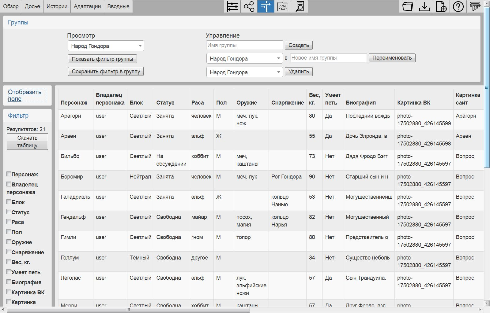
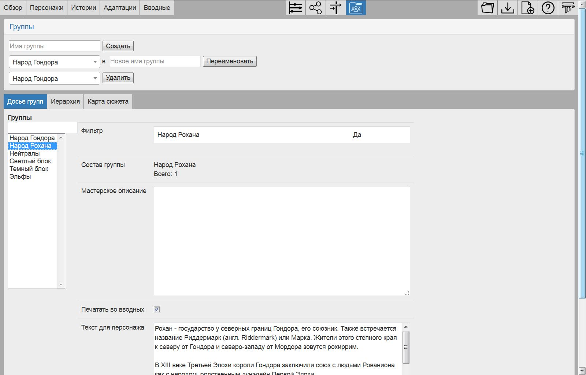
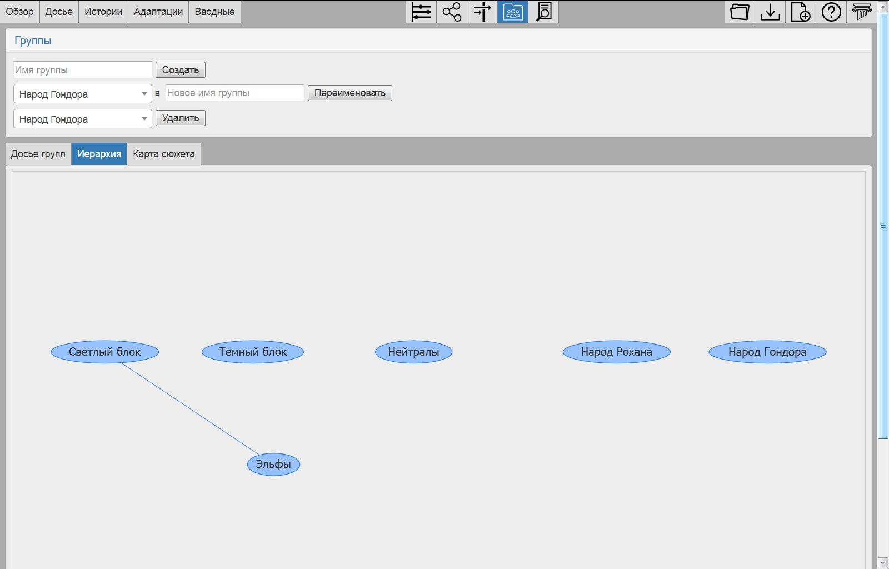
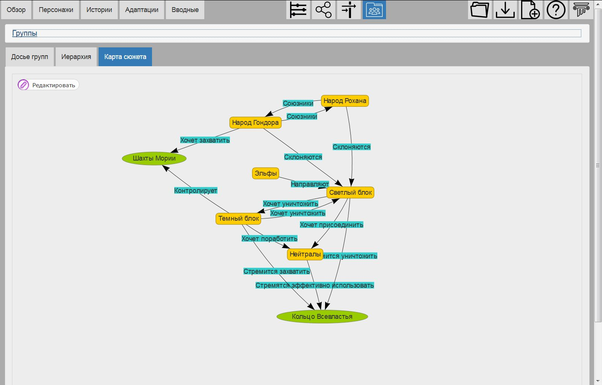
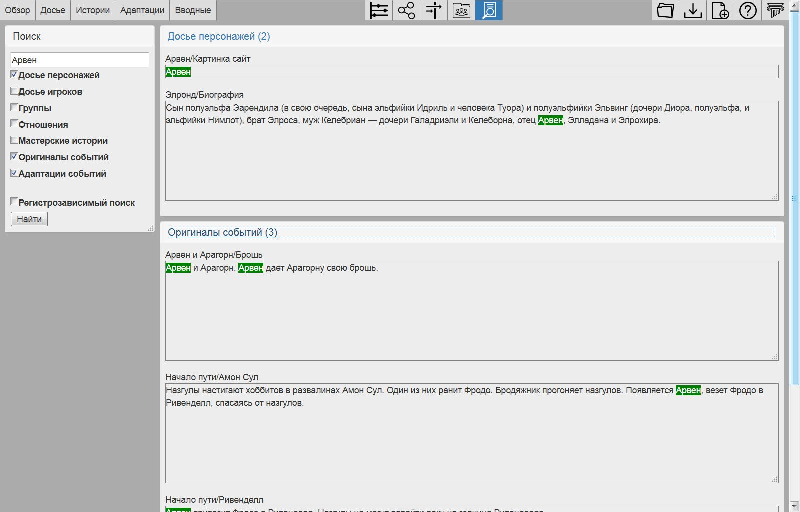
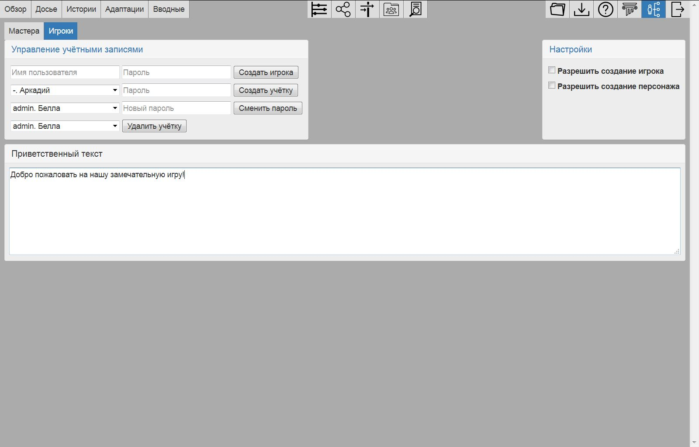

Страница мастера
================

.. _header-desc:

Заголовок
---------

Вверху страницы находятся основная навигация и кнопки для работы с базой. 

Основные вкладки 

	:ref:`overview-desc` - общая информация об игре и статистика.

	:ref:`profile-desc` - управление персонажами и досье. 

	:ref:`story-desc` - заполнение историй: создание событий, перечень персонажей с указанием инвентаря и активности, ассоциация персонажей и событий. 

	:ref:`events-desc` - детализация видения событий для каждого персонажа. 
	
	:ref:`briefings-desc` - предварительный просмотр и экспорт вводных. 
	
Вкладки просмотра данных

	:ref:`timeline-desc` - просмотр хронологии событий, уточнение времени событий. 

	:ref:`social-network-desc` - просмотр графа социальных взаимодействий. 
	
	:ref:`characters-filter` - поиск персонажей по досье и сохранение фильтра как условие попадания персонажа в группу. 
	
	:ref:`groups-desc` - работа с группами, иерархия групп, карта сюжета. 
	
	:ref:`text-search` - поиск по текстам. 
	
Управление базой

	**Загрузить** - загрузка базы из файла.

	**Сохранить** - сохранение базы в файл.
	
	**Новая база** - создание новой базы.
	
	**Помощь** - открывает справку в новой вкладке.
	
	:ref:`administrative-tools` (только в серверной версии) - управление правами на персонажей, истории, группы и адаптации, включение режима редактора. 
	
	:ref:`logs` - информация об авторах программы и история действий пользователей НИМС: создание/переименование/удаление персонажей и историй и т.д. 
	
.. figure:: images/0_header.jpg

	Заголовок

.. _overview-desc:
	
Обзор
-----

Это первая страница, открывающаяся при старте НИМС. 

Содержание страницы

	``Название`` - здесь указывается название игры.
	
	``Дата начала доигровых событий`` - дата начала доигровых событий. 
	
	``Дата окончания доигровых событий`` - дата начала игры в мире игры. Между этими двумя датами будут происходить доигровые *события*. Эти даты необходимы для выставления границ хронологии. Можно выставлять даты событий и вне указанного временного промежутка. Введённые значения играют вспомогательную роль. Если у события не указано время, то оно по умолчанию заменяется датой начала игры.
	
	``Время последнего сохранения базы`` - это время последнего сохранения базы в файл.
		
	``Описание`` - текст с описанием игры. Ни на что не влияет, но мы решили, что он тут должен быть) При желании мастера могут вести тут какие-то общие заметки для себя.
	
	``Статистика`` - общие данные об открытой базе: 
  
		``Количество персонажей/игроков/историй/групп/событий`` 
    
		``Количество пользователей`` - актуально для серверной версии
    
		``Первое и последнее события в базе`` по хронологии 
    
		``Количество знаков в текстах`` - считаются мастерские истории, тексты групп, событий и адаптаций
    
		``Завершённость историй`` - число историй, у которых все адаптации отмечены, как завершённые
		
		``Общая завершенность`` - число адаптаций, отмеченных как завершенные

.. figure:: images/1_1_overview.jpg
	
	Вкладка Обзор. Описание
	
На подвкладке **Диаграммы** приводятся стандартные гистограммы и круговые диаграммы. Число на столбце гистограммы означает высоту столбца. При наведении мышью на столбец приводится детализация: значение и дополнительная информация. Например, на рисунке сообщение "4: Ряба, Маша и медведь", означает, что в историях Ряба и "Маша и медведь" задействовано по 4 персонажа. Над круговыми диаграммами показывается название доли и её размер.

Стандартные диаграммы:

	``Количество событий в историях`` - гистограмма, показывающая сводку по количеству событий в историях.
	
	``Количество персонажей в историях`` - гистограмма, показывающая сводку по количеству персонажей в историях.
	
	``Количество историй у персонажей`` - гистограмма, показывающая сводку по количеству историй у каждого персонажа.
	
	``Детальная завершенность историй`` - гистограмма, показывающая сводку по завершенности историй. Крайне левое значение - ни одна адаптация не завершена. Крайне правое - все адаптации в истории завершены.
	
	``Количество знаков по видам текстов`` - гистограмма, показывающая какую долю в общем количестве символов занимают следующие виды текстов: мастерские истории, оригиналы событий, адаптации событий, группы и отношения.
	
	``Количество знаков у персонажей`` - гистограмма, показывающая сводку по количеству знаков во вводной каждого персонажа. Учитываются только события/адаптации в историях и тексты для групп. Тексты в досье и отношения персонажей не учитываются.
	
	``Принадлежность объектов`` - доли персонажей, игроков, историй и групп принадлежащих пользователям в серверном режиме.
	
	``Персонажи и игроки`` - гистограмма показывающая сколько в базе не сопоставленных персонажей, не сопоставленных игроков и сопоставленных игроков/персонажей.
	
Диаграммы досье строятся автоматически для полей вида число (гистограмма), единственный выбор и галочка (круговая диаграмма). Ширина столбца гистограммы для числовых полей автоматически подстраивается под значимый интервал (первый столбец не обязан начинаться с нуля).
  
.. figure:: images/1_2_diagrams.jpg
	
	Вкладка Обзор. Диаграммы
	
.. _profile-desc:

Досье
-----

На странице **Досье** есть общая часть и три дополнительных вкладки: **Редактор досье**, **Конструктор досье** и **Сопоставление**.

Общая часть включает в себя элементы для создания/переименования/удаления персонажей и игроков в верхней части вкладки.

.. figure:: images/2_1_characterProfile.jpg

	Вкладка Досье

.. _characters-profile:
	
Досье. Редактор досье
---------------------

На вкладке **Редактор досье** происходит заполнение досье персонажа/игрока и просмотр отчёта по персонажу. В заголовке панели находится два выпадающих списка: список персонажей и список игроков. При выборе персонажа/игрока в центральной части отображается досье.  Внесенные в досье изменения сохраняются автоматически. Подробнее про типы данных в досье можно прочитать в описании концепции досье.

В отчёте по персонажу отображаются данные по каждой истории, в которой участвует персонаж: название истории, тип активности, степень завершённости адаптаций, с какими персонажами в истории выбранный персонаж взаимодействует и какой у персонажа инвентарь.

.. figure:: images/2_1_characterProfile.jpg

	Вкладка Персонажи. Досье

.. _characters-profile-editor:
	
Досье. Конструктор досье
------------------------

На вкладке **Конструктор досье** выполняется редактирование досье персонажей: добавление/изменение/удаление полей в досье. В верхней части вкладки находятся элементы управления для создания, перемещения и удаления полей. Имена полей должны быть уникальны. Все текущие поля показаны в таблице: ``Название``, ``Тип``, ``Значения``, ``Печатать во вводных`` и ``Доступ игрока``. То, что указано в поле ``Значения`` является значением по умолчанию для всех полей, кроме единственного выбора. В единственном выборе значением по умолчанию является первый элемент. Поля с установленной галочкой ``Печатать во вводных`` будут выводиться во вводные.

Начиная с версии 0.6.1 сервер НИМС может работать в режиме базы заявок. В этом режиме игроки могут получить доступ к досье персонажа и игрока. Уровень доступа к каждому полю определяется значением в колонке ``Доступ игрока``. Существует три уровня доступа: ``Изменение``, ``Только чтение``, ``Скрыто``. По умолчанию все поля от игрока скрываются.

.. figure:: images/2_3_characterProfileConfigurer.jpg

	Вкладка Персонажи. Конструктор досье
	
.. _characters-profile-binding:

Досье. Сопоставление
--------------------

На вкладке **Сопоставление** выполняется сопоставление персонажа и игрока. Первый слева список - список персонажей. Второй - список игроков. Третий - список сопоставлений. Чтобы сопоставить игрока с персонажем выберите персонажа из первого списка, игрока из второго списка и нажмите кнопку ``Сопоставить``. Чтобы разъединить сопоставление персонажа и игрока выберите сопоставление и нажмите кнопку ``Разъединить``.

.. figure:: images/2_4_characterMapping.jpg

	Вкладка Персонажи. Сопоставление
	
.. _story-desc:

Истории
-------

На странице **Истории** осуществляется заполнение информации об историях. В правой верхней части экрана находится панель управления историями: создание/переименование/удаление историй. В левой верхней части экрана расположена панель выбора текущей истории для просмотра. Заполнение мастерской информации выполняется на соответствующих подвкладках:

	**Мастерская история** - текст истории в самом общем виде. Заполнять мастерскую историю не обязательно, но по нашему опыту бывает полезно иметь всю историю перед глазами.
	
	:ref:`story-events` - описания событий истории. Описание состоит из названия события, описания события (этот текст мы так же называем **оригиналом события** в противоположность **адаптации**) и времени наступления события.
	
	:ref:`story-characters` - перечисление персонажей, участвующих в истории, их инвентарей, связанных с этой историей и вид активности персонажа (см. :ref:`concepts-character-activity`).
	
	:ref:`story-presence` - здесь отмечается факт присутствия каждого персонажа истории в событиях.

При работе на вкладке **Истории** можно включить режим работы с одной или с двумя подвкладками. Можно выбрать любую комбинацию подвкладок. Чтобы спрятать подвкладку кликните на активный заголовок. На данном рисунке активны две панели. Далее будут скриншоты и для однопанельного режима.

.. figure:: images/3_1_masterStory.jpg

	Вкладка Истории
	
.. _story-events:

Истории. События
----------------

На вкладке **События** выполняется разбиение истории на события. У каждого события есть следующие атрибуты: название (не уникально), текст, позиция и время. Кроме обычных операций создания/удаления/перемещения событий добавлены операции клонирования и объединения событий. Клонирование создает полную копию события с созданием копии текстов адаптаций (см. раздел :ref:`events-desc`). Объединение событий соединяет два подряд идущих события в одно. Объединяется все: название, описание и адаптации.

В таблице события приведены в том порядке, в котором их укажет мастер, а не в хронологическом порядке. Переименование и обновление текста событий сохраняется при завершении редактирования, то есть немедленно. Справа указано точное время наступления события. Если поле подсвечено красным, значит используется значение по умолчанию - время окончания доигровых событий.

.. figure:: images/3_2_storyEvents.jpg

	Вкладка Истории. События
	
.. _story-characters:

Истории. Персонажи
------------------

На вкладке **Персонажи** выполняется добавление/удаление/замещение персонажей в истории. При замещении все данные от старого персонажа переходят к новому. Так что да, Ромео не приехал, его место займет Меркуцио)

Здесь же приведено две таблицы. В первой таблице заполняется инвентарь персонажа, связанный с этой историей. Например, Фродо получает Кольцо Всевластья в истории начало пути и мы делаем отметку в таблице инвентаря, что на начало игры кольцо будет у Фродо. Вторая таблица указывает вид активности персонажа в истории. Описание видов активности приведено в разделе :ref:`concepts-character-activity`.

.. figure:: images/3_3_storyCharacters.jpg

	Вкладка Истории. Персонажи

.. _story-presence:
	
Истории. Присутствие
--------------------

На этой вкладке определяется участие персонажей в тех или иных событиях. В таблице в первом столбце перечислены названия событий. В заголовке имена персонажей истории. Отметьте галочкой пересечение персонажа и события, если персонаж принял в нём участие. Снятие галочки приводит к удалению уже существующих адаптаций событий (см. раздел :ref:`events-desc`). На всякий случай в этом месте всегда выскакивает напоминалка.

Слева находится список-фильтр персонажей. С его помощью мы указываем каких персонажей мы хотим видеть в таблице справа (множественный выбор через ctrl/shift). Это сделано для работы с историями с большим количеством персонажей.

.. figure:: images/3_4_eventPresence.jpg

	Вкладка Истории. Присутствие
	
.. _events-desc:

Адаптации
---------

У каждого персонажа может быть свое видение происходящих событий, поэтому для событий необходимо сделать адаптацию как это событие выглядело с точки зрения того или иного персонажа.

Слева сверху расположен селектор истории (единственный выбор). Слева снизу расположен переключатель фильтра - по персонажам и по событиям (множественный выбор через ctrl/shift). По центру отображаются таблица из двух столбцов. В левом столбце выводится оригинальное описание события, которое можно редактировать. В правом столбце выводятся текстовые поля с описанием события для каждого выбранного персонажа - текст адаптации. Таким образом в один момент времени можно работать, как с адаптацией одного персонажа, так и с несколькими персонажами одновременно. Под текстом адаптации выводится галочка - отметка о завершении работы над адаптацией. Сверху расположена галочка-фильтр завершенных историй. История считается завершенной, если проставлены галочки о завершении всех адаптаций. 

Оригинал события состоит из названия события, времени события и текста. Адаптация события состоит из имени персонажа, субъективного времени и текста адаптации. Пример субъективного времени: "лет двадцать назад", "третьего дня, с утра" и т.д. Если текст адаптации пуст, то во вводную пойдет текст оригинала. По аналогии если субъективное время не указано, то во вводную пойдёт время события как есть, с точностью до минуты.

Размер левого столбца с селектором истории и фильтрами событий/персонажей можно регулировать с помощью таскаемого уголка (см. скриншот). Вообще, так можно изменять любое окно, имеющее треугольничек в правом нижнем углу.

.. figure:: images/4_events.jpg

	Вкладка Адаптации
	
.. _briefings-desc:

Вводные
-------

На вкладке **Вводные** происходит финальная подготовка вводных к экспорту и сам экспорт. На подвкладке **Предварительный просмотр** выполняется вычитка вводных. На подвкладке **Экспорт** соответственно экспорт. 
	
.. _breifings-preview:

Вводные. Предварительный просмотр
---------------------------------

Прежде чем экспортировать вводные, можно посмотреть какая информация будет выведена, используя вкладку предварительного просмотра. В заголовке панели находится селектор персонажа, для которого мы хотим посмотреть вводную. При просмотре вводной доступны следующие опции:

	``Режим адаптации`` и ``Режим вычитки`` - в более ранних версиях НИМС был реализован только режим вычитки, отображавший только тот текст, который пойдёт во вводные. Понаблюдав за пользователями мы пришли к выводу, что в режиме предварительного просмотра иногда необходимо показывать не только выводимый текст события, а оба варианта - и адаптацию и оригинал и оставить возможность для их редактирования. Разница для различных режимов в частных случаях описана ниже.

	``Группировать события по историям`` и ``Сортировать события по хронологии`` - выбор способа представления событий.
	
	``Свернуть все панели`` - в предварительном просмотре вводные персонажа разбиты на панели: инвентарь, досье, группы, отношение к другим персонажам, и в зависимости от способа отображения событий будут показаны панели для историй или группы событий по пять штук. В зависимости от этой галочки все панели будут изначально свёрнуты или развёрнуты.
	
	``Отключить заголовки`` - возможность отключения заголовков в предварительном просмотре. Так как заголовки могут содержать излишнюю информацию, может возникнуть необходимость не выводить их во вводных и вычитка вводных может производиться с учётом этого.
	
.. figure:: images/5_1_1_briefingPreview.jpg

	Вкладка Предварительный просмотр, все панели свёрнуты
	
Панель Досье
^^^^^^^^^^^^

На этой панели выводятся все поля досье персонажа, которые отмечены как выгружаемые в **Конструкторе досье**. Досье доступно только для просмотра. Режимы адаптации и вычитки не влияют на отображение этой панели.

.. figure:: images/5_1_2_profile.jpg

	Вкладка Предварительный просмотр, досье персонажа

Панель Инвентарь
^^^^^^^^^^^^^^^^

На этой панели выводится весь инвентарь персонажа. Число в заголовке панели показывает количество не пустых инвентарей персонажа. Инвентари доступны для редактирования. Режимы адаптации и вычитки не влияют на отображение этой панели. 

.. figure:: images/5_1_3_inventory.jpg

	Вкладка Предварительный просмотр, инвентарь персонажа

Панель Группы
^^^^^^^^^^^^^

На этой панели выводятся все тексты для персонажей из групп, в которых состоит персонаж. Число в заголовке панели показывает количество групп персонажа. Тексты групп доступны только для просмотра. Режимы адаптации и вычитки не влияют на отображение этой панели. 

.. figure:: images/5_1_4_groups.jpg

	Вкладка Предварительный просмотр, группы

Панель Отношение к другим персонажам
^^^^^^^^^^^^^^^^^^^^^^^^^^^^^^^^^^^^

На этой панели заполняется описание отношений между персонажами. Число в заголовке панели означает количество не пустых отношений к другим персонажам. Все персонажи делятся на две группы относительно вычитываемого персонажа: те, с кем он был в одном событии и те, с кем не был. Иными словами всех кто в первой группе персонаж может знать в лицо, а всех остальных не знать. У персонажа может быть отношение к любому другому персонажу. Причём отношения могут быть ассиметричны. Например, все знают и боятся босса мафии, а он знает только своих и ему этого достаточно. 

Часто нужно иметь перед глазами какую-то минимальную информацию о человеке, к которому прописывается отношение. Для этого была добавлена возможность выбора поля досье. Соответствующее поле досье будет отображаться в колонке ``Дополнительно``.

В зависимости от режима редактирования таблица отношений имеет следующие колонки:

	``Имя персонажа`` - имя персонажа к которому мы прописываем отношение.
	
	``Отношение`` - описание отношения.
	
	``Обратное отношение`` - описание обратного отношения. Эта колонка есть в режиме адаптаций и отсутствует в режиме вычитки.
	
	``Дополнительно`` - дополнительная информация о персонаже, к которому мы прописываем отношение. Здесь выводится список историй в которых персонажи встречались и избранное поле досье персонажа, к которому мы прописываем отношение.

Если текст отношения оставить пустым, то считается, что отношения нет. 

.. figure:: images/5_1_5_relations_amode.jpg

	Вкладка Предварительный просмотр, отношение в режиме адаптаций
	
.. figure:: images/5_1_6_relations_pmode.jpg

	Вкладка Предварительный просмотр, отношение в режиме вычитки
	
Панель Событий
^^^^^^^^^^^^^^

На этой панели заполняются тексты событий и субъективное время. Не редактируемые поля: название события, время наступления события. Редактируемые поля: текст оригинала события (после разблокировки), текст адаптации события и субъективное время события. Для разблокировки редактирования оригинала нажмите кнопку ``Разблокировать редактирование оригинала события``. Ранее панель событий работала только в режиме вычитки - показывался только тот текст, который будет выводиться во вводную. В режиме адаптации можно редактировать оба текстовых поля и оригинала и адаптации. Поле текста адаптации в этом случае показывается безусловно, даже если адаптация пуста.

Поле ``Субъективное время`` показывает время события, которое получит персонаж во вводной. Если поле пусто, он увидит время как есть.

.. figure:: images/5_1_7_events_amode.jpg

	Вкладка Предварительный просмотр, события в режиме адаптаций
	
.. figure:: images/5_1_8_events_pmode.jpg

	Вкладка Предварительный просмотр, события в режиме вычитки

.. _breifings-export:
	
Вводные. Экспорт
----------------

На вкладке **Экспорт** доступны следующие опции. Режим выгрузки:

	``Каждую вводную в отдельный файл`` - если проставить эту галочку, то страница сформирует архив файлов с вводными (удобно для рассылки). В противном случае все вводные будут выгружены в один файл (удобно для печати).
	
	``Выводить только готовые истории`` - если проставить эту галочку, то во вводные попадут только те истории, в которых все адаптации отмечены как завершённые.
	
Выбор вводных:

	``Выгрузить все вводные`` - выгрузка всех вводных (может потребовать много времени).
	
	``Выгрузить часть вводных`` - выгрузка вводных блоками по 1, 5, 10, 20, 50 штук.
	
	``Точный мультивыбор`` - точечная выборка вводных для выгрузки (самый гибкий, но и самый трудоёмкий вариант).
	
Выбор историй:

	``Выгрузить все истории`` - выгрузка всех историй.

	``Точный мультивыбор`` - точечная выборка историй для выгрузки.

В разделе **Простая выгрузка** перечислены несколько встроенных шаблонов: ``Сформировать вводные, события сгруппированны по времени (docx)``, ``Сформировать вводные, события сгруппированны по историям (docx)``, ``Сформировать список инвентаря (docx)`` и ``Сформировать вводные txt``.

.. figure:: images/5_2_1_standardExport.jpg

	Вкладка Вводные. Экспорт-Простая выгрузка
	
По готовности выгруженного файла будет выведен дополнительный запрос на сохранение (см. рис.). Ранее возникала ошибка при сохранении файла. После добавления этого диалога проблема исчезла.

.. figure:: images/5_2_4_extraConfirm.jpg

	Вкладка Вводные. Экспорт-дополнительный запрос выгрузки
	
В разделе продвинутой выгрузки необходимо загрузить свой собственный шаблон docx. Примеры шаблонов распространяются вместе с НИМС. Язык шаблона очень похож на язык текстовой выгрузки Mustache. При нажатии на кнопку ``Сформировать вводные`` начинается процесс выгрузки. Можно изменить настройки выгрузки и ``Сформировать вводные`` по ранее загруженному в страницу шаблону. Подробнее см. :ref:`briefings-templates`.
  
.. figure:: images/5_2_2_customDocx.jpg

	Вкладка Вводные. Экспорт-Продвинутая выгрузка docx
	
На странице текстовой выгрузки слева находится поле с шаблоном, справа выводится текст с результатами применения этого шаблона. Шаблон по умолчанию включает все доступные для выгрузки данные о персонажах. При генерации вводной используется шаблонизатор Mustache. Кнопка ``Предварительный просмотр`` сгенерирует текст в правом поле. Выгрузка текстовых файлов осуществляется с помощью кнопки ``Выгрузить``.

Поэкспериментировав с текстовой выгрузкой становится понятно что и как вы хотите вывести. Но нужно было разбираться с текстовыми шаблонами для docx, так как там есть некоторые отличия в механизме шаблонов. Специально для упрощения работы с docx было добавлено 2 кнопки. Кнопка ``Конвертировать в docx шаблон`` преобразует текущий текстовый шаблон в docx шаблон. Далее вы можете открыть полученный файл, настроить внешний вид и применить этот шаблон на странице с продвинутой выгрузкой. Кнопка ``Сгенерировать в docx по текущему шаблону`` преобразует текущий текстовый шаблон в docx шаблон и тут же применяет имеющиеся данные к docx шаблону для получения результата. Полученный таким образом docx файл можно использовать для проверки выгрузки, так как он будет фактически без оформления.

Так же можно указать нужное расширение файла, при формировании текстов (txt, html и др.).

Для совместимости с joinrpg был добавлен механизм выгрузки на основе Markdown (кнопка ``Выгрузка Markdown``). Соответственно до переноса текста на joinrpg вы можете посмотреть на результат обработки Markdown. Используется библиотека CommonMark, совместимая с системой joinrpg.

.. warning:: Текст шаблона не сохраняется в НИМС, если вы уйдете с вкладки и вернетесь обратно, то шаблон будет сброшен.
  
.. figure:: images/5_2_3_customTxt.jpg

	Вкладка Вводные. Экспорт-Продвинутая текстовая выгрузка
	
.. _timeline-desc:

Хронология
----------

На этой вкладке отображается хронология событий. Слева находится селектор историй или персонажей. Вы можете посмотреть хронологию событий в истории либо хронологию приключений выбранного персонажа. Чтобы сделать множественный выбор зажмите ctrl и выбирайте элементы в списке. Масштаб хронологии изменяется с помощью колесика мыши. Красным отмечено время начала и завершения доигровых событий. 

Размер левого столбца с селектором историй можно регулировать с помощью таскаемого уголка (см. скриншот).

.. note:: Возможность перетаскивания событий в версии НИМС 0.4.2 была отключена по просьбе пользователей, чтобы не смещать события случайно.

.. figure:: images/6_timeline.jpg

	Вкладка Хронология
	
.. _social-network-desc:

Социальная сеть
---------------

На этой вкладке отрисовываются социальные сети на основе имеющихся данных. Поддерживаются несколько типов отрисовываемых сетей с разными видами узлов и связей между ними (см. раздел :ref:`concepts-social-network`). Для отрисовки необходимо указать общие и частные параметры социальной сети и нажать кнопку ``Нарисовать``.

.. warning::  Отрисовка социальной сети требует большого количества ресурсов, поэтому перед ее использованием рекомендуется сохранить текущее состояние базы. 

После того как социальная сеть будет нарисована, список ``Показать узел``, расположенный над общими параметрами будет заполнен. В этом списке находятся все узлы текущей социальной сети. Выберите узел из списка, чтобы сеть на нём отцентрировалась.

Общие параметры
^^^^^^^^^^^^^^^

Раскраска узлов выполняется на основе полей досье с типом **единственный выбор** и **галочка**, а так же на основе принадлежности той или иной группе. Вы можете выбрать любое из этих полей, а ниже будет приведена цветовая расшифровка.

Так же возможно три вида выборки:

1. Все данные. Будут отрисованы все данные.

2. Избранные персонажи. В этом случае появится список персонажей. Можно выбрать нескольких персонажей с помощью ctrl/shift. В этом случае будут отрисованы выбранные персонажи, все истории, в которых задействованы эти персонажи и все остальные персонажи, пересекающиеся в событиях с избранными. Примечание: при отрисовке графа человек-история не все связи отображают реальные связи персонажей по событиям.

3. Избранные истории. В этом случае появится список историй. Можно выбрать несколько историй с помощью ctrl/shift. В этом случае будут отрисованы все истории и все персонажи, входящие в истории.

Частные параметры
^^^^^^^^^^^^^^^^^

Частной настройкой является тип отрисовываемого графа.  Список поддерживаемых социальных сетей приведен в разделе :ref:`concepts-social-network`.

.. figure:: images/7_socialNetwork.jpg

	Вкладка Социальная сеть
	
.. _characters-filter:
	
Фильтр
------

На вкладке находятся 4 панели:

	#. ``Группы`` - управление группами и сохранение фильтра в группу.
	
	#. ``Отобразить поле`` - список столбцов для отображения.
	
	#. ``Фильтр`` - настройки фильтрации.
	
	#. ``Таблица данных`` (центральная часть экрана) - результаты фильтрации.
	

	Вкладка Фильтр

Панель ``Группы`` описана в разделе :ref:`groups-desc`, так как она относится в первую очередь к работе с группами.

На панели ``Отобразить поле`` перечислены все столбцы данных, выводящихся в результате фильтрации, кроме имени персонажа и игрока (множественный выбор через ctrl/shift). Имя персонажа и имя игрока всегда выводится в результате фильтрации. Данные в фильтре бывают трёх типов: из досье персонажа, из досье игрока и статистические данные.

В версии НИМС 0.4.4u3 были добавлены статистические данные в фильтр:

	``Актив``, ``Спутник``, ``Защита``, ``Пассив`` - количество историй, в которых персонаж имеет указанный тип активности.
	
	``Завершённость адаптаций, %`` - процент завершённых адаптаций для данного персонажа.
	
	``Количество историй`` - количество историй, в которых принимает участие данный персонаж.

.. figure:: images/2_2_2_selectedColumns.jpg

	Панель ``Отобразить поле``
	
Панель ``Фильтр`` используется для построения фильтра данных. В первой строке выводится количество персонажей, удовлетворяющих построенному фильтру. С помощью кнопки ``Скачать таблицу`` вы можете скачать текущий результат фильтрации в формате CSV. Этот формат поддерживается и Excel и LibreOffice. 
	
Далее находится инструмент построения фильтра. Последовательность действий для фильтрации:

	Шаг 1. Отметьте галочкой те столбцы данных, по которым вы хотите фильтровать персонажей. Эти столбцы автоматически переместятся на вершину списка столбцов и у них появятся поля для ввода ограничений.
	
	Шаг 2. Задайте необходимые ограничения для выбранных столбцов. Подробнее про типы данных столбцов можно прочитать в разделе :ref:`characters-profile-editor`.
	
	Шаг 3. Если вы хотите отключить фильтр для некоторых столбцов - выключите галочку рядом с названием столбца. Этот столбце вернётся в список не фильтруемых столбцов. 
	
	Шаг 4. Повторная активация галочки для столбца вернёт столбец в фильтр с ранее выставленным условием.
	
Все шаги проиллюстрированы на рисунке.

.. figure:: images/2_2_3_filterExample.jpg

	Панель ``Фильтр``

Обновление результата фильтрации происходит сразу после изменения параметров фильтра. Размер левого столбца с настройками фильтра персонажей можно регулировать с помощью таскаемого уголка внизу панели ``Фильтр``.

Панель ``Таблица данных`` выводит результаты фильтрации. Клик по заголовку таблицы выполняет сортировку по соответствующему полю + иконка. 

.. figure:: images/2_2_4_filterResult.jpg

	Панель ``Таблица данных``
	
.. _groups-desc:
  
Группы
------

Во многих ролевых сервисах есть поддержка групп персонажей. Обычно они реализованы следующим образом: создаётся группа и каждый персонаж по очереди вносится в группу. Мы пошли другим путем – зачем что-то вносить вручную, если у нас есть досье персонажа? Мы формируем фильтр по досье, который определяет состав группы. Так что теперь, если у персонажа в досье проставлена галочка «тамплиер», то он автоматически попадет в группу «тамплиеры».

Теперь в деталях. Информация о группе состоит из двух частей: фильтр группы и досье группы. 

Фильтр группы
^^^^^^^^^^^^^

Фильтр группы определяет какие персонажи попадут в группу. Фильтр группы это сохранённый фильтр персонажей.

На картинке представлена панель ``Группы`` с вкладки ``Фильтр``. В правой части стандартный набор действий создание/переименование/удаление группы. При создании фильтр группы пуст, что значит, что ничего не фильтруется и все персонажи попадают в новосозданную группу. В левой части действия для фильтра группы. Выберите группу из выпадающего списка. При нажатии на кнопку ``Показать фильтр группы`` текущие настройки фильтрации будут заменены настройками из выбранной группы. При нажатии на кнопку ``Сохранить фильтр в группу`` текущие настройки фильтрации будут сохранены в фильтр выбранной группы.

Если вы создаете нового персонажа и проставляете ему параметры досье, подходящие под этот фильтр, он автоматически войдет в группу. Если вы измените параметры досье уже имеющегося персонажа, так что они станут/перестанут соответствовать фильтру, то он так же автоматически войдет в/выйдет из группы.

	Вкладка Фильтра с панелью Группы

Досье группы
^^^^^^^^^^^^

На подвкладке **Досье группы** представлена информация о досье групп. Принцип работы с досье групп такой же как и с досье персонажей: слева выбираем группу для редактирования, по центру заполняем данные. В отличие от персонажей досье групп фиксировано и состоит из следующих частей: 

	``Фильтр`` - отображает структуру текущего фильтра группы.
	
	``Состав группы`` - список персонажей, участвующих в группе.
	
	``Мастерское описание`` - заметки о группе, доступные только мастерам.
	
	``Печатать во вводных`` - переключатель, нужно ли выводить текст группы во вводные персонажам.
	
	``Текст для персонажа`` - информация о группе, которая попадёт персонажу во вводную.

	Подвкладка Досье группы
	
Иерархия
^^^^^^^^

Группы могут соотноситься между собой. В группах могут быть подгруппы. Этот факт можно проиллюстрировать схемой, представленной на данной вкладке. Иерархия групп строится автоматически на основе анализа фильтров групп. Например, группа "3ий курс Гриффиндора" это подгруппа "Гриффиндора" и подгруппа "3го курса", которые в свою очередь являются подгруппами "Хогвартса". В иерархии групп они бы сформировали ромб.

	Подвкладка Иерархия
	
.. _investigation-board:
	
Карта сюжета
^^^^^^^^^^^^

Карта сюжета это инструмент для отображения конфликтов и интересов групп в виде схемы. **Карту сюжета вы формируете в ручную. Этот процесс не автоматизируем.** Концепция карты сюжета изложена в разделе :ref:`concepts-investigation-board`. Процесс работы с картой сюжета:

	1. Создаёте группы. Можно пустые.
	
	2. Добавляете группы на карту сюжета.
	
	3. Добавляете ресурсы на карту сюжета.
	
	4. Прописываете отношения между группами и позиции групп по отношению к ресурсам.
	
К группе можно записать заметки, с перечислением сильных/слабых сторон или что ещё вам покажется важным.

	Подвкладка Карта сюжета
	
.. _text-search:
  
Поиск по текстам
----------------

На этой вкладке вы можете искать слова в требуемом виде текстов. Слева находятся настройки поиска. По центру выводятся результаты поиска. Подробнее см. :ref:`concepts-text-search`.

	Вкладка Поиск по текстам
  
.. _administrative-tools:

Администрирование
-----------------

Эта вкладка активна только в серверном режиме.

.. _administrative-tools-masters:
  
Администрирование. Мастера
^^^^^^^^^^^^^^^^^^^^^^^^^^

На этой вкладке выполняются действия по управлению работой нескольких мастеров. Описание теории процесса смотрите в разделе :ref:`concepts-server-mode`. На панели ``Управление учётными записями`` вы можете создавать/удалять пользователей и менять им пароли. На панели ``Специальные действия`` вы можете передать права администратора, назначить/удалить редактора и переключим режим прав на адаптации. На панели ``Права на редактирование`` слева вы видите полный список что кому принадлежит. По центру показываются ваши объекты и список пользователей. Чтобы передать свои объекты, выберите нужные, выберите пользователя и нажмите кнопку ``Назначить права``. Ваши объекты перейдут другому пользователю. Администратор может передавать любые объекты, в том числе не свои личные.

.. figure:: images/8_adminTools.jpg

	Вкладка Администрирование. Мастера
	
.. _administrative-tools-players:
  
Администрирование. Игроки
^^^^^^^^^^^^^^^^^^^^^^^^^

На этой вкладке выполняются действия по управлению взаимодействия игроков и базы заявок. См. :ref:`concepts-players`. В отличие от учётных записей мастеров учётные записи игроков не являются самостоятельными сущностями. Это означает, что досье игрока может существовать без учётной записи, а учётная запись не может существовать без игрока. На панели ``Управление учётными записями`` вы можете:

	Создать игрока и учётную запись.
	
	Создать учётную запись для уже существующего игрока.
	
	Сменить пароль для учётной записи игрока.
	
	Удалить учётную запись игрока, при это досье игрока удалено не будет.

Справа находится панель ``Настройки`` со следующими опциями:

	``Разрешить создание игрока`` - если проставить эту галочку, то на странице входа в базу появится вкладка ``Регистрация``, на которой игрок сможет самостоятельно завести себе учётную запись.
	
	``Разрешить создание персонажа`` - если проставить эту галочку, то при входе в базу у игрока появится возможность заявить своего персонажа, при условии, что с ним не ассоциировано никаких других персонажей.
	
По центру находится текстовое поле, которое будет показано игроку при входе в базу. Например, там можно оставить справочную информацию или правила заполнения заявки.
	

	Вкладка Администрирование. Игроки
	
.. _logs:
  
Логи
----
  
НИМС включает в себя несколько защитных механизмов и один из них это логи. В логах мы можем посмотреть историю последних действий пользователей. Текущее ограничение - последняя 1000 операций. Возможно, мы изменим эту цифру в будущем. Логируются следующие виды деятельности: сохранение/загрузка базы, обновление метаинформации кроме описания игры, управление персонажами/досье/историями, изменения в историях - управление событиями, изменение вида активности и инвентаря, отметки о готовности адаптаций и выгрузка вводных. В серверном режиме к этому списку добавляется всё, что касается администрирования: управление пользователями, передача/назначение прав, изменение настроек. Основной принцип - мы не отслеживаем изменения текстов, но отслеживаем изменения в структуре базы.

Запись о событии содержит следующие поля:

	1. ``№`` - номер события в списке событий.
	2. ``Дата`` - время совершения события. На сервере будет использовано время сервера.
	3. ``Пользователь`` - пользователь от имени которого совершено событие. Может отсутствовать. Например, при автоматическом сохранении базы на сервере в логе указывается факт сохранения без пользователя.
	4. ``Действия`` - тип действия.
	5. ``Параметры`` - переданные параметры. С их помощью можно воспроизвести последовательность действий пользователя.
	
.. figure:: images/9_1_log.jpg

	Вкладка Логи
  