Страницы
========

.. _header-desc:

Заголовок
---------

Вверху страницы находятся основная навигация и кнопки для работы с базой. 

Основные вкладки 

	:ref:`overview-desc` - общая информация об игре и статистика.

	:ref:`characters-desc` - управление персонажами и досье. 

	:ref:`story-desc` - заполнение историй: создание событий, перечень персонажей с указанием инвентаря и активности, ассоциация персонажей и событий. 

	:ref:`events-desc` - детализация видения событий для каждого персонажа. 
	
	:ref:`breifings-desc` - предварительный просмотр и экспорт вводных. 
	
Вкладки просмотра данных

	:ref:`timeline-desc` - просмотр хронологии событий, уточнение времени событий. 

	:ref:`social-network-desc` - просмотр графа социальных взаимодействий. 
	
	:ref:`characters-filter` - поиск персонажей по досье и сохранение фильтра как условие попадания персонажа в группу. 
	
	:ref:`groups-desc` - работа с группами, иерархия групп, карта сюжета. 
	
Управление базой

	**Загрузить** - загрузка базы из файла.

	**Сохранить** - сохранение базы в файл.
	
	**Новая база** - создание новой базы.
	
	**Помощь** - открывает справку в новой вкладке.
	
	:ref:`administrative-tools` (только в серверной версии) - управление правами на персонажей, истории, группы и адаптации, включение режима редактора. 
	
	:ref:`logs` - информация об авторах программы и история действий пользователей НИМС: создание/переименование/удаление персонажей и историй и т.д. 
	
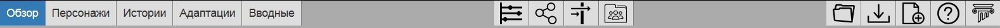

	Заголовок

.. _overview-desc:
	
Обзор
-----

Это первая страница, открывающаяся при старте НИМС. 

Содержание страницы

	``Название`` - здесь указывается название игры.
	
	``Дата начала доигровых событий`` - дата начала доигровых событий. 
	
	``Дата окончания доигровых событий`` - дата начала игры в мире игры. Между этими двумя датами будут происходить доигровые *события*. Эти даты необходимы для выставления границ хронологии. Можно выставлять даты событий и вне указанного временного промежутка. Введённые значения играют вспомогательную роль. Если у события не указано время, то оно по умолчанию заменяется игровой датой.
	
	``Время последнего сохранения базы`` - это время последнего сохранения базы в файл.
		
	``Описание`` - текст с описанием игры. Ни на что не влияет, но мы решили, что он тут должен быть) При желании мастера могут вести тут какие-то общие заметки для себя.
	
	``Статистика`` - общие данные об открытой базе: 
  
		``количество историй/персонажей/событий`` 
    
		``количество пользователей`` - нужно для серверной версии)
    
		``первое и последнее события в базе`` по хронологии 
    
		``количество знаков в текстах`` - считаются мастерские истории, тексты групп, событий и адаптаций
    
		``количество завершенных историй`` - число историй, у которых все адаптации отмечены, как завершенные
		
		``общая завершенность`` - число адаптаций, отмеченных как завершенные

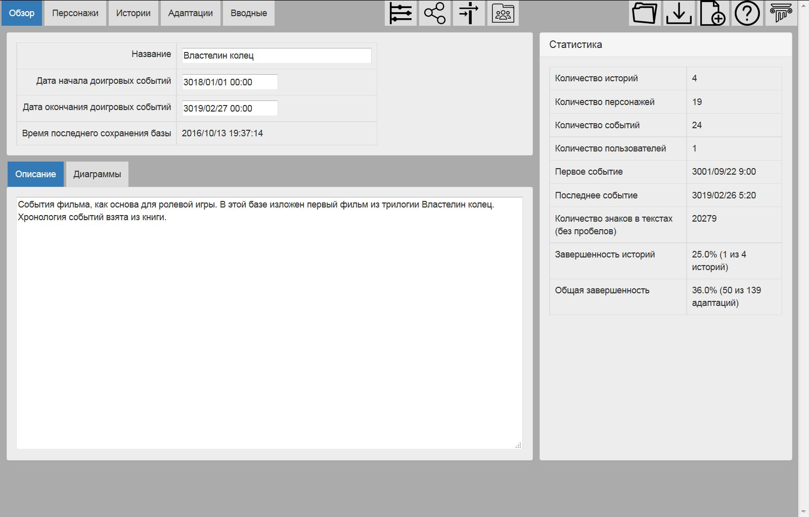
	
	Вкладка Обзор. Описание
	
На подвкладке **Диаграммы** приводятся стандартные гистограммы и круговые диаграммы. Число на столбце гистограммы означает высоту столбца. При наведении мышью на столбец приводится детализация: значение и дополнительная информация. Например, на рисунке сообщение "4: Ряба, Маша и медведь", означает, что в историях Ряба и "Маша и медведь" задействовано по 4 персонажа. Над круговыми диаграммами показывается название доли и её размер.

Стандартные диаграммы

	``Количество событий в историях`` - гистограмма, показывающая сводку по количеству событий в историях.
	
	``Количество персонажей в историях`` - гистограмма, показывающая сводку по количеству персонажей в историях.
	
	``Количество историй у персонажей`` - гистограмма, показывающая сводку по количеству историй у каждого персонажа.
	
	``Детальная завершенность историй`` - гистограмма, показывающая сводку по завершенности историй. Крайне левое значение - ни одна адаптация не завершена. Крайне правое - все адаптации в истории завершены.
	
	``Количество знаков у персонажей`` - гистограмма, показывающая сводку по количеству знаков во вводной каждого персонажа. Учитываются только события/адаптации в историях и тексты для групп. Тексты в досье и отношения персонажей не учитываются.
	
	``Принадлежность объектов`` - доли персонажей, историй и групп принадлежащих пользователям в серверном режиме.
	
Диаграммы досье строятся автоматически для полей вида число (гистограмма), единственный выбор и галочка (круговая диаграмма). Ширина столбца гистограммы для числовых полей автоматически подстраивается под значимый интервал (первый столбец не обязан начинаться с нуля).
  
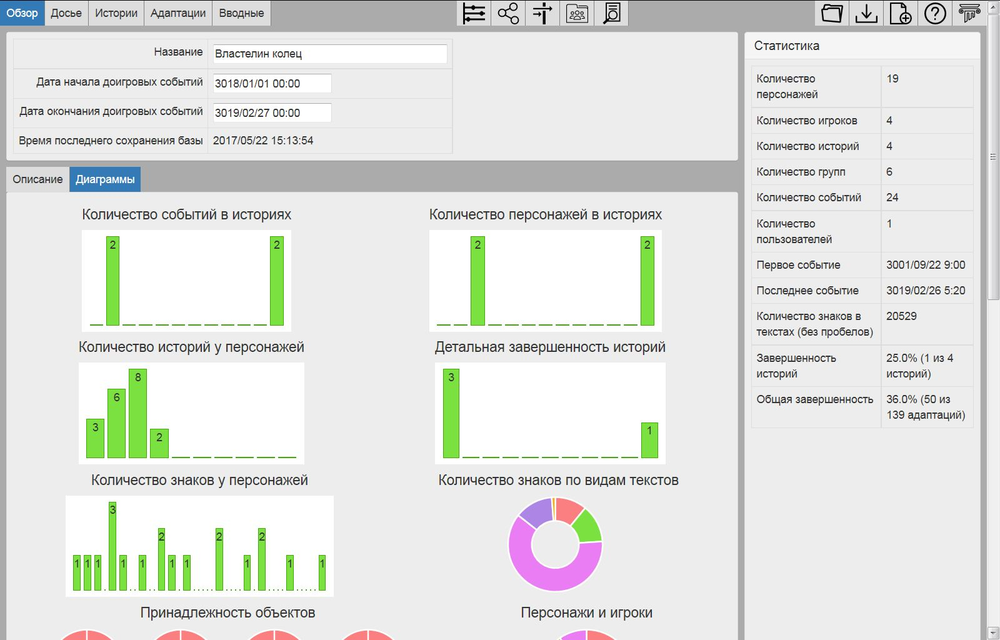
	
	Вкладка Обзор. Диаграммы
	
.. _characters-desc:

Персонажи
---------

На странице **Персонажи** есть общая часть и две дополнительных вкладки: **Досье** и **Конструктор досье**.

Общая часть включает в себя элементы для создания/переименования/удаления персонажей в верхней части вкладки.

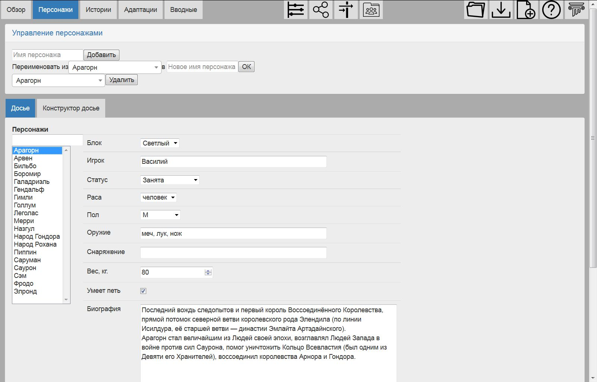

	Вкладка Персонажи

.. _characters-profile:
	
Персонажи. Досье
----------------

На вкладке **Досье** происходит заполнение досье персонажа. В левой части экрана выбирается персонаж. По центру показано досье. Внесенные в досье изменения сохраняются автоматически. Подробнее про типы данных в досье можно прочитать в описании **Конструктора досье**.


	Вкладка Персонажи. Досье

.. _characters-profile-editor:
	
Персонажи. Конструктор досье
----------------------------

На вкладке **Конструктор досье** выполняется редактирование досье персонажей: добавление/изменение/удаление полей в досье. В верхней части вкладки находятся элементы управления для создания, перемещения и удаления полей. Имена полей должны быть уникальны. Все текущие поля показаны в таблице: ```Название``, ``Тип``, ``Значения`` и ``Печатать во вводных``. То, что указано в поле ``Значения`` является значением по умолчанию для всех полей, кроме единственного выбора. В единственном выборе значением по умолчанию является первый элемент. Поля с установленной галочкой ``Печатать во вводных`` будут выводиться во вводные.

Типы полей:

	``Текст`` - поле для хранения текстовых данных. Пример: биография персонажа.

	``Строка`` - поле хранит одну строку. Пример: вероисповедание.

	``Единственный выбор`` - поле содержащее перечисление значений из которых может быть выбрано только одно. Значения единственного выбора указываются через запятую. Первое значение является значением по умолчанию. Пример: пол ж, м, не важно.

	``Число`` - числовое значение. Пример: возраст персонажа.

	``Галочка`` - поле хранит значение да/нет. Пример: является ли персонаж хакером.

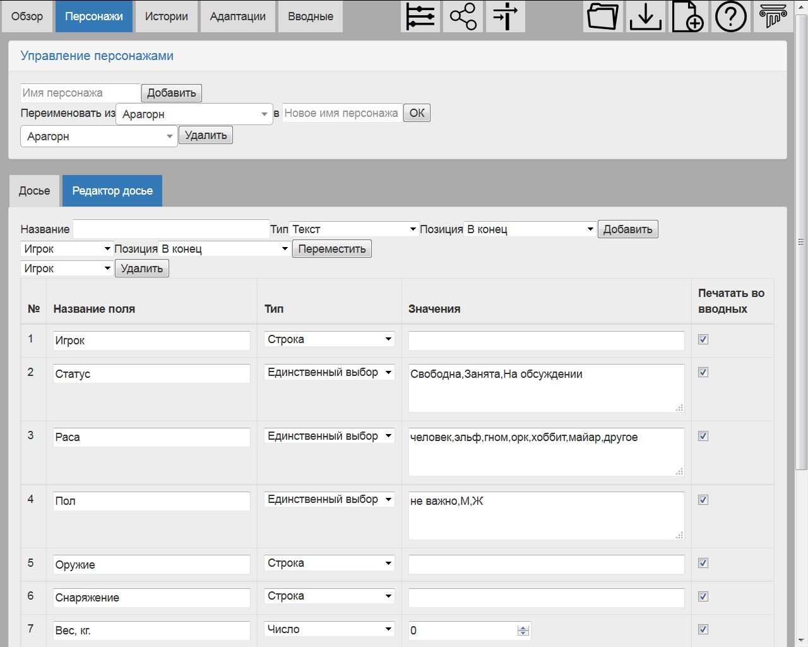

	Вкладка Персонажи. Конструктор досье
	
.. _story-desc:

Истории
-------

На странице **Истории** осуществляется заполнение информации об историях. В правой верхней части экрана находится панель управления историями: создание/переименование/удаление историй. В левой верхней части экрана расположена панель выбора текущей истории для просмотра. Заполнение мастерской информации выполняется на соответствующих подвкладках

	**Мастерская история** - текст истории в самом общем виде. Заполнять мастерскую историю не обязательно, но по нашему опыту бывает полезно иметь всю историю перед глазами.
	
	:ref:`story-events` - описания событий истории. Описание состоит из названия события, описания события (этот текст мы так же называем **оригиналом события** в противоположность **адаптации**) и времени наступления события.
	
	:ref:`story-characters` - перечисление персонажей, участвующих в истории, их инвентарей, связанных с этой историей и вид активности персонажа (см. :ref:`secondary-entities-desc`).
	
	:ref:`story-presence` - здесь отмечается факт присутствия каждого персонажа истории в событиях.

При работе на вкладке **Истории** можно включить режим работы с одной или с двумя подвкладками. Можно выбрать любую комбинацию подвкладок. Чтобы спрятать подвкладку кликните на активный заголовок. На данном рисунке активны две панели. Далее будут скриншоты и для однопанельного режима.

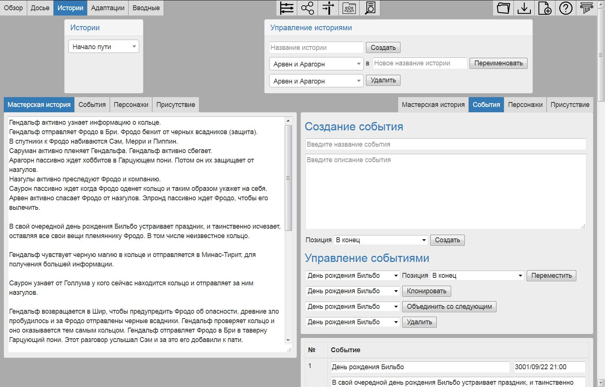

	Вкладка Истории
	
.. _story-events:

Истории. События
----------------

На вкладке **События** выполняется разбиение истории на события. У каждого события есть следующие атрибуты: название (не уникально), текст, позиция и время. Кроме обычных операций создания/удаления/перемещения событий добавлены операции клонирования и объединения событий. Клонирование создает полную копию события с созданием копии текстов адаптаций (см. раздел :ref:`events-desc`). Объединение событий соединяет два подряд идущих события в одно. Объединяется все: название, описание и адаптации.

В таблице события приведены в том порядке, в котором их укажет мастер, а не в хронологическом порядке. Переименование и обновление текста событий сохраняется при завершении редактирования, то есть немедленно. Справа указано точное время наступления события. Если поле подсвечено красным, значит используется значение по умолчанию - время окончания доигровых событий.

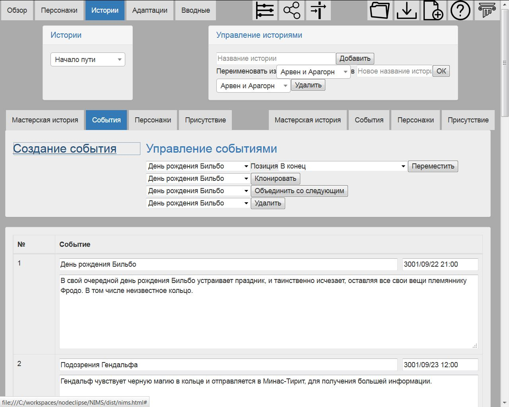

	Вкладка События
	
.. _story-characters:

Истории. Персонажи
------------------

На вкладке **Персонажи** выполняется добавление/удаление/замещение персонажей в истории. При замещении все данные от старого персонажа переходят к новому. Так что да, Ромео не приехал, его место займет Меркуцио)

Здесь же приведено две таблицы. В первой таблице заполняется инвентарь персонажа, связанный с этой историей. Например, Фродо получает Кольцо Всевластья в истории начало пути и мы делаем отметку в таблице инвентаря, что на начало игры кольцо будет у Фродо. Вторая таблица указывает вид активности персонажа в истории. Описание видов активности приведено в разделе :ref:`secondary-entities-desc`.

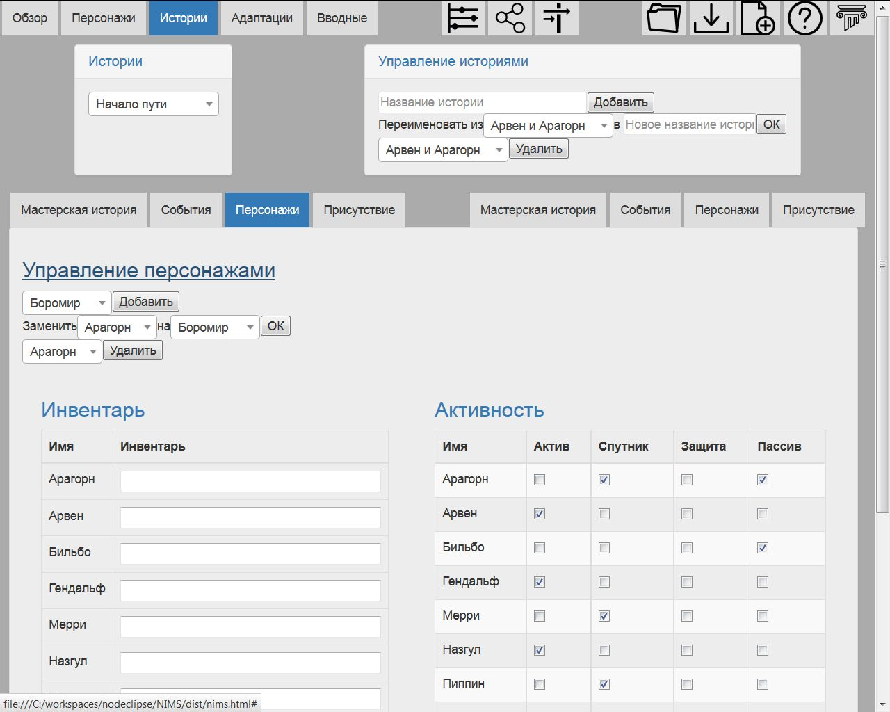

	Вкладка Истории. Персонажи

.. _story-presence:
	
Истории. Присутствие
--------------------

На этой вкладке определяется участие персонажей в тех или иных событиях. В таблице в первом столбце перечислены названия событий. В заголовке имена персонажей истории. Отметьте галочкой пересечение персонажа и события, если персонаж принял в нём участие. Снятие галочки приводит к удалению уже существующих адаптаций событий (см. раздел :ref:`events-desc`). На всякий случай в этом месте всегда выскакивает напоминалка.

Слева находится список-фильтр персонажей. С его помощью мы указываем каких персонажей мы хотим видеть в таблице справа (множественный выбор через ctrl/shift). Это сделано для работы с историями с большим количеством персонажей.

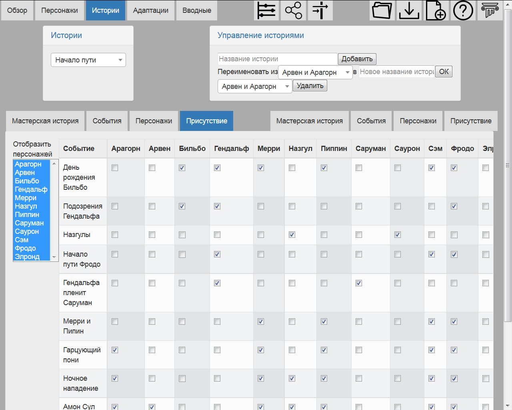

	Вкладка Истории. Присутствие
	
.. _events-desc:

Адаптации
---------

У каждого персонажа может быть свое видение происходящих событий, поэтому для событий необходимо сделать адаптацию как это событие выглядело с точки зрения того или иного персонажа.

Слева сверху расположен селектор истории (единственный выбор). Слева снизу расположен переключатель фильтра - по персонажам и по событиям (множественный выбор через ctrl/shift). По центру отображаются таблица из двух столбцов. В левом столбце выводится оригинальное описание события, которое можно редактировать. В правом столбце выводятся текстовые поля с описанием события для каждого выбранного персонажа - текст адаптации. Таким образом в один момент времени можно работать, как с адаптацией одного персонажа, так и с несколькими персонажами одновременно. Под текстом адаптации выводится галочка - отметка о завершении работы над адаптацией. Сверху расположена галочка-фильтр завершенных историй. История считается завершенной, если проставлены галочки о завершении всех адаптаций. 

Оригинал события состоит из названия события, времени события и текста. Адаптация события состоит из имени персонажа, субъективного времени и текста адаптации. Если текст адаптации пуст, то во вводную пойдет текст оригинала. По аналогии если субъективное время не указано, то во вводную пойдёт время события как есть.

Размер левого столбца с селектором истории и фильтрами событий/персонажей можно регулировать с помощью таскаемого уголка (см. скриншот).

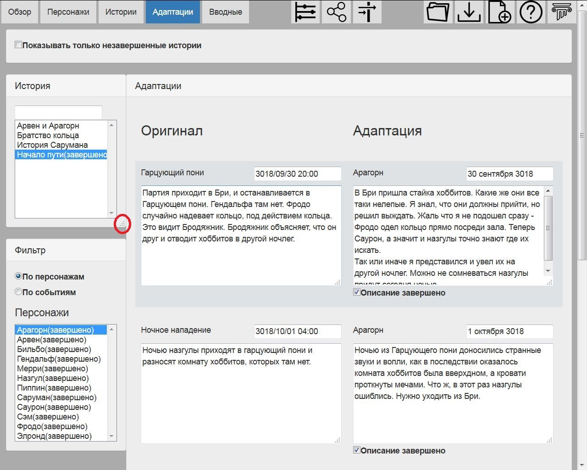

	Вкладка События
	
.. _breifings-desc:

Вводные
-------

На вкладке **Вводные** происходит финальная подготовка вводных к экспорту и сам экспорт. На подвкладке **Предварительный просмотр** выполняется вычитка вводных. На подвкладке **Экспорт** соответственно экспорт. 
	
.. _breifings-preview:

Вводные. Предварительный просмотр
---------------------------------

Прежде чем экспортировать вводные, можно посмотреть какая информация будет выведена, используя вкладку предварительного просмотра. В заголовке панели находится селектор персонажа, для которого мы хотим посмотреть вводную. При просмотре вводной доступны следующие опции:

	``Режим адаптации`` и ``Режим вычитки`` - в более ранних версиях НИМС был реализован только режим вычитки, отображавший только тот текст, который пойдёт во вводные. Понаблюдав за пользователями мы пришли к выводу, что в режиме предварительного просмотра иногда необходимо показывать не только выводимый текст события, а оба варианта - и адаптацию и оригинал и оставить возможность для их редактирования. Разница для различных режимов в частных случаях описана ниже.

	``Группировать события по историям`` и ``Сортировать события по хронологии`` - выбор способа представления событий.
	
	``Свернуть все панели`` - в предварительном просмотре вводные персонажа разбиты на панели: инвентарь, досье, группы, отношение к другим персонажам, и в зависимости от способа отображения событий будут показаны панели для историй или группы событий по пять штук. В зависимости от этой галочки все панели будут изначально свёрнуты или развёрнуты.
	
	``Отключить заголовки`` - возможность отключения заголовков в предварительном просмотре. Так как заголовки могут содержать излишнюю информацию, может возникнуть необходимость не выводить их во вводных и вычитка вводных может производиться с учётом этого.
	
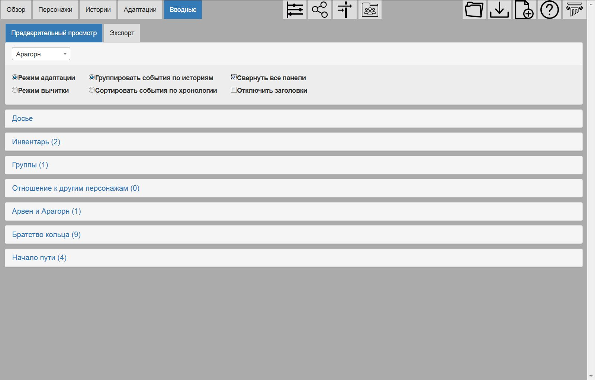

	Вкладка Предварительный просмотр, все панели свёрнуты
	
Панель Досье
^^^^^^^^^^^^

На этой панели выводятся все поля досье персонажа, которые отмечены как выгружаемые в **Конструкторе досье**. Досье доступно только для просмотра. Режимы адаптации и вычитки не влияют на отображение этой панели.

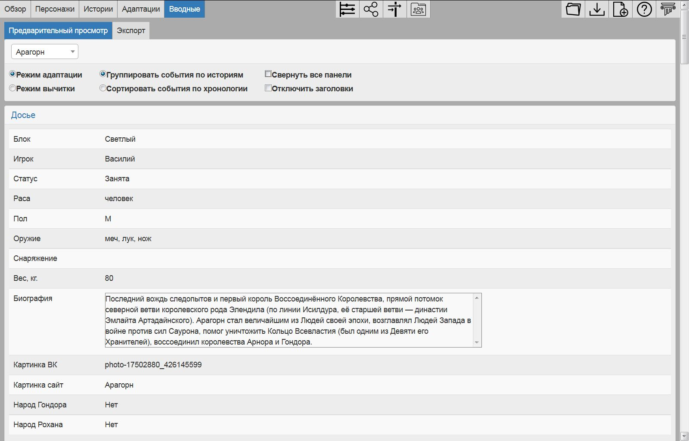

	Вкладка Предварительный просмотр, досье персонажа

Панель Инвентарь
^^^^^^^^^^^^^^^^

На этой панели выводится весь инвентарь персонажа. Число в заголовке панели показывает количество не пустых инвентарей персонажа. Инвентари доступны для редактирования. Режимы адаптации и вычитки не влияют на отображение этой панели. 

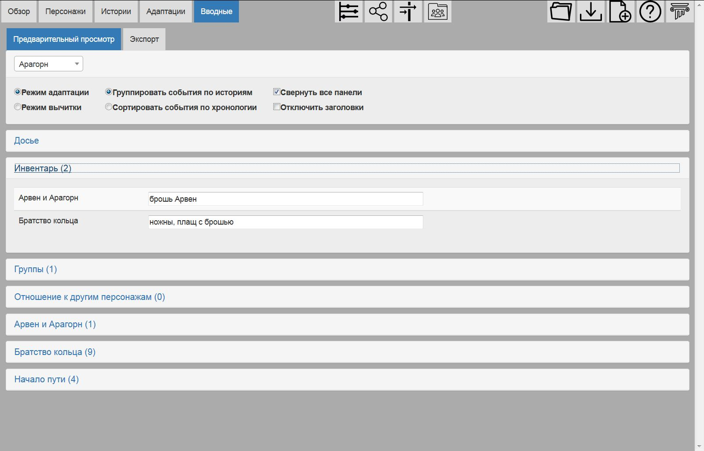

	Вкладка Предварительный просмотр, инвентарь персонажа

Панель Группы
^^^^^^^^^^^^^

На этой панели выводятся все тексты для персонажей из групп, в которых состоит персонаж. Число в заголовке панели показывает количество групп персонажа. Тексты групп доступны только для просмотра. Режимы адаптации и вычитки не влияют на отображение этой панели. 

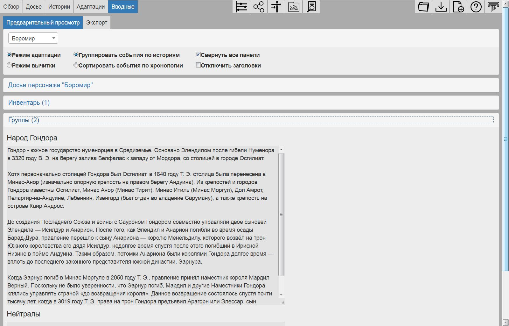

	Вкладка Предварительный просмотр, группы

Панель Отношение к другим персонажам
^^^^^^^^^^^^^^^^^^^^^^^^^^^^^^^^^^^^

На этой панели заполняется описание отношений между персонажами. Число в заголовке панели означает количество не пустых отношений к другим персонажам. Все персонажи делятся на две группы относительно вычитываемого персонажа: те, с кем он был в одном событии и те, с кем не был. Иными словами всех кто в первой группе персонаж может знать в лицо, а всех остальных не знать. У персонажа может быть отношение к любому другому персонажу. Причём отношения могут быть ассиметричны. Например, все знают и боятся босса мафии, а он знает только своих и ему этого достаточно. 

Часто нужно иметь перед глазами какую-то минимальную информацию о человеке, к которому прописывается отношение. Для этого была добавлена возможность выбора поля досье. Соответствующее поле досье будет отображаться в колонке ``Дополнительно``.

В зависимости от режима редактирования таблица отношений имеет следующие колонки:

	``Имя персонажа`` - имя персонажа к которому мы прописываем отношение.
	
	``Отношение`` - описание отношения.
	
	``Обратное отношение`` - описание обратного отношения. Эта колонка есть в режиме адаптаций и отсутствует в режиме вычитки.
	
	``Дополнительно`` - дополнительная информация о персонаже, к которому мы прописываем отношение. Здесь выводится список историй в которых персонажи встречались и избранное поле досье персонажа, к которому мы прописываем отношение.

Если текст отношения оставить пустым, то считается, что отношения нет. 

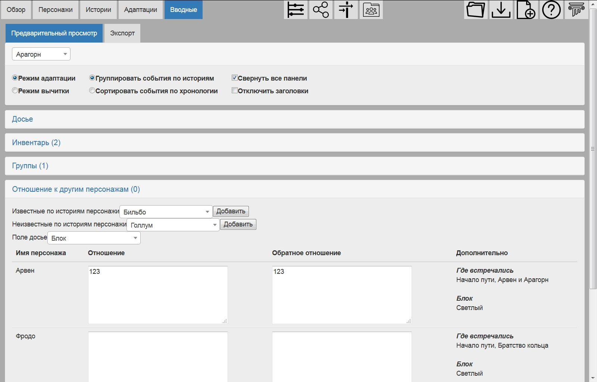

	Вкладка Предварительный просмотр, отношение в режиме адаптаций
	
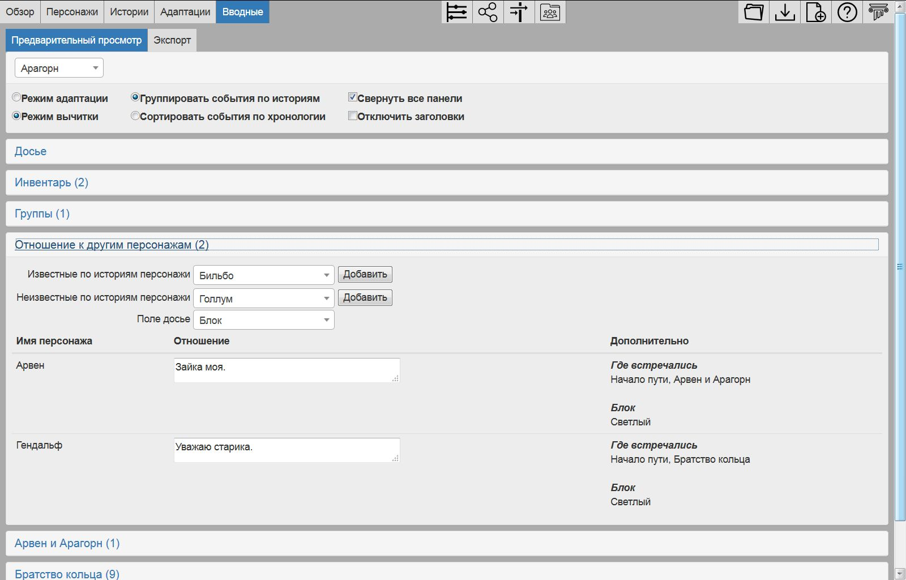

	Вкладка Предварительный просмотр, отношение в режиме вычитки
	
Панель Событий
^^^^^^^^^^^^^^

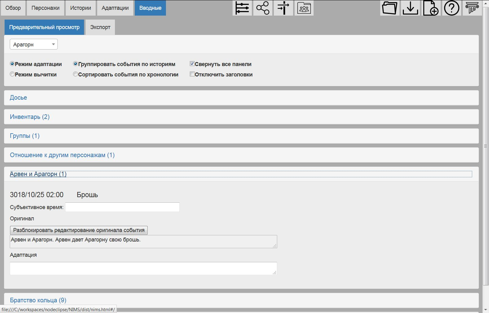

	Вкладка Предварительный просмотр, события в режиме адаптаций
	
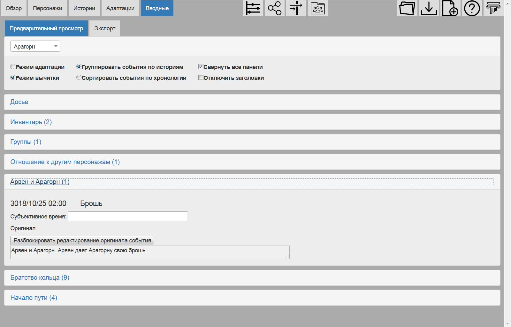

	Вкладка Предварительный просмотр, события в режиме вычитки


Поле ``Субъективное время`` показывает время события, которое получит персонаж во вводной. Если поле пусто, он увидит время как есть.
	
Обращаю ваше внимание - если в событии присутствует кнопка ``Разблокировать редактирование оригинала события``, значит для персонажа не была написана адаптация текста события и он увидит его как есть. Редактирование такого поля является редактированием текста события. В противном случае вы редактируете адаптацию события.

.. _breifings-export:
	
Вводные. Экспорт
----------------

На вкладке экспорта доступны следующие опции. Вводные можно выводить одним файлом, либо каждую в отдельный файл. Во втором случае вводные будут выгружены в zip архиве. Можно выводить как все вводные, так и только некоторые. Возможна выгрузка поштучно, интервалами по 5, 10 и 20 вводных или случайный выбор (самый гибкий, но и самый трудоёмкий вариант).

В разделе Простая выгрузка перечислены несколько встроенных шаблонов: ``выгрузка в docx c событиями по хронологии``, ``выгрузка в docx c событиями по историям``, ``выгрузка таблицы с инвентарем`` и ``выгрузка в текстовый файл``.

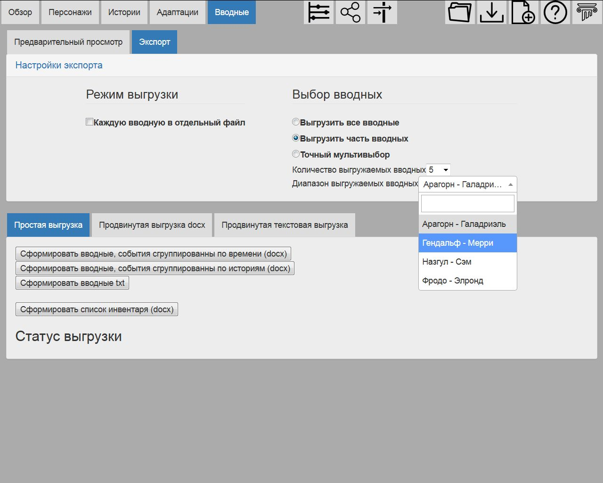

	Вкладка Вводные. Экспорт-Простая выгрузка
	
По готовности выгруженного файла будет выведен дополнительный запрос на сохранение (см. рис.). Ранее возникала ошибка при сохранении файла. После добавления этого диалога проблема исчезла.

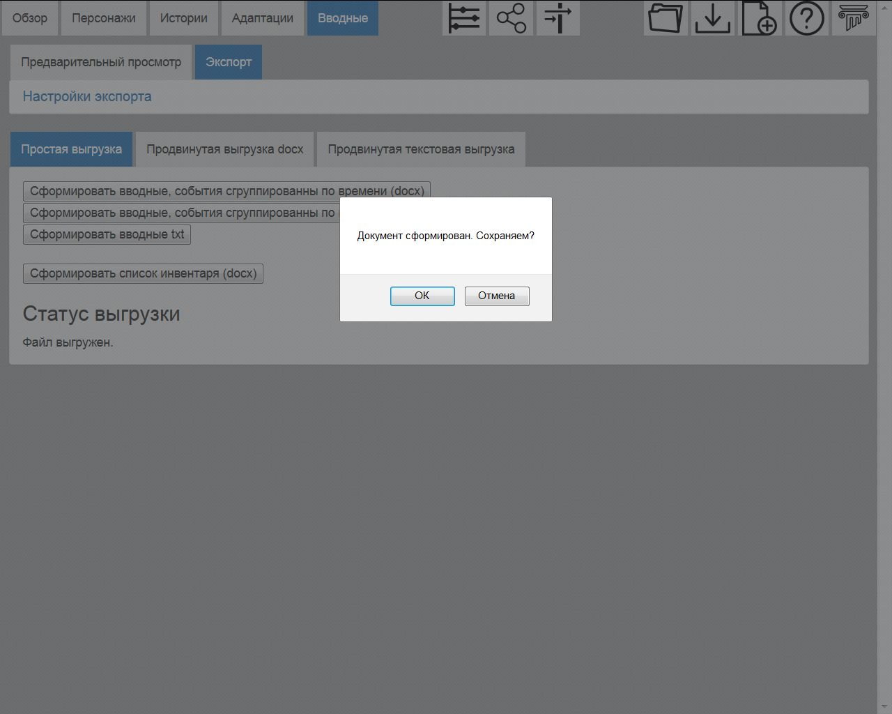

	Вкладка Вводные. Экспорт-дополнительный запрос выгрузки
	
В разделе продвинутой выгрузки необходимо загрузить свой собственный шаблон docx. Шаблон может включать в себя как все данные, так и только часть из них. Примеры шаблонов распространяются вместе с НИМС. Язык шаблона очень похож на язык текстовой выгрузки Mustache. Текстовые выгрузки доступны прямо в странице, поэтому учиться работе с шаблонами рекомендуется на них (следующий раздел).
  
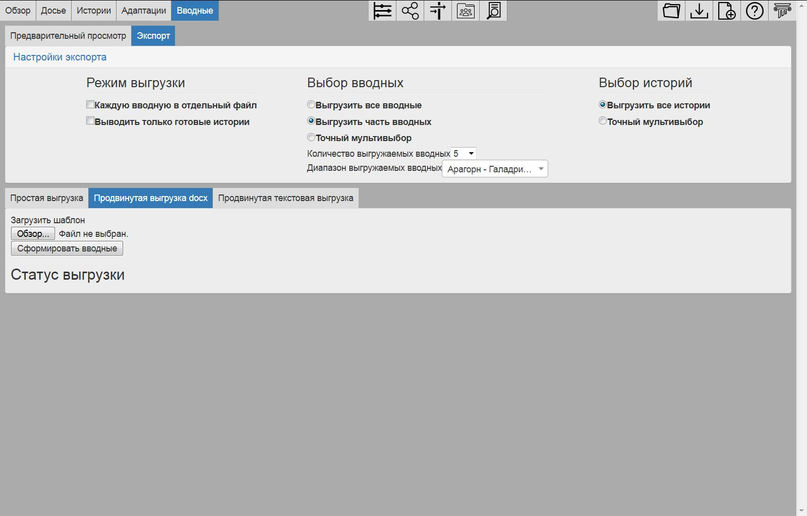

	Вкладка Вводные. Экспорт-Продвинутая выгрузка docx
	
На странице текстовой выгрузки слева находится поле с шаблоном, справа выводится текст с результатами применения этого шаблона. Шаблон по умолчанию включает все доступные для выгрузки данные о персонажах. Поля для вставки отмечаются с помощью двойных фигурных скобок {{...}}. Некоторые специальные символы при вставке экранируются и превращаются в белиберду. Это нормально) Чтобы этого избежать используйте тройные фигурные скобки {{{...}}}. В частности запрещенным символом является слэш при указании времени. Попробуйте заменить {{{time}}} на {{time}}, чтобы посмотреть как изменится выдача. Кнопка ``Предварительный просмотр`` сгенерирует текст в правом поле. Выгрузка текстовых файлов осуществляется с помощью кнопки ``Выгрузка``.

Поэкспериментировав с текстовой выгрузкой становится понятно что и как вы хотите вывести. Но нужно было разбираться с текстовыми шаблонами для docx, так как там есть некоторые отличия в механизме шаблонов. Специально для упрощения работы с docx было добавлено 2 кнопки. Кнопка ``Конвертировать в docx шаблон`` преобразует текущий текстовый шаблон в docx шаблон. Далее вы можете открыть полученный файл, настроить внешний вид и применить этот шаблон на странице с продвинутой выгрузкой. Кнопка ``Сгенерировать в docx по текущему шаблону`` преобразует текущий текстовый шаблон в docx шаблон и тут же применяет имеющиеся данные к docx шаблону для получения результата. Полученный таким образом docx файл можно использовать для проверки выгрузки, так как он будет фактически без оформления.


Так же можно указать нужное расширение файла, при формировании текстов (txt, html и др.).

.. warning:: Текст шаблона не сохраняется в НИМС, если вы уйдете с вкладки и вернетесь обратно, то текст будет сброшен.
  
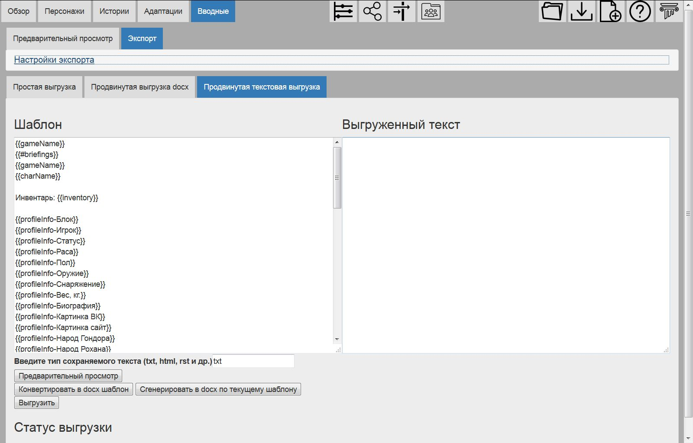

	Вкладка Вводные. Экспорт-Продвинутая текстовая выгрузка
	
.. _timeline-desc:

Хронология
----------

На этой вкладке отображается хронология событий. Слева находится селектор событий. Чтобы сделать множественный выбор зажмите ctrl и выбирайте элементы в списке. Масштаб хронологии изменяется с помощью колесика мыши. Красным отмечено время начала и завершения доигровых событий. События можно перетаскивать по хронологии. Для этого нажмите ЛКМ на событии и тащите его в нужную сторону. При этом следует учитывать, что от этих перемещений время событий в историях меняется автоматически. 

Размер левого столбца с селектором историй можно регулировать с помощью таскаемого уголка (см. скриншот).

.. note:: Возможность перетаскивания событий в версии НИМС 0.4.2 была отключена по просьбе пользователей, чтобы не смещать события случайно.

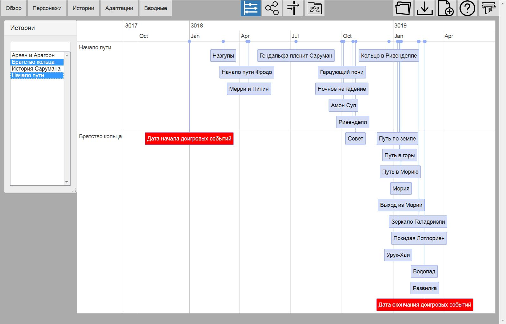

	Вкладка Хронология
	
.. _social-network-desc:

Социальная сеть
---------------

На этой вкладке отрисовываются социальные сети на основе имеющихся данных. Поддерживаются несколько типов отрисовываемых сетей с разными видами узлов и связей между ними (см. далее типы графов). Отрисовка социальной сети требует большого количества ресурсов, поэтому перед ее использованием рекомендуется сохранить текущее состояние базы. Для отрисовки необходимо указать общие и частные параметры социальной сети и нажать кнопку ``Нарисовать``.

После того как социальная сеть будет нарисована, список ``Показать узел``, расположенный над общими параметрами будет заполнен. В этом списке находятся все узлы текущей социальной сети. Выберите узел из списка, чтобы сеть на нём отцентрировалась.

Общие параметры

Раскраска узлов выполняется на основе полей досье c типом **единственный выбор** и **галочка**. Вы можете выбрать любое из этих полей, а ниже будет приведена цветовая расшифровка.
Так же возможно три вида выборки.

1. Все данные. Будут отрисованы все данные.

2. Избранные персонажи. В этом случае появится список персонажей. Можно выбрать нескольких персонажей с помощью ctrl. В этом случае будут отрисованы выбранные персонажи, все истории, в которых задействованы эти персонажи и все остальные персонажи, пересекающиеся в событиях с избранными. Примечание: при отрисовке графа человек-история не все связи отображают реальные связи персонажей по событиям.

3. Избранные истории. В этом случае появится список историй. Можно выбрать несколько историй с помощью ctrl. В этом случае будут отрисованы все истории и все персонажи, входящие в истории.

Частной настройкой является тип отрисовываемого графа. Поддерживаются следующие типы.

1. Социальные связи - сеть связей между персонажами. Узлы: персонажи. Связь между узлами: совместное участие персонажей в некотором событии. Чем толще связь, тем в больших историях эти персонажи пересекаются. При наведении на связь выводится список историй, в которых пересекаются эти персонажи.

2. Персонаж-участие-история - сеть связей персонажей и историй. Узлы: персонажи и истории. Связь между узлами: участие персонажа в истории. Размер истории пропорционален числу участников истории.

3. Персонаж-активность-история - сеть связей персонажей и историй на основе данных об активности. Узлы: персонажи и истории. Связь между узлами: активность персонажа в истории. См. раздел с описанием активностей. Можно выбирать несколько требуемых активностей через ctrl.

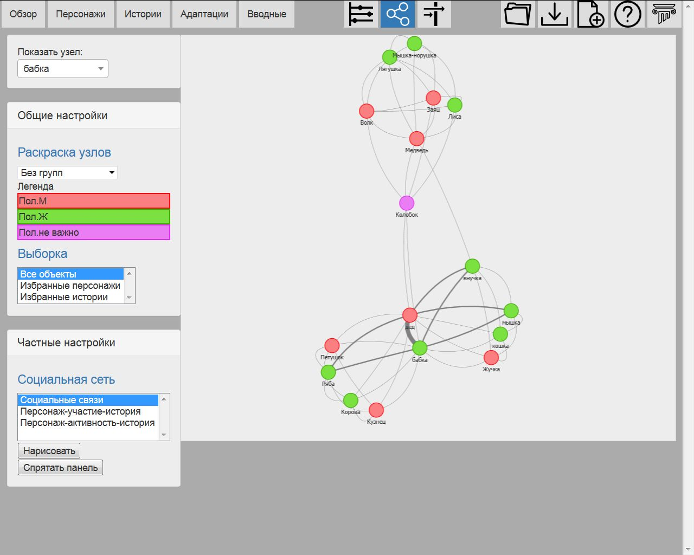

	Вкладка Социальная сеть
	
.. _characters-filter:
	
Фильтр
------

На вкладке Фильтр выполняется выборка из персонажей по досье. Подробнее про типы данных в досье можно прочитать в разделе :ref:`characters-profile-editor`. Фильтрация строк и текстов происходит по наличию искомой строки в строке или тексте. Фильтрация по полям с единственным выбором происходит по выбору из предложенного списка значений. Чтобы сделать множественный выбор зажмите ctrl и выбирайте элементы в списке. Фильтрация для значений вида да/нет аналогична фильтрации по полям с единственным выбором. Фильтрация по числовым значениям требует указания числа и вида проверки: не важно, больше, равно, меньше. Обновление результата фильтрации происходит сразу после изменения параметров фильтра. В центральной части выводится результат фильтрации. Клик по заголовку таблицы выполняет сортировку по соответствующему полю + иконка. 

Размер левого столбца с настройками фильтра персонажей можно регулировать с помощью таскаемого уголка (см. скриншот).

В верхнем левом углу добавлен список отображаемых полей (множественный выбор через ctrl/shift). Так же под заголовком фильтра указано количество результатов, возвращенное фильтром.

В версии НИМС 0.4.4u3 были добавлены следующие статистические столбцы в фильтр:

	``Актив``, ``Спутник``, ``Защита``, ``Пассив`` - количество историй, в которых персонаж имеет указанный тип активности.
	
	``Завершённость адаптаций, %`` - процент завершённых адаптаций для данного персонажа.
	
	``Количество историй`` - количество историй, в которых принимает участие данный персонаж.

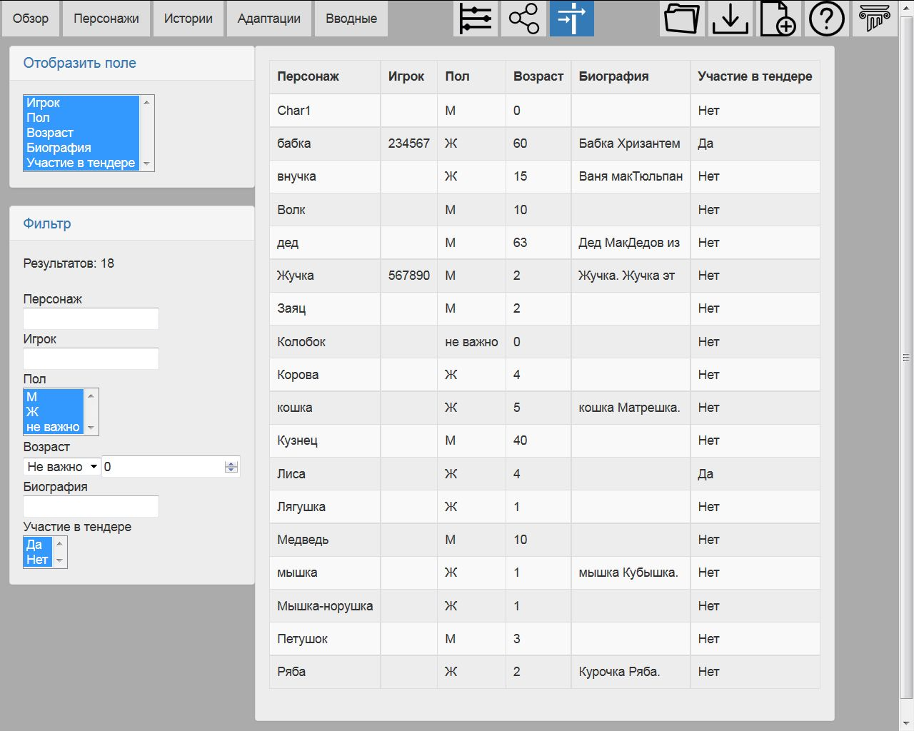

	Вкладка Фильтр
	
.. _groups-desc:
  
Группы
------

123123
  
.. _administrative-tools:
  
Администрирование
-----------------

Когда мы думали над системой прав для НИМС одним из первых вопросов был: что делать, если пользователи почти одновременно изменили данные, и новые правки затерли предыдущие?
Рассматривались разные варианты, но мы решили пойти простым путем, исключающим возникновение данной ситуации. В текущей реализации можно посмотреть все что написано, но править данные может только их владелец. Владеть можно персонажами и историями. Так же данный подход исключает возможность несанкционированного, случайного и не очень редактирования другим автором. Право на адаптации может рассчитываться как от историй, так и от персонажей. Для этого в админке есть специальный переключатель.

Кто есть кто и что он может?

Админ

	1. может создавать пользователей
	2. может удалять пользователей 
	3. не может удалить самого себя
	4. может менять пользователям пароли
	5. может назначать права на объекты
	6. может отбирать права на объекты никому не передавая
	7. может назначить редактора
	8. может передать админство
	9. может переключить правило назначения прав на адаптации - от истории или от персонажа
	10. обзор и конструктор досье - редактирует только админ
	11. может перезалить базу полностью и только он

.. warning:: Нельзя переименовать пользователя.

Редактор

	1. получает полный доступ ко всем объектам. Вновь созданные объекты тоже, без владения.
	2. назначается админом
	3. редактор может самостоятельно сложить с себя полномочия
	4. может ли редактор переименовывать/удалять персонажей/истории - да

Автор

	1. может создавать истории и персонажей (права на созданные объекты принадлежат создателю)
	2. может передавать свои права другим авторам
	3. автор не может отобрать у самого себя права никому не передав

Всем

	1. сохранение базы в файл для автономной работы (не завершено)
	2. экспорт вводных

Объекты и права на них

Изначально персонажи принадлежат создателям персонажей. Только владелец персонажа может редактировать его досье.

Изначально истории принадлежат создателям историй. Только владелец истории может добавлять в нее новые события и персонажей (можно не своих).

Права на адаптации определяются текущим режимом - наследуются от историй и наследуются от персонажей.

Права на объект могут не принадлежать никому.

  
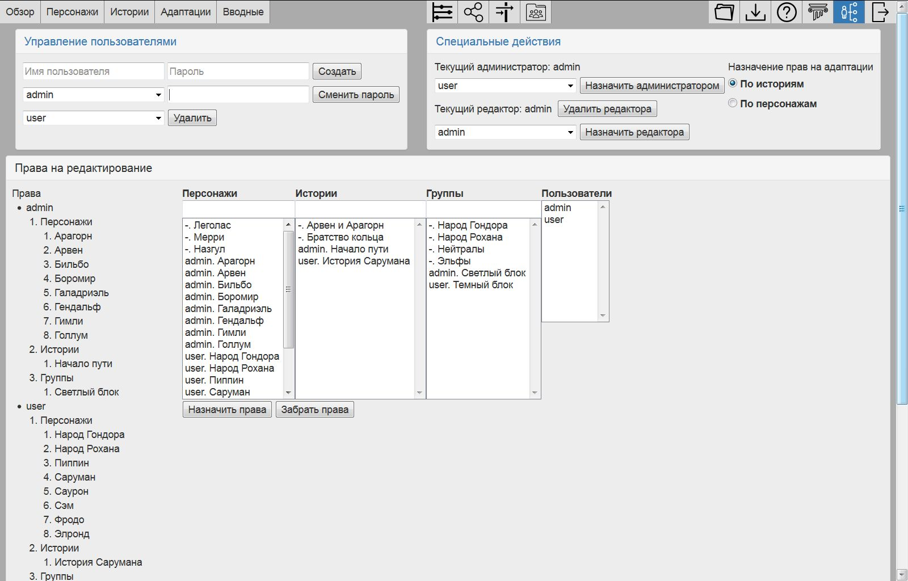

	Вкладка Администрирование
	
.. _logs:
  
Логи
----
  
В новой версии НИМС было добавлено несколько защитных механизмов и один из них это логи. В логах мы можем посмотреть историю последних действий пользователей. Текущее ограничение - последняя 1000 операций. Возможно мы изменим эту цифру в будущем. Логируются следующие виды деятельности: сохранение/загрузка базы, обновление метаинформации кроме описания игры, управление персонажами/досье/историями, изменения в историях - управление событиями, изменение вида активности и инвентаря, отметки о готовности адаптаций и выгрузка вводных. В серверном режиме к этому списку добавляется все, что касается администрирования: управление пользователями, передача/назначение прав, изменение настроек. Основной принцип - мы не отслеживаем изменения текстов, но отслеживаем изменения в структуре базы.

Запись о событии содержит следующие поля:

	1. ``№`` - номер события в списке событий.
	2. ``Дата`` - время совершения события. На сервере будет использовано время сервера.
	3. ``Пользователь`` - пользователь от имени которого совершено событие. Может отсутствовать. Например, при автоматическом сохранении базы на сервере в логе указывается факт сохранения без пользователя.
	4. ``Действия`` - тип действия.
	5. ``Параметры`` - переданные параметры. С их помощью можно воспроизвести последовательность действий пользователя.
	
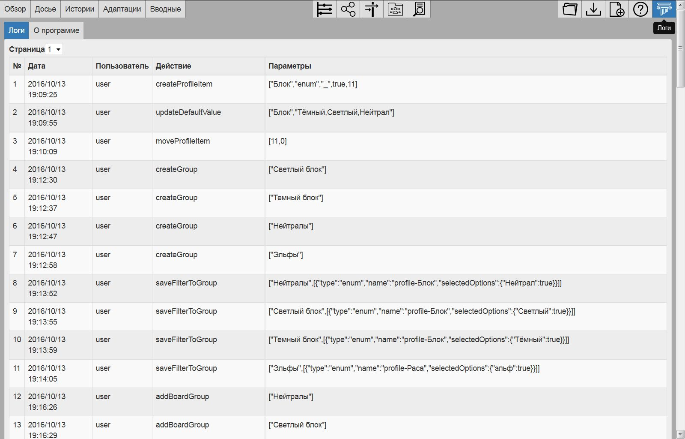

	Вкладка Логи
  